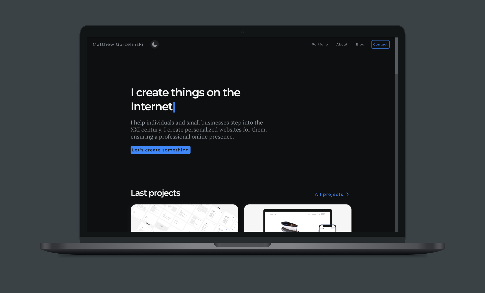

# gorzelinski.com

A codebase for my [website](https://gorzelinski.com), [blog](https://gorzelinski.com/blog/), and [portfolio](https://gorzelinski.com/portfolio/). They are designed, coded, and written by me - [Matthew Gorzelinski](https://gorzelinski.com/about/).

## 🛠️ Built with

      

"If it ain't broke, don't fix it," people say. Even though my previous website was working pretty well, working _on it_ became harder and harder. That's why I migrated to a new tech stack.

- [TypeScript](https://www.typescriptlang.org/)
- [Next.js](https://nextjs.org/)
- [Panda CSS](https://panda-css.com/)
- [MDX](https://mdxjs.com/)
- [Playwright](https://playwright.dev/)
- [Jest](https://jestjs.io/)
- [Vercel](https://vercel.com/)

## 🚀 Getting started

### Prerequisites

[Node.js](https://nodejs.org/en/download/package-manager) runtime environment installed on your machine.

### Installation

Running this website locally is pretty simple:

1. Clone this repository
2. Install the dependencies with `npm install`
3. Run the development server using `npm run dev`
4. Open http://localhost:3000 with your browser to see the result

### Epilogue

Here, I gave you the full instructions. My website is (and will be) open-source. You can clone it, experiment with it, or even steal ideas from it. I would even encourage that. David Bowie said, "The only art I'll ever study is stuff I can steal from." I don't know if that's an art, but I'll be flattered if you take inspiration from my work. Don't just copy-paste the whole thing and claim it's your own, ok? The fun part is in the discovery, figuring out things on your own. I write about my journey on this very website.

## 📝 Content

If you're reading this file, there is a high chance you're a nerd like me. And even if you're not, and you're here by mistake, you may find something interesting on my website. That's because I write about many eclectic things that currently interest me. I elaborated more about topics in my first post - [Hello... world?](https://gorzelinski.com/blog/hello-world/) You may start there and decide on your own. Another posts that may interest you by a category:

- [Design](https://gorzelinski.com/blog/stylish-design-principles-with-a-nasty-acronym/)
- [Writing](https://gorzelinski.com/blog/the-craft-of-writing/)
- [Coding](https://gorzelinski.com/blog/object-oriented-programming-in-javascript/)

You can also check my portfolio. There are [case studies](https://gorzelinski.com/portfolio/gorzelinski/) from projects I worked on. It's a bit poor there, but I'll try to enrich it in the future.

## 🤝 Contributions

Let me know if something is broken or doesn't work as expected. New ideas for improvements are also welcome. You can open an [issue](https://github.com/gorzelinski/gorzelinski.com/issues) or [fork](https://github.com/gorzelinski/gorzelinski.com) the repo and create a [pull request](https://github.com/gorzelinski/gorzelinski.com/pulls). It's my personal pet project, and I usually work on it alone, but that shouldn't stop you from contributing.

## ✉️ Contact

Do you have a project idea? Or any questions? You can write me an old-school email or direct message. Don’t hesitate. Seriously. You can find me here:

- <a href="mailto:hello@gorzelinski.com">Email</a>
- [GitHub](https://github.com/gorzelinski)
- [Bluesky](https://bsky.app/profile/gorzelinski.com)
- [Twitter](https://x.com/gorzelinski)
- [LinkedIn](https://www.linkedin.com/in/mateusz-gorzelinski)
- [Facebook](https://www.facebook.com/gorzelinski)
- [Dribbble](https://dribbble.com/gorzelinski)
- [Instagram](https://www.instagram.com/gorzelinsky/)

## ❤️ Acknowledgments

I wouldn't finish this README without giving some credit. Of course, this list isn't complete. It's hard to recall all the people who had some influence on my work. But some names pop out in my mind immediately.

- [Maxime Heckel](https://github.com/MaximeHeckel)
- [Josh W. Comeau](https://github.com/JoshWComeau)
- [Wes Bos](https://github.com/wesbos)
- [Scott Tolinski](https://github.com/stolinski)
- [Dan Abramov](https://github.com/gaearon)
- [Andrei Neagoie](https://github.com/aneagoie)
- [Tomasz Jakut a.k.a. Comandeer](https://github.com/Comandeer)
