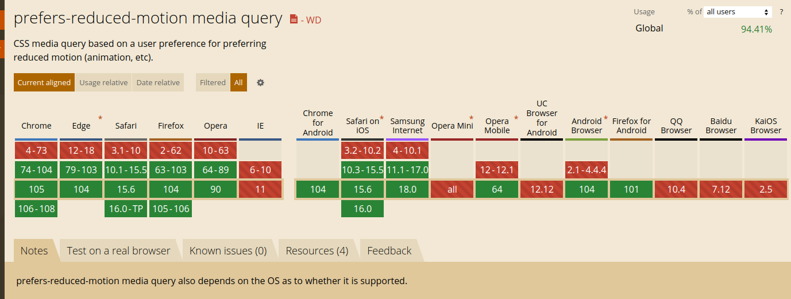

Lubię minimalizm. Lubię minimalizm w moim pokoju, na moim ekranie i - jak widzisz - na moim blogu. Ale nawet dla mnie, niektóre wodotryski są fajne. Myślę, że przemyślana animacja może poprawić wrażenia z użytkowania. Możesz znaleźć subtelne przykłady na mojej stronie. Niektórzy projektanci albo programiści mogą się ze mną nie zgodzić. Efektywność może być dla nich najwyższym priorytetem. Ale czasami to nie jest nawet kwestia preferencji.

16 grudnia 1997 roku, epizod Pokemonów wyświetlony w telewizji w Tokio spowodował migreny, zniekształcenia wizualne, mdłości i drgawki u ponad 500 dzieci. Nie potrzebujesz jednak jaskrawego serialu albo gry wideo, aby wywołać te reakcje. Migające światło, wzorce z linii, kraty, szachownice i inne konfiguracje mogą sprowokować _drgawki wywołane światłem_ [<sup>[1]</sup>](https://onlinelibrary.wiley.com/doi/full/10.1111/j.1528-1167.2005.31405.x).

Istnieje cała klasyfikacja różnych zaburzeń przedsionkowych. To ten system odpowiedzialny za naszą orientację przestrzenną. Jego praca, w przypadku niektórych ludzi, może zostać zaburzona przez zewnętrzne wyzwalacze. Wizualnie wywołane zawroty głowy mogą być sprowokowane przez złożone, zniekształcone lub ruszające się wizualne bodźce o dużej powierzchni. Ludzie mogą odczuwać iluzję poruszania się bez właściwego poruszania się [<sup>[2]</sup>](https://www.researchgate.net/profile/Alexandre-Bisdorff/publication/38070636_Classification_of_vestibular_symptoms_Towards_an_international_classification_of_vestibular_disorders/links/00463515a70a1c1b7c000000/Classification-of-vestibular-symptoms-Towards-an-international-classification-of-vestibular-disorders.pdf).

Zatem, migający ekran lub ruch (czyli w zasadzie animacja) może wywołać poważne, fizyczne reakcje u niektórych użytkowników. Niektóre z nich brzmią jak reakcje na karuzelę dla wielu ludzi - w tym dla mnie. Dlatego nie zabieraj swojego użytkownika na mimowolną wycieczkę do parku rozrywki. Nie kręć nim jak winylem.<sup>\*</sup>

\*W angielskiej wersji nawiązałem w ten sposób do znanego utworu z lat 80, "You Spin Me Round (Like a Record)".

## Opcje redukcji ruchu

Twórcy systemów operacyjnych zatroszczyli się o tych ludzi. Każdy duży, mobilny i komputerowy system operacyjny (macOS, Linux, Windows 7+, iOS, Android) ma jakieś ustawienie do redukcji ruchu. Zaznaczenie tej opcji wyłącza systemowe animacje.

- W Windows 10: Ustawienia > Ułatwienia dostępu > Wyświetlacz > Pokaż animacje w systemie Windows
- W Ubuntu: Terminal > `gsettings set org.gnome.desktop.interface enable-animations false`
- W macOS: Preferencje systemowe > Dostępność > Ekran > Redukuj ruch
- W iOS: Ustawienia > Dostępność > Ruch > Redukuj ruch
- W Android: Ustawienia > Dostępność > Usuń animacje

Ta opcja jest także udostępniona użytkownikom sieci. Z wykorzystaniem `prefers-reduced-motion` CSS media query, możesz wykryć czy użytkownik preferuje animacje. Działa to podobnie do `prefers-color-scheme` media query. Ale to nie zadziała, jeżeli wsparcie przeglądarek jest kiepskie. Sprawdźmy:



Wsparcie jest dobre, dlatego spróbuję uczynić moją stronę bardziej dostępną!

## Wykorzystanie

Moja strona jest minimalistyczna, dlatego jest tu niewiele animacji. Ale jest jeden, dobry przykład - efekt maszyny do pisania na mojej [stronie głównej](/pl/). Stworzyłem komponent maszyny do pisania, który przyjmuje wyrazy i symuluje zapisywanie ich.

Dokumentacja Mdn definiuje: “funkcja prefers-reduced-motion media query jest wykorzystywana do wykrywania, czy użytkownik zażądał od systemu minimalizacji zbędnych animacji”. Pomimo że wspomniana animacja elegancko przedstawia to co zwykle robię - piszę na klawiaturze - nie jest niezbędna. Stworzyłem ją głównie dla estetyki. Dlatego jest dobrym kandydatem do ograniczenia ruchu.

## CSS media query

Ten fragment kodu jest odpowiedzialny za migający kursor. Co sekundę, przezroczystość kreski pionowej oscyluje pomiędzy 0 i 1.

```css
@keyframes blink {
  50% {
    opacity: 0;
  }
}

.cursor:after {
  content: '|';
  animation: blink 1s step-start infinite;
  color: var(--color-primary-base);
}
```

Możemy wyłączyć tę animację korzystając z naszej funkcji media query.

```css
@media (prefers-reduced-motion: reduce) {
  .cursor:after {
    content: '';
    animation-name: none;
  }
}
```

Jeżeli użytkownik preferuje ograniczenie ruchu, animacja nie będzie odtworzona i nie będzie znaku kreski pionowej.

## React

Ale w tej animacji jest jeszcze druga część - pisanie. Ta część jest zaimplementowana w języku JavaScript. Najprawdopodobniej istnieje jakiś kombinatorski sposób na zaimplementowanie czegoś podobnego w czystym CSS. Nawet próbowałem kilka rozwiązań, ale żadne mnie nie satysfakcjonowało. Pomimo że CSS się rozwija, ma swoje ograniczenia. Istnieją też inne typy animacji, które po prostu nie mogą być zrobione w CSS.

W innej części mojej strony wykorzystuję `window.matchMedia()`, aby wykryć preferencje systemowe dotyczące koloru motywu. Używając tej metody, możemy uzyskać dostęp do wartości media queries z poziomu JS. Użyję jej, żeby sprawdzić preferencje ruchu.

```jsx
const hasReducedMotionPreference = window.matchMedia(
  '(prefers-reduced-motion: reduce)'
).matches // Wartość Bool - żależy od ustawień systemowych
```

Teraz mogę wykorzystać tę informację w niestandardowym haku.

```jsx
import { useState, useEffect } from 'react'

export const usePrefersReducedMotion = () => {
  const [hasReducedMotionPreference, setHasReducedMotionPreference] =
    useState(false)

  useEffect(() => {
    const mediaQueryList = window.matchMedia('(prefers-reduced-motion: reduce)')
    const initialPreference = mediaQueryList.matches
    setHasReducedMotionPreference(initialPreference)

    const listener = (event) => {
      setHasReducedMotionPreference(event.matches)
    }
    mediaQueryList.addEventListener('change', listener)
    return () => {
      mediaQueryList.removeEventListener('change', listener)
    }
  }, [])

  return hasReducedMotionPreference
}
```

Domyślną wartością tego haka jest `false` - nie znamy jeszcze preferencji użytkownika. Możesz też ustawić ją jako `true` - domyślnie animacje będą wyłączone. W ten sposób funkcja jest bardziej dostępna, ale powodowała przemieszczanie się mojego layoutu, dlatego na razie zostawię wartość `false`. Następnie hak `useEffect()` sprawdza preferencje systemu operacyjnego. W zależności od ustawień, zmienna `hasReducedMotionPreference` jest odpowiednio zaktualizowana. Zmienna ta jest zwracana przez funkcję. Event listener sprawia, że zmienna jest aktualna z ustawieniami systemowymi. Możesz sprawdzić go w akcji. Zmień ustawienia ruchu na swoim systemie podczas obserwacji mojej [strony głównej](/pl/).

Możemy wykorzystywać nasz hak w każdym komponencie, który używa animacji. Wykorzystam go w moim komponencie landing, gdzie zlokalizowany jest efekt maszyny do pisania.

```jsx
import { usePrefersReducedMotion } from '../hooks/usePrefersReducedMotion'
// Pozostałe deklaracje import

const Landing = () => {
  const { t } = useTranslation('components/landing')
  const hasReducedMotionPreference = usePrefersReducedMotion()

  return (
    <Hero>
      <Tile as="header">
        <H1 aria-label={t('aria')}>
          {hasReducedMotionPreference ? (
            t('typewriter.create')
          ) : (
            <Typewriter
              strings={[
                t('typewriter.design'),
                t('typewriter.code'),
                t('typewriter.write'),
                t('typewriter.create')
              ]}
            ></Typewriter>
          )}
        </H1>
      </Tile>
    </Hero>
  )
}

export default Landing
```

Wykorzystanie go nie jest skomplikowane. Importuje niestandardowy hak i używam go, aby zwrócić preferencje dotyczące animacji. Następnie wykorzystuję operator trójskładnikowy. Jeżeli opcja redukcji ruchu jest włączona, statyczny wyraz jest renderowany. W przeciwnym wypadku efekt maszyny do pisania jest odtworzony.

## Wyłączenie wszystkich animacji

“No dobra, ale to wygląda jak sporo pracy. Czy nie możemy wyłączyć wszystkich animacji jednym fragmentem kodu, w stylu resetu CSS?”. W zasadzie możemy. Przeglądając sieć, znalazłem taki fragment kodu:

```css
* {
  /*CSS transitions*/
  -o-transition-property: none !important;
  -moz-transition-property: none !important;
  -ms-transition-property: none !important;
  -webkit-transition-property: none !important;
  transition-property: none !important;
  /*CSS transforms*/
  -o-transform: none !important;
  -moz-transform: none !important;
  -ms-transform: none !important;
  -webkit-transform: none !important;
  transform: none !important;
  /*CSS animations*/
  -webkit-animation: none !important;
  -moz-animation: none !important;
  -o-animation: none !important;
  -ms-animation: none !important;
  animation: none !important;
}
```

Ale myślę, że to nie jest dobry pomysł. Po pierwsze, zachęcam cię do zminimalizowania zapisu `!important`. Wykorzystując go zbyt często możesz zrobić bałagan ze specyficznością w języku CSS. Po drugie, nie wszystkie animacje są w języku CSS. Ten fragment kodu nie zadziała w przypadku animacji canvas, SVG i innych podobnych. No i redukcja ruchu nie oznacza braku animacji. Niektóre animacje mogą poprawić wrażenia z użytkowania. Czasami linia pomiędzy niezbędnymi i zbędnymi animacjami jest rozmyta, ale już samo zastanawianie się nad problemem jest dobrym startem. Pod koniec pisania, znalazłem ten [artykuł](http://alistapart.com/article/designing-safer-web-animation-for-motion-sensitivity/) - zawiera przykłady problematycznych animacji, więc może się przyda.

Drobiazgowe przygotowanie animacji i ich zredukowanych wersji może być męczące. Ale - jak zawsze - jest warte swojej ceny. Uczynienie twojej strony bardziej dostępną, może oszczędzić niektórym osobom kłopotu, zatem więcej osób może cieszyć się twoją zawartością.
