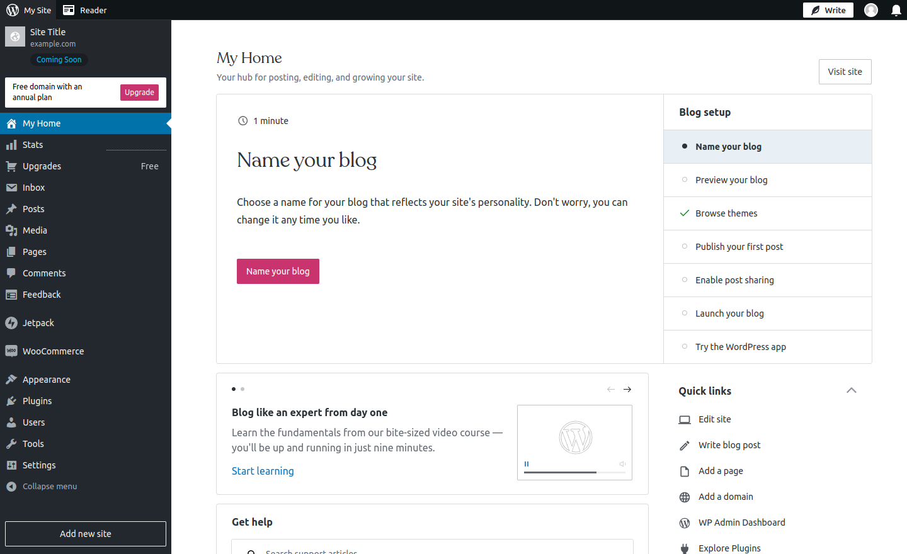
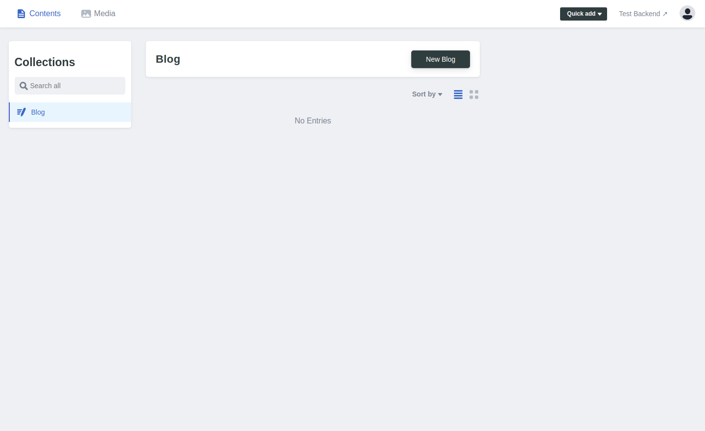
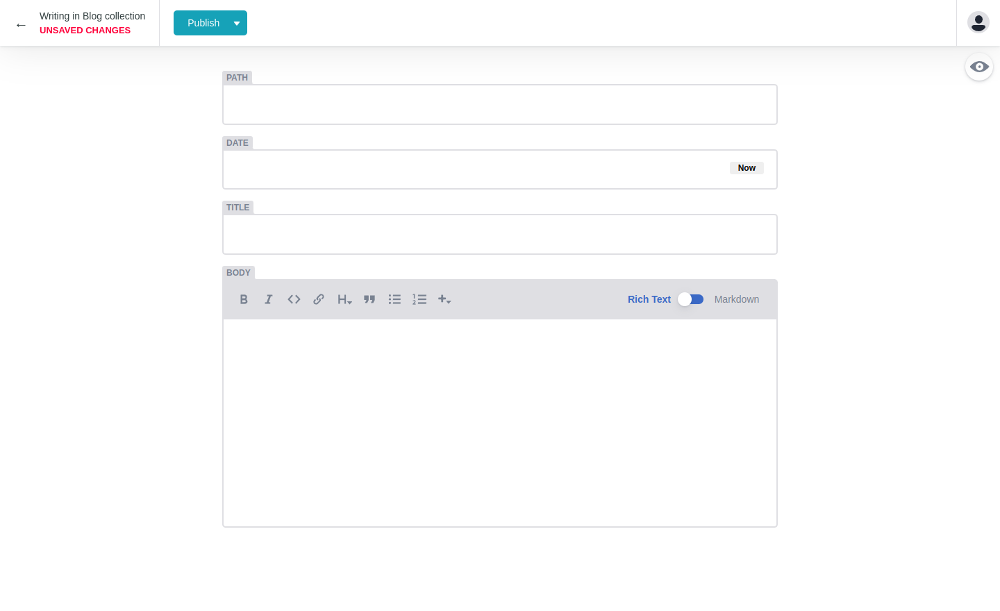
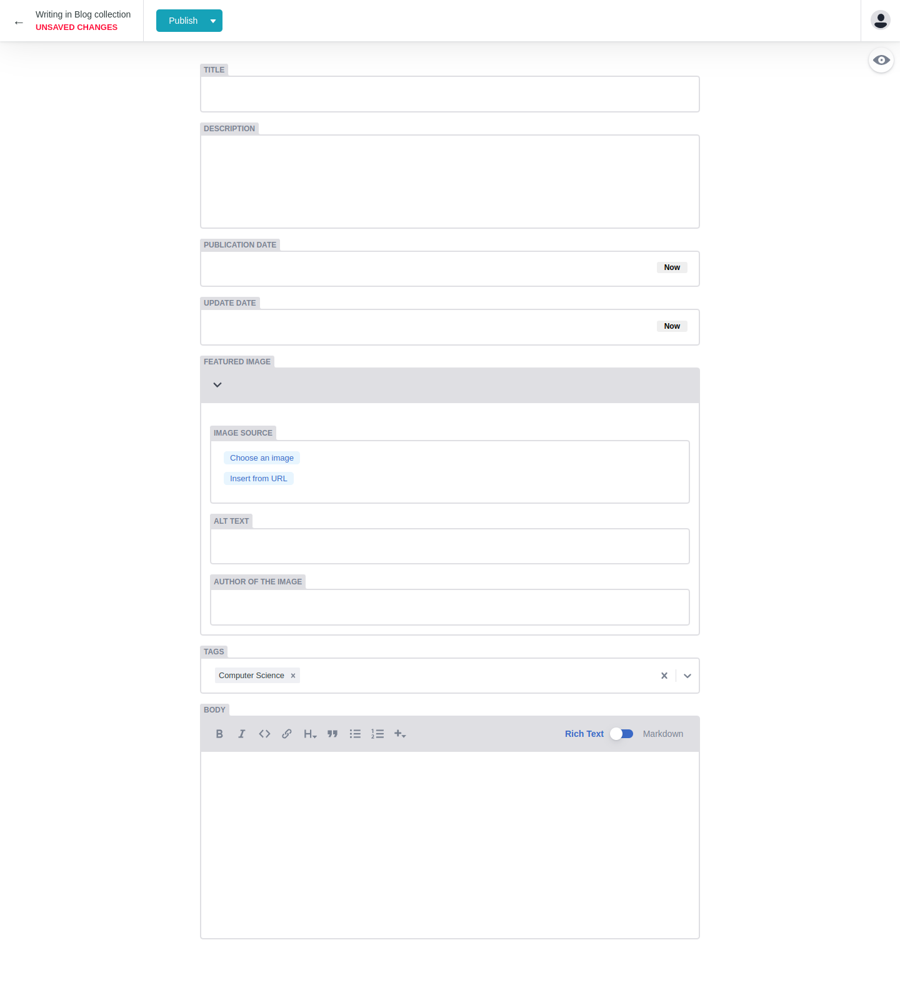
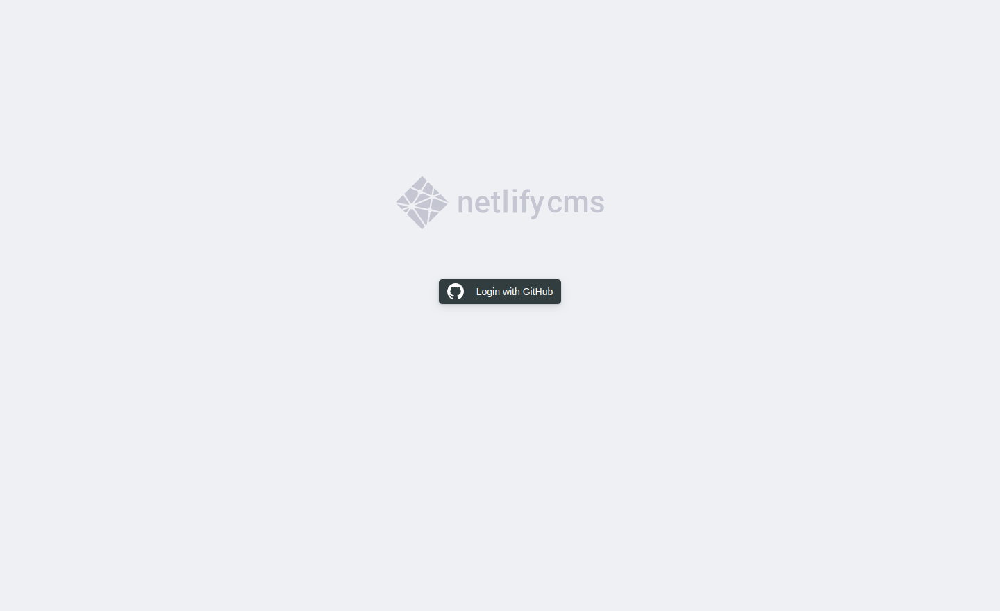

---
title: Gatsby z Netlify CMS
description: "W tym wpisie przyjrzymy się bliżej Netlify CMS. Jest to przykład CMSa nowego typu, który jest oparty o Git. Zintegrujemy go z przykładowym projektem Gatsby."
date: 2022-09-23T16:00:00+02:00
updated: 2022-09-23T16:00:00+02:00
image:
  alt: "Pięć metalowych kół zębatych na czarnym tle"
  caption: "Zdjęcie autorstwa Miguel Á. Padriñán"
  src: "./pexels-miguel-á-padriñán-3785933.jpg"
categories: ["web development"]
tags: ["gatsby", "netlify", "cms"]
type: "post"
---

Jeżeli jesteś web developerem, prawdopodobnie rozpoznajesz to zdjęcie. Nawet jeżeli nie jesteś - prawdopodobnie wiesz co to jest.



Panel WordPress - prosty i intuicyjny sposób zarządzania treściami na twojej stronie. Nie musisz znać PHP, MySQL lub HTML, żeby stworzyć coś jak wpis na blogu. Zawiera wiele zakładek, pól i przycisków, które pomagają w tworzeniu treści. Wrażenia z użytkownika muszą być dobre, bo jest to nadal najpopularniejszy CMS na rynku. Ale ta popularność wiąże się z ogromnym kosztem - jest to główny cel dla hakerów i spamerów. Potencjalne luki w zabezpieczeniach to nie jedyne minusy, ale ten post nie jest o tym.

Ostatecznie, twoje treści muszą znajdować się w składni HTML, aby zostały zinterpretowane przez przeglądarkę. Mógłbyś kodować wszystko ręcznie. Ja sam do stworzenia tego posta używam MDX - jest to specjalny format łączący Markdown i JavaScript, który ty widzisz jako stronę internetową. Wszystko jest statyczne i bezpieczne. Ale wymaga to nauki specjalnych składni, a nie każdy chce tego. Dodatkowo łatwo w ten sposób coś zepsuć, dlatego chciałem sprawdzić jak działają Git-based CMS.

## Netlify CMS

Netlify CMS jest przykładem systemu zarządzania treści, bazującym na systemie kontroli wersji GIt. Ten CMS używa Git'a pod maską. Pozwala to na trzymanie wszystkiego w repozytorium Git - treści obok kodu. Ma on trochę zalet w porównaniu do standardowych CMS'ów takich jak WordPress. Jednocześnie nie poświęca łatwości użytkowania. U samych podstaw, Netlify CMS to jest aplikacja React, która owija Git workflow. Dlatego nie musisz uczyć się narzędzi takich jak Git, Yaml czy Markdown, aby go używać. Oferuje on bogaty interfejs użytkownika dostępny z poziomu przeglądarki, podobnie jak WordPress. Jest przyjazny dla nie-technicznych użytkowników. Ale potrzeba trochę wiedzy, aby go skonfigurować. Dlatego zintegruje Netlify CMS z przykładowym projektem Gatsby w tym wpisie. Postaram się odtworzyć strukturę posta z mojego bloga.

<Callout type="info">

Jeżeli chcesz poznać szerszy obraz jak Gatsby lub Netlify CMS wpisuje się w [architekturę Jamstack](/blog/jamstack-what-why-how/), napisałem o tym post.

</Callout>

## Jak używać Gatsby z Netlify CMS?

Zaczniemy od zainicjowania nowego projektu Gatsby. W tym celu możemy użyć [Gatsby CLI](https://www.gatsbyjs.com/docs/reference/gatsby-cli/).

```bash
gatsby new netlify-cms-example https://github.com/gatsbyjs/gatsby-starter-hello-world
```

Następnie musimy zainstalować dwie paczki: `netlify-cms-app` i `gatsby-plugin-netlify-cms`. Pierwsza z nich jest odpowiedzialna za stworzenie wcześniej wspomnianej aplikacji, druga zintegruje ją z frameworkiem Gatsby.

```bash
npm install netlify-cms-app gatsby-plugin-netlify-cms
```

Wtyczki Gatsby muszą być zarejestrowane, aby działać. Musimy dodać nową zależność do tablicy.

```js
//gatsby-config.js

module.exports = {
  plugins: [`gatsby-plugin-netlify-cms`],
}
```

Sam plugin nie wymaga konfiguracji, ale Netlify CMS wymaga. Nie ma on pojęcia jakiego typu treści ty albo edytorzy będziecie tworzyć. Dlatego, potrzebuje on pliku `config.yml` z **folderami, kolekcjami** i różnymi **polami.** Na razie skopiujmy przykładową konfigurację. Wklejamy ją do folderu `static/admin`. Gatsby przekopiuje jego zawartość do wyjściowego build'u.

```yml
#static/admin/config.yml
backend:
  name: test-repo

media_folder: static/assets
public_folder: /assets

collections:
  - name: blog
    label: Blog
    folder: blog
    create: true
    fields:
      - { name: path, label: Path }
      - { name: date, label: Date, widget: datetime }
      - { name: title, label: Title }
      - { name: body, label: Body, widget: markdown }
```

Teraz możemy wpisać `gatsby develop` w terminalu. Jeżeli skonfigurowałeś wszystko poprawnie, podobny interfejs powinien powitać cię pod adresem `http://localhost:8000/admin/`:



## Konfiguracja Netlify CMS

Myślę, że to jest dobry moment na eksplorację poszczególnych opcji konfiguracyjnych. Poniżej jest kilka ważnych, ogólnych:

- `backend` - określa jak uzyskać dostęp na twojej stronie. Przyjmuje następujące opcje:
  - `repo` - ścieżka do repozytorium (nazwa użytkownika/nazwa repo).
  - `branch` - gałąź do przechowywania treści.
  - `base_url` - nazwa klienta OAuth, gdy używasz zewnętrznego serwera OAuth.
  - `cms_label_prefix` - etykieta dla żądań pull lub merge, gdy editorial workflow jest w użyciu.
- `publish_mode` - pozwala włączyć editorial workflow - więcej etapów przed publikacją.
- `media_folder` - relatywna ścieżka do folderu dla udostępnionych plików.
- `public_folder` - ścieżka, dzięki której można dostać się do udostępnionych plików w już opublikowanej stronie.
- `site_url` - adres URL do opublikowanej strony.

### Kolekcje

Istnieją specjalne opcje dla kolekcji. Kolekcja to lista obiektów tego samego typu. Posty na blogu, przepisy lub produkty są dobrymi przykładami. Każda skonfigurowana kolekcja wyświetla się na lewym pasku bocznym, co było widać. Te opcje określają kształt twoich treści.

- `name` - unikalny identyfikator dla kolekcji.
- `identifier_field` - to pole jest użyte (zamiast domyślnego) podczas tworzenia adresów URL. Netlify CMS oczekuje pola `title` w domyśle.
- `label` - etykieta dla kolekcji w interfejsie użytkownika. W domyśle pole `name`, ale te pola mogą się różnić.
- `label_singular` - to samo co powyżej, tylko dla pojedynczych elementów. Pole `label` w domyśle.
- `description` - opcjonalny opis wyświetlony w interfejsie.
- `folder` lub `files` - typ kolekcji. Opcja `folder` przyjmuje ścieżkę do folderu. Wewnątrz tego folderu powinny znajdować się pliki o tym samym formacie i polach (np. wpisy na blogu). Opcja `files` zawiera pojedynczo skonfigurowane pliki (np. strona główna).
- `filter` - opcja tylko dla folderu. Jak sugeruje nazwa - filtruje pliki z folderu. Przyjmuje pola `field` i `value`, aby wykorzystać do filtracji.
- `create` - kolejna opcja dla folderu. Wartość `true` pozwala użytkownikom na tworzenie nowych wartości w kolekcji. `false` w domyśle.
- `extension` - wykorzystywane do znajdowania i zapisywania plików w folderze kolekcji.
- `format` - wykorzystane do parsowania i zapisywania plików w folderze kolekcji.
- `slug` - szablon do generowania nazw plików na podstawie różnych pól. Wewnątrz tej opcji możesz korzystać z wielu znaczników, takich jak:
  - `{{slug}}` - wersja tytułu, która jest URL-safe.
  - `{{year}}` - rok stworzenia pliku.
  - `{{second}}` - sekunda stworzenia pliku.
  - `{{field_name}}` - poza domyślnymi znacznikami, możesz także wykorzystać niestandardowe znaczniki. Wymaga to otoczenia nazwy pola podwójnymi nawiasami klamrowymi.
- `preview_path` - szablon do generowania ścieżek do treści na stronie, która jest online. Tagi są takie same jak poprzednio z wyjątkami:
  - `{{slug}}` - tutaj oznacza cały adres dla bieżącego elementu.
  - Tagi związane z datami mogą wymagać dodatkowej konfiguracji.
  - `{[dirname}}` - ścieżka do folderu rodzica kolekcji.
  - `{{filename}}` - nazwa pliku.
  - `{{extension}}` - rozszerzenie pliku.

### Pola

Każdy element kolekcji może zawierać wiele pól. Kiedy klikniesz, aby stworzyć nowy element kolekcji (”New Blog” w naszym przypadku), zobaczysz elementy interfejsu jak te.



Wygląda to podobnie do standardowego systemu zarządzania treściami. Jeżeli przyjrzysz się dokładnie poprzedniej konfiguracji i porównasz ją z tym zrzutem ekranu, zauważysz, że opcje pól odpowiadają elementom interfejsu. Opcja `fields` mapuje widgety i wartości zapisane w pliku. Przyjmuje listę obiektów z następującymi opcjami:

- `name` - unikalny identyfikator pola.
- `label` - etykieta pola w interfejsie użytkownika.
- `widget` - definiuje typy danych i elementy do ich wprowadzania. Przyjmuje string, który determinuje typ widgetu. Istnieją domyślne widgety, takie jak date, image czy markdown. Dodatkowe opcje pozwalają na ich konfiguracje. Te opcje różnią się w zależności od typu, ale są też opcje współdzielone jak `required` lub `hint`.
- `required` - określa czy pole jest wymagane.
- `hint` - pomocniczy tekst wyświetlany w interfejsie użtykownika.
- `default` - domyślna wartość pola. Dostępna dla większości widgetów.
- `pattern` - lista składająca się z wzorca regex i komunikatu o błędzie - wykorzystywane do walidacji pól.

## Wpisy na blogu z Netlify CMS

Przyswoiliśmy sporo informacji, ale myślę, że teraz jesteśmy gotowi, aby zastąpić domyślną konfigurację naszą własną. Chcemy mieć możliwość dodawania, modyfikowania i usuwania typowych wpisów na blogu, zawierających tytuły, opisy, zdjęcia, tagi itp. Zacznijmy konfigurując naszą kolekcję.

```yml
#static/admin/config.yml
collections:
  - name: blog
    label: Blog
    label_singular: Post
    folder: content/blog
    create: true
    delete: true
    extension: markdown
    format: frontmatter
    slug: "{{slug}}"
    preview_path: "blog/{{filename}}"
    fields:
    # Below
```

Pola `name` i `label` mogą pozostać takie same. Dodałem także `label_singular` dla pojedynczych postów. Użytkownik CMS'a ma mieć możliwość tworzenia i usuwania wpisów. Posty powinny być w formacie markdown z dodatkowymi informacjami w formacie frontmatter. Musimy dodać pola, które pozwolą na uzupełnienie tych informacji. Pole `title` jest wymagane do tworzenia adresu URL. Pole `description` może być wyświetlone, albo użyte w meta tagach.

```yml
fields:
  - { name: title, label: Title }
  - { name: description, label: Description, widget: text }
  - { name: date, label: Publication Date, widget: datetime }
  - { name: updated, label: Update Date, widget: datetime }
  - name: image
    label: Featured Image
    widget: object
    summary: "{{fields.src}}"
    fields:
      - { name: src, label: Image source, widget: image }
      - { name: alt, label: Alt text, widget: string }
      - {
          name: credit,
          label: Author of the image,
          widget: string,
          required: false,
        }
  - {
      name: tags,
      label: Tags,
      widget: select,
      multiple: true,
      options:
        [
          "Web Development",
          "Design",
          "Computer Science",
          "Data Science",
          "Mathematics",
        ],
      default: ["Computer Science"],
      min: 1,
      max: 4,
      required: false,
    }
  - { name: body, label: Body, widget: markdown }
```

Użytkownik może wybierać daty z widgetem `datetime`. Wyróżnione zdjęcie powinno być obiektem i zawierać pola, aby było dostępne. Po wybraniu zdjęcia używając widgetu `image`, użytkownik powinien dodać alternatywny tekst i dodać informacje o autorze zdjęcia. Dodałem także kilka tagów z elementem `select`dla organizacji bloga. Użytkownik może tworzyć zawartość wpisu wykorzystując element `markdown`. Po tej konfiguracji, nasz CMS powinien wyglądać tak:



## Łączenie Netlify CMS z repozytorium Git

Użytkownik od teraz może używać naszego CMSa do tworzenia wpisów, ale wprowadzone informacje pozostają tylko w przeglądarce. Potrzebujemy repozytorium git, aby zapisać te informacje. Najpierw musimy połączyć nasze lokalne repozytorium z serwisem takim jak GitHub. Po zrobieniu tego, zróbmy krok wstecz. Netlify CMS to jest webowa aplikacja SPA, jak wcześniej wspomniałem. Z tego wynika, że chcemy dokonywać zmian w naszym repozytorium z poziomu przeglądarki. Wymaga to uwierzytelniania, a GitHub wymaga do tego serwera. [Netlify](https://www.netlify.com/) oferuje rozwiązanie i może się tym zająć. Łączenie repozytorium z Netlify jest prostolinijne. Tworzysz tam konto, wybierasz Sites > Add new site > Import an existing project i podążasz za instrukcjami. Możemy dodać uwierzytelnianie do naszej opublikowanej strony wykorzystując [konfigurację OAuth](https://docs.netlify.com/visitor-access/oauth-provider-tokens/#using-an-authentication-provider). Musimy dodać nową aplikację OAuth na stronie GitHub i zapisać wygenerowane credentials do naszej strony w Netlify. Odtąd nasz CMS może dokonywać zmian w naszym repozytorium… no prawie. Musimy także dodać brakujące informacje do naszej konfiguracji. Następnie możemy zapisać zmiany i wysłać je do repozytorium GitHub.

```yml
#static/admin/config.yml
backend:
  name: github
  repo: your-username/repo-name
  branch: main
```

Odwiedź `https://twoja-strona.netlify.app/admin/`, a twoja przeglądarka powinna wyświetlić stronę uwierzytelniającą jak ta poniżej.



Po zalogowaniu możesz stworzyć wpis, wypełnić wszystkie jego pola i kliknąć “publish now”. Po kilku sekundach twoje zmiany zostaną zapisane do repozytorium. Hura! Udało nam się. “Ale… nasze posty nie wyświetlają się na stronie”, możesz dodać. Odpowiedziałbym - tak, słuszna uwaga. Jednakże, celem tego wpisu była integracja pomiędzy Netlify CMS i Gatsby. Wszystko inne chciałem uczynić tak prostym jak to możliwe, dlatego zacząłem z minimalną konfiguracją. Jeżeli zacząłeś mając bloga, to masz już tę część. Ten wpis staje się długi, więc na tym zakończę. Być może dodam drugą część, w której wyświetlimy nasze wpisy.
