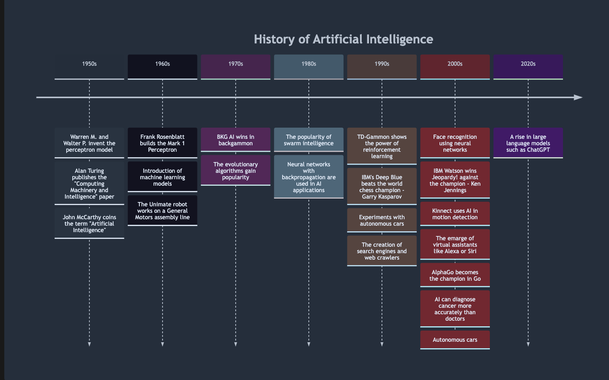
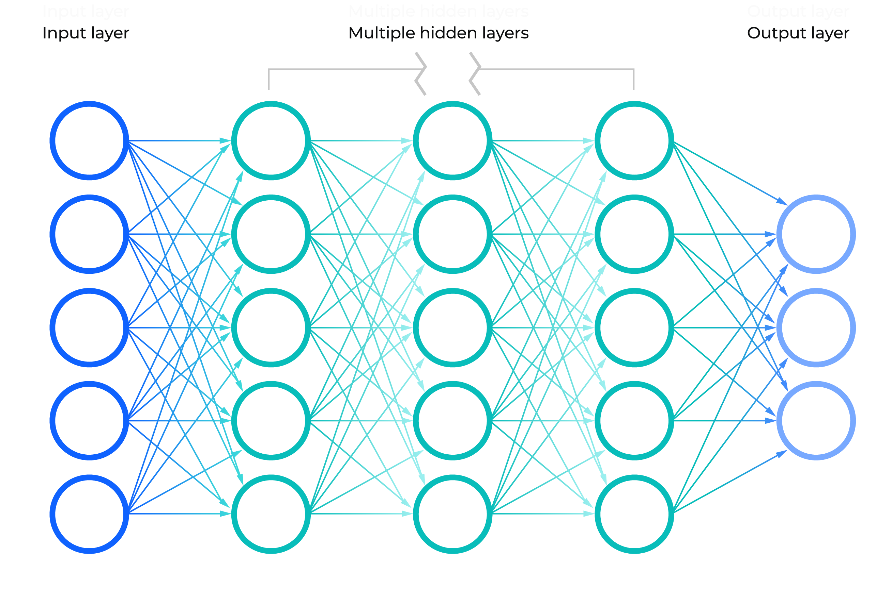

AI - the buzzword that gets more and more attention. Especially in the last months. If you're even slightly interested in the tech industry, you most likely have heard the "ChatGPT" term here and there. According to Google Trends, interest in AI has increased at least threefold in 2023. The "chatgpt" keyword had a massive increase in searches in the last 12 months - around 4000% (the biggest overall)! But I'm not boarding the hype train. I don't want to learn about ChatGPT without knowing the basics of AI. I prefer a slow and methodical approach - learning fundamentals and stacking layers of knowledge. So, I'm boarding a handcar, I guess? The AI combines multiple subjects that interest me: math, statistics, computer science, data, and philosophy. This post will briefly touch on many basic definitions and concepts related to AI. It may be the beginning of a long journey. Get in - the handcar needs two people to pump. All we have to do is to follow the damn train!

## The History of AI

The term "AI" was coined in 1956 by a computer scientist named John McCarthy. He used the words in the "Dartmouth Summer Research Project on Artificial Intelligence." The Dartmouth Conference lasted eight weeks and got a bunch of computer scientists, cognitive psychologists, and mathematicians to join forces. The scientists that participated in the conference developed many theories that are the basis for AI. Since then, the field has been constantly evolving.

However, scientists at the Dartmouth Conference seriously underestimated how much data and computing power an AI would need to solve complex problems. The AI revolution didn't begin with a single event, idea, or invention. We got to where we are today with many small decisions and two significant developments in computing:

1. An enormous increase in computing power
2. Development of the Internet and social media

<Callout variant="info">

**Moore's Law** - an observation that the number of transistors on a microchip roughly doubles every two years, whereas its cost halved over that same timeframe.

</Callout>

## Data, tons of data

The number of transistors wouldn't be helpful without tons of data. AI doesn't know anything after creation - just like a baby. But similarly to a baby, it has the potential to learn stuff. Right after birth, the baby experiences various stimuli: sounds, images, smells, etc. With time and experience, the baby, for example, learns that sticking a Lego brick inside a nose is not a good idea. With more experience, the kid has more opportunities to learn something.

AI can also learn but using data. The more examples it has, the more chances it has to find patterns between them. And such an AI model can use these patterns to predict something. But what are those examples? Data is a non-processed fact about, well, anything. It can be a spreadsheet with cardiological data, a series of images, or audio recordings.

The more numerous dataset, the better. But we shouldn't sacrifice quality in the name of quantity. The quality of data is as important as the size of the data.

> Garbage in, garbage out.

## What is Artificial Intelligence?

What exactly is AI? I was tap dancing around the subject because it's an ambiguous term, and there may not be one correct definition. Mentioned John McCarthy offers the following explanation in his 2004 [paper](https://www-formal.stanford.edu/jmc/whatisai.pdf):

> It is the science and engineering of making intelligent machines, especially intelligent computer programs. It is related to the similar task of using computers to understand human intelligence, but AI does not have to confine itself to methods that are biologically observable.

"[Artificial Intelligence: A Modern Approach](https://aima.cs.berkeley.edu/)" is a widely adopted textbook in the study of AI. Authors - Stuart Russell and Peter Norving - present four potential definitions of AI based on the similarities to humans, thinking, and acting. That gives four possibilities:

|          | Human                          | Ideal                         |
| -------- | ------------------------------ | ----------------------------- |
| Thinking | Systems that think like humans | Systems that think rationally |
| Acting   | Systems that act like humans   | Systems that act rationally   |

We could put the famous Alan Turing test in the "systems that act like humans" category.

<Callout variant="info">

**The Turing test** - originally called the imitation game in his 1950 [Computing Machinery and Intelligence](https://redirect.cs.umbc.edu/courses/471/papers/turing.pdf) paper. It’s a test to determine whether a computer can "think." A remote human interrogator, within a fixed time, must distinguish between a computer and a human subject based on their replies to various questions posed by the interrogator. A computer succeeds at "thinking" if the interrogator misidentifies it as a human subject.

</Callout>

So, with all the context, we know that Artificial Intelligence is a subfield of computer science. It's a system that acts like humans. It's human intelligence exhibited by machines. A machine is said to have artificial intelligence if it can interpret data, potentially learn from it, and use that knowledge to adapt and achieve specific goals.

## Narrow AI

Narrow AI, also called Weak AI or Artificial Narrow Intelligence (ANI), is AI trained to solve problems in a specific context or field. It's a type of AI that surrounds us today. You probably have one example in front of your eyes - Siri, Google Assistant, or Cortana. Those virtual assistants use speech recognition and deep neural networks to help you control your device. Identifying objects in images is another example of narrow AI. However, such systems cannot solve problems in other contexts. Siri can't help you identify kittens in photos.

## General AI

General AI, Strong AI, or Artificial General Intelligence (AGI), is a theoretical form of AI where a machine would have an intelligence equal to humans. We can learn from different experiences, interactions with the world and use the knowledge from one field in others. Human intelligence also means memory, planning, and consciousness. It may be a bummer for some AI enthusiasts, but we are far from it (at least for now).

## Superintelligence?

Artificial Super Intelligence (ASI) would surpass the intelligence and ability of the human brain. Some catastrophists warn before evil AI and machines that will dominate the world and wipe out the human race. But, in the near (or even wide) future, it's hard to imagine another T-1000 marauding around the streets of a post-apocalyptic world. For now, superintelligence is in the realm of philosophy, speculations, and sci-fi movies like 2001: A Space Odyssey.

## Data Science

Data Science combines math, statistics, programming, analytics, AI, and machine learning. The main goal of a data scientist is analyzing data and uncovering actionable insights hidden in data. Organizations can use these insights to guide decision-making and strategic planning. The role of a data science and machine learning expert are overlapping.

## Machine Learning

Machine learning is a subfield of AI and a component of data science. The name explains what we want to achieve - machines that can learn. It's a science of getting computers to act without being explicitly programmed. The focus is to use data and algorithms to imitate how humans learn. We learn gradually with time and experience. Machine learning models gradually improve their accuracy with time and more data. There are some types of this learning.

### Supervised Learning

In this type of learning, you have data and labels. A label provides context for data. For example, it can indicate whether a photo contains a chihuahua or a muffin (those comparisons can be tricky!). It's called "supervised" because there is a supervisor - a human who knows the correct answers. A machine learning algorithm tries to use the data to predict a label. If the algorithm is wrong, the supervisor points out mistakes. The learning process is similar to a school, where teachers correct students.

#### Classification

Mentioned chihuahua or muffin problem is an example of classification. Classification involves predicting if an object is one thing or another. Such an algorithm tries to match objects and preset categories. Our problem has two options, so it's a binary classification. But, of course, you're not limited to that. A problem with more than two options is called multi-class classification.

#### Regression

Regression is another type of supervised learning. This method uses an algorithm to understand the relationship between dependent and independent variables. Regression helps predict a number based on different data points. For example, we can use it to predict the price of a house given its features.

### Unsupervised Learning

In this type of learning, there is data but no labels. However, there are still patterns hidden in the data. It's called "unsupervised" because there is no need for human supervision. Unsupervised learning uses algorithms to analyze and cluster unlabeled data sets.

#### Clustering

Clustering (or cluster analysis) is a technique of grouping unlabeled data based on their similarities and differences. Data points in one group (cluster) are more similar to each other than to other groups. This technique can be used, for example, in image compression.

#### Association

The association is another type of unsupervised learning. It's a rule-based method of finding relationships between variables in datasets. You've probably experienced this type of learning recently because recommendation engines (like YouTube recommendations algorithm) use it.

### Transfer Learning

Usually, we train one ML model for a specific task X. For task Y we train another model. But it can be expensive. The learning process requires tons of data and millions of calculations. Transfer learning can help with that. Instead of learning everything from scratch, it can use existing knowledge. It's a method of starting with a pre-trained model and training it for a new but related problem. For example, if we have a model that recognizes chihuahuas, that knowledge could help us learn how to identify dogs.

### Reinforcement Learning

This type of learning is less common and has fewer practical applications. But, man - it's cool to watch. YouTube algorithm recommended me this video of [AI learning to walk](https://www.youtube.com/watch?v=L_4BPjLBF4E). The author created a simple game in Unity where you can control a box-shaped robot named Albert. Albert, in this video, is controlled entirely by an ML algorithm. The algorithm learns "how to walk" by trial and error using feedback from its actions and experiences - a basis for reinforcement learning. Reinforcement learning uses rewards and punishments as signals for positive and negative behavior. The goal is to maximize the total cumulative reward by finding a suitable action model.

## Neural Network

A Neural Network is a method of implementing machine learning. The human brain was the inspiration for this method. The brain is composed of billions of neurons. Neurons communicate with each other using synapses and axons. An artificial neural network contains multiple layers: an input layer, hidden layers, and an output layer. Each layer is composed of nodes - artificial neurons. Nodes are connected and have associated weights and thresholds. If the output of any individual node is above the specified threshold value, the node is activated, sending data to the next layer of the network. Otherwise, the node doesn't pass data along.

<Callout variant="info">

**Perceptron** is the simplest form of neural network - a single-layer neural network. It's an artificial neuron that uses the Heaviside step function as the activation function. In supervised learning, the perceptron is an algorithm for binary classification. An American psychologist - Frank Rosenblatt - implemented the first perceptron program in 1957. Back then, the perceptron looked promising, but scientists couldn't train it to recognize many classes of patterns. However, it was a good start for neural networks with more layers and greater processing power - multilayer perceptrons.

</Callout>

### Deep Learning

Deep learning is a subset of machine learning - more specifically, of neural networks. It's a more complex form of neural network - essentially a neural network with multiple layers. The "deep" refers to the depth of layers in the neural network. While a simpler neural network can make approximate predictions, additional hidden layers can optimize and refine its accuracy (sometimes exceeding human-level performance). Deep learning is gaining more and more applications like mentioned assistants, image analysis, or self-driving cars.

If you want a deeper understanding (I'm a master of smooth segues) of certain concepts or need more context, check the below links.

- [Artificial Intelligence](https://www.ibm.com/topics/artificial-intelligence)
- [Computing Machinery and Intelligence](https://redirect.cs.umbc.edu/courses/471/papers/turing.pdf)
- [What is Artificial Intelligence?](https://www-formal.stanford.edu/jmc/whatisai.pdf)
- [Artificial Intelligence: A Modern Approach](https://aima.cs.berkeley.edu/)
- [The Turing Test](https://plato.stanford.edu/entries/turing-test/)
- [Moore's law](https://www.britannica.com/technology/Moores-law)
- [Machine Learning](https://www.ibm.com/topics/machine-learning)
- [Data Science](https://www.ibm.com/topics/data-science)
- [Transfer Learning](https://developer.ibm.com/articles/transfer-learning-for-deep-learning/)
- [Reinforcement Learning](https://towardsdatascience.com/reinforcement-learning-101-e24b50e1d292)
- [Neural Networks](https://www.ibm.com/topics/neural-networks)
- [Deep Learning](https://www.ibm.com/topics/deep-learning)
- [Grokking Artificial Intelligence Algorithms](https://www.goodreads.com/book/show/58672072-grokking-artificial-intelligence-algorithms)
- [Crash Course Artificial Intelligence](https://www.youtube.com/playlist?list=PL8dPuuaLjXtO65LeD2p4_Sb5XQ51par_b)

Oh, and this post wasn't generated using ChatGPT. Or was it?
