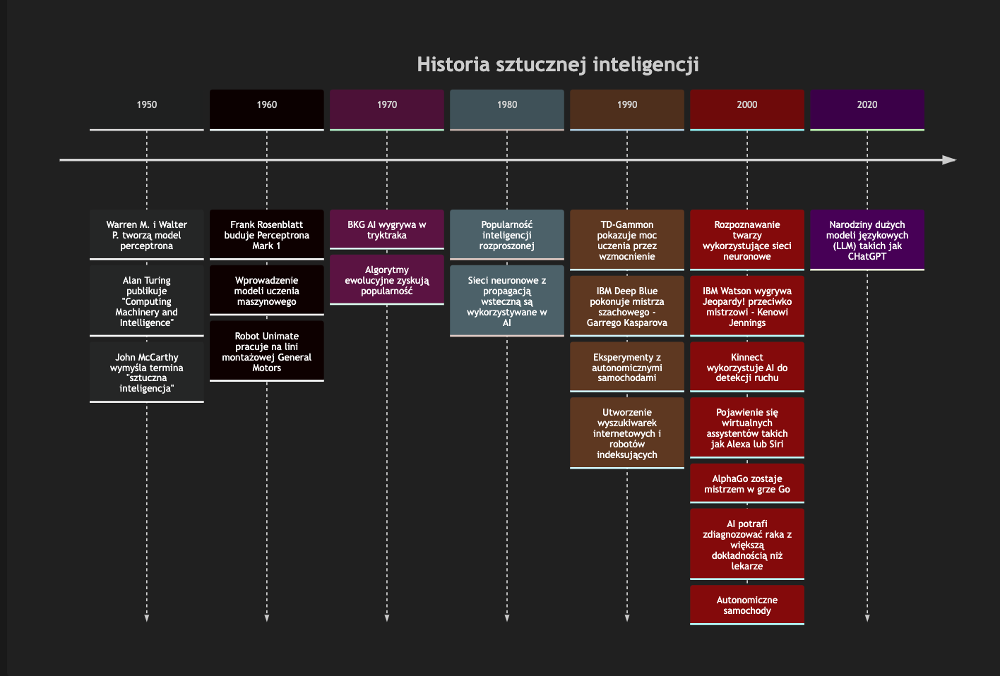
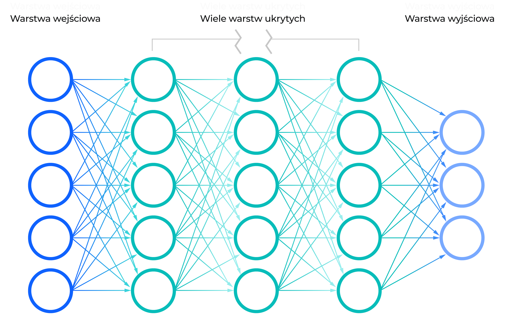

AI - modne słowo, które otrzymuje coraz więcej atencji. Szczególnie w ostatnich kilku miesiącach. Jeżeli choć w małym stopniu interesujesz się branżą technologiczną, najprawdopodobniej obił ci się o uszy termin "ChatGPT". Według Google Trends zainteresowanie AI wzrosło trzykrotnie w 2023 roku. Słowo kluczowe "chatgpt" uzyskało ogromny przyrost popularności w ciągu ostatnich 12 miesięcy - około 4000% (największy w ogóle)! Ale nie wsiadam na ten hype train. Nie chcę uczyć się o ChatGPT nie znając podstaw AI. Preferuję wolne i metodyczne podejście - naukę fundamentów i gromadzenie kolejnych warstw wiedzy. Zatem wsiadam chyba na… drezynę? AI łączy wiele interesujących mnie tematów: matematykę, statystykę, informatykę, dane czy nawet filozofię. Ten post pobieżnie dotknie wielu podstawowych definicji i konceptów związanych z AI. Być może będzie to początek długiej wyprawy. Wskakuj - drezyna potrzebuje dwóch ludzi do pompowania. Wszystko co musimy zrobić, to podążać za tym cholernym pociągiem!

## Historia AI

Termin "AI" został wymyślony w 1956 roku przez informatyka o imieniu John McCarthy. Użył on tego terminu w nazwie konferencji - "Dartmouth Summer Research Project on Artificial Intelligence". Konferencja w Dartmouth trwała osiem tygodni i była przystanią dla bandy informatyków, psychologów kognitywnych i matematyków. Naukowcy, którzy uczestniczyli w konferencji rozwinęli wiele teorii, które są podstawą AI. Od tamtej pory, obszar ten się cały czas rozwija.

Jednakże naukowcy z konferencji Dartmouth poważnie nie docenili jak wiele danych i mocy obliczeniowej AI będzie potrzebowało do rozwiązywania złożonych problemów. Rewolucji AI nie rozpoczęło pojedyncze wydarzenie, pomysł czy wynalazek. Dotarliśmy tu, gdzie jesteśmy za sprawą wielu małych decyzji i dwóch, znaczących usprawnień w przetwarzaniu danych:

1. Ogromny wzrost mocy obliczeniowej
2. Rozwój Internetu i mediów społecznościowych

<Callout variant="info">

**Prawo Moore'a** - obserwacja mówiąca, że liczba tranzystorów na procesorze podwaja się mniej więcej co dwa lata, przy jednoczesnym obniżeniu kosztów o połowę.

</Callout>

## Dane, tony danych

Liczba tranzystorów nie dała by zbyt wiele bez masy danych. AI zaraz po utworzeniu nic nie wie - podobnie do dziecka. Jednocześnie podobnie do dziecka, ma potencjał, żeby uczyć się rzeczy. Zaraz po urodzeniu, dziecko doświadcza wielu różnorodnych bodźców: dźwięków, obrazów, zapachów itp. Z czasem i doświadczeniem, dziecko uczy się na przykład, że wkładanie sobie klocka Lego do nosa nie jest dobrym pomysłem. Z kolejnymi doświadczeniami, dzieciak ma więcej okazji, żeby nauczyć się czegoś.

AI również się uczy, ale wykorzystując dane. Im więcej przykładów ma, tym większe szanse, że znajdzie zależności pomiędzy nimi. AI może wykorzystać te wzorce do predykcji różnych rzeczy. Ale czym są te przykłady? Dane to nieprzetworzone fakty o, hmm, wszystkim. Może to być arkusz kalkulacyjny z danymi kardiologicznymi, zbiór zdjęć albo nagrania audio.

Im liczniejszy zbiór danych, tym lepiej. Ale nie powinniśmy poświęcać jakości danych na rzecz ich ilości. Jakość danych jest równie istotna co ich wielkość.

> Śmieci na wejściu, śmieci na wyjściu.

## Co to jest sztuczna inteligencja?

Czym właściwie jest AI? Stepowałem wokół tematu, ponieważ jest to niejednoznaczny termin i być może nie ma jednej, właściwej definicji. Wspomniany John McCarthy oferuje następujące wyjaśnienie w swojej [pracy](https://www-formal.stanford.edu/jmc/whatisai.pdf) z 2004 roku:

> Jest to nauka i inżynieria tworzenia inteligentnych maszyn, w szczególności inteligentnych programów komputerowych. Wiąże się to z podobnym zadaniem wykorzystania komputerów do zrozumienia ludzkiej inteligencji, ale sztuczna inteligencja nie musi ograniczać się do metod, które są biologicznie obserwowalne.

"[Artificial Intelligence: A Modern Approach](https://aima.cs.berkeley.edu/)" jest szeroko zaadaptowanym podręcznikiem do nauki AI. Autorzy - Stuart Russell i Peter Norving - prezentują cztery, potencjalne definicje AI bazujące na podobieństwach do ludzi, myśleniu i działaniu. To daje cztery możliwości.

|           | Ludzkie                            | Idealne                             |
| --------- | ---------------------------------- | ----------------------------------- |
| Myślenie  | Systemy, które myślą jak ludzie    | Systemy, które myślą racjonalnie    |
| Działanie | Systemy, które działają jak ludzie | Systemy, które działają racjonalnie |

Moglibyśmy umieścić sławny test Alana Turinga w kategorii "systemów, które działają jak ludzie".

<Callout variant="info">

**Test Turinga** - oryginalnie nazwany "grą w imitacje" w jego pracy z 1950 roku - [Computing Machinery and Intelligence](https://redirect.cs.umbc.edu/courses/471/papers/turing.pdf). Jest to test determinujący, czy komputer potrafi "myśleć". Zdalny, ludzki przesłuchujący, w skończonym czasie, musi odróżnić komputer od człowieka na podstawie odpowiedzi na różne pytania, zadane przez przesłuchującego. Komputerowi udaje się "myśleć", jeżeli przesłuchujący myli go z człowiekiem.

</Callout>

Mając cały ten kontekst, wiemy, że sztuczna inteligencja jest częścią informatyki. Jest to system, który działa jak człowiek. Jest to ludzka inteligencja eksponowana przez maszyny. Maszyna ma sztuczną inteligencję, jeżeli potrafi interpretować dane, potencjalnie uczyć się z nich i używać tej wiedzy do adaptacji i osiągania konkretnych celów.

## Wąskie AI

Wąskie AI, zwane także słabym AI lub Wąską Sztuczną Inteligencją (ANI), to AI wytrenowane do rozwiązywania problemów w konkretnym kontekście lub polu. Jest to typ AI, który otacza nas na co dzień. Prawdopodobnie masz jeden przykład przed oczami - Siri, Asystenta Google lub Cortane. Ci wirtualni asystenci wykorzystują rozpoznawanie mowy i głębokie sieci neuronowe, aby pomóc ci kontrolować twoje urządzenie. Rozpoznawanie obiektów na zdjęciach to inny przykład wąskiego AI. Jednakże takie systemy nie potrafią rozwiązywać złożonych problemów w innych kontekstach. Siri nie pomoże ci rozpoznać kotków na zdjęciach.

## Ogólne AI

Ogólne AI, silne AI lub Silna Sztuczna Inteligencja (AGI), jest teoretyczną formą AI, gdzie maszyna miałaby inteligencję porównywalną z ludzką. Jesteśmy w stanie uczyć się z różnych doświadczeń, interakcji ze światem i używać wiedzy z jednej dziedziny w innej. Ludzka inteligencja znaczy także pamięć, planowanie i samoświadomość. Będzie to może rozczarowujące dla niektórych entuzjastów AI, ale jesteśmy bardzo daleko od ogólnego AI (przynajmniej na razie).

## Superinteligencja?

Super Sztuczna Inteligencja (ASI) przewyższałaby inteligencję i możliwości ludzkiego mózgu. Niektórzy katastrofiści ostrzegają przed złym AI i maszynami, które zdominują świat i zmiotą rasę ludzką z powierzchni ziemi. Ale w niedalekiej (lub nawet dalekiej) przyszłości trudno jest sobie wyobrazić kolejnego T-1000 grasującego po ulicach postapokaliptycznego świata. Na razie, superinteligencja pozostaje w sferze filozofii, spekulacji i filmów sci-fi takich jak 2001: Odyseja kosmiczna.

## Data science

Danetyka (lub danologia. Tak, to są polskie odpowiedniki, które znalazłem) łączy matematykę, statystykę, programowanie, analitykę, AI i uczenie maszynowe. Głównym celem naukowca zajmującego się tą dziedziną jest analiza danych i odkrywanie praktycznych spostrzeżeń ukrytych w danych. Organizacje mogą wykorzystać te spostrzeżenia, aby kierować podejmowaniem decyzji i strategicznym planowaniem. Role eksperta od danych i uczenia maszynowego często się pokrywają.

## Uczenie maszynowe

Uczenie maszynowe to część AI i komponent data science. Nazwa wyjaśnia co chcemy osiągnąć - maszyny, które mogą się uczyć. Jest to nauka o sprawianiu, aby komputery działały bez wyraźnego programowania. Nacisk kładziony jest na wykorzystanie danych i algorytmów, aby imitować ludzkie uczenie się. Uczymy się stopniowo z czasem i doświadczeniem. Modele uczenia maszynowego stopniowo poprawiają swoją dokładność z czasem i większą ilością danych. Istnieje kilka typów tego uczenia.

### Uczenie nadzorowane

W tym typie uczenia, mamy dane i etykiety. Etykieta dostarcza kontekstu dla danych. Np. wskazuje czy zdjęcie zawiera psa chihuahua, czy muffina (te porównania potrafią być zdradliwe!). W nazwie mamy "nadzorowane", ponieważ istnieje nadzorca - człowiek, który zna poprawne odpowiedzi. Algorytm uczenia maszynowego próbuje używać danych, aby przewidzieć etykietę. Jeżeli algorytm się myli, nadzorca wytyka błędy. Ten proces nauki jest podobny do szkoły, gdzie nauczyciel poprawia ucznia.

#### Klasyfikacja

Wspomniany problem, "chihuahua czy muffin", jest przykładem klasyfikacji. Klasyfikacja obejmuje przewidywanie czy obiekt jest jedną rzeczą czy inną. Nasz problem ma dwie opcje, wiec jest to klasyfikacja binarna. Oczywiście nie jesteś ograniczony do tego. Problem z większą ilością opcji nazwany jest klasyfikacją wieloklasową.

#### Regresja

Regresja jest kolejnym typem uczenia nadzorowanego. Ta metoda wykorzystuje algorytmy do zrozumienia relacji pomiędzy niezależnymi i zależnymi zmiennymi. Regresja pomaga przewidzieć numer na podstawie różnych punktów danych. Np. możemy wykorzystać ją do przewidywania cen domu na podstawie jego cech.

### Uczenie nienadzorowane

W tym typie uczenia mamy dane, ale bez etykiet. Jednakże, w danych, nadal istnieją ukryte wzorce. W nazwie mamy "nienadzorowane", ponieważ nie potrzebujemy ludzkiego nadzorcy. Uczenie nienadzorowane wykorzystuje algorytmy do analizowania i klastrowania danych bez etykiet.

#### Klastrowanie

Klastrowanie (lub analiza skupień) to technika grupowania nieoznakowanych danych na podstawie ich podobieństw i różnic. Punkty danych w jednej grupie (klastrze) są bardziej podobne do siebie, niż do innych grup. Ta technika może być wykorzystana np. w kompresji zdjęć.

#### Asocjacja

Asocjacja jest kolejnym typem uczenia nienadzorowanego. Jest to metoda znajdowania relacji pomiędzy zmiennymi, w zbiorach danych, na bazie zasad. Prawdopodobnie doświadczyłeś tego typu uczenia, ponieważ silniki rekomendacji (jak ten od YouTube) wykorzystuje go.

### Transfer wiedzy

Zwykle trenujemy jeden model uczenia maszynowego dla zdania X. Dla zadania Y trenujemy inny model. Ale potrafi to być kosztowne. Proces uczenia wymaga mnóstwa danych i milionów kalkulacji. Transfer wiedzy może się przydać w takim wypadku. Zamiast uczenia się wszystkiego od początku, możemy wykorzystać istniejącą wiedzę. Jest to metoda zaczynania z wstępnie przeszkolonym modelem i trenowania go do nowego, ale powiązanego problemu. Na przykład, jeżeli mamy model rozpoznający psy chihuahua, to ta wiedza może pomóc nam w identyfikacji psów w ogóle.

## Uczenie przez wzmacnianie

Ten typ uczenia jest mniej powszechny i ma mniej praktycznych aplikacji. Ale jak fajnie się go ogląda! Algorytm YouTube'a polecił mi to wideo o [AI uczącym się chodzić](https://www.youtube.com/watch?v=L_4BPjLBF4E). Autor stworzył prostą grę w Unity, gdzie możesz kontrolować robota w kształcie pudełka o imieniu Albert. Albert, w tym wideo, jest kontrolowany całkowicie przez algorytm uczenia maszynowego. Algorytm uczy się "jak chodzić" metodą prób i błędów, wykorzystując informacje zwrotne ze swoich akcji i doświadczeń - podstawa uczenia przez wzmacnianie. Uczenie przez wzmacnianie wykorzystuje nagrody i kary jako sygnały pozytywnego i negatywnego zachowania. Celem jest zmaksymalizowanie ogólnej nagrody przez znalezienie odpowiedniego modelu działania.

## Sieci neuronowe

Sieć neuronowa to metoda implementacji uczenia maszynowego. Ludzki mózg posłużył jako inspiracja dla tej metody. Mózg jest złożony z miliardów neuronów. Neurony komunikują się ze sobą wykorzystując synapsy i aksony. Sztuczna sieć neuronowa zawiera wiele warstw: warstę wejściową, warstwy ukryte i warstwę wyjściową. Każda warstwa złożona jest z węzłów - sztucznych neuronów. Węzły są połączone, a także mają przyporządkowane wagi i progi. Jeżeli wyjście pojedynczego węzła jest powyżej ustalonej wartości progu, węzeł jest aktywowany, wysyłając dane do następnej warstwy sieci. W innym wypadku, węzeł nie przesyła danych.

<Callout variant="info">

**Perceptron** to najprostsza forma sieci neuronowej - jednowarstwowa sieć neuronowa. Jest to sztuczny neuron, który wykorzystuje funkcję skokową Heaviside'a jako funkcję aktywacji. W uczeniu nadzorowanym, perceptron to algorytm binarnej klasyfikacji. Amerykański psycholog - Frank Rosenblatt - zaimplementował pierwszy perceptronowy program w 1957 roku. Wówczas perceptrony wyglądały obiecująco, ale naukowcy nie mogli wykorzystać ich do rozpoznawania wielu klas wzorców. Jednakże był to dobry początek dla sieci neuronowych z większą ilością warstw i większą mocą przetwarzania - wielowarstwowych perceptronów.

</Callout>

### Uczenie głębokie

Uczenie głębokie to podzbiór uczenia maszynowego - bardziej konkretnie, sieci neuronowych. Jest to bardziej złożona forma sieci neuronowych - sieci z wieloma warstwami. Słowo "głębokie" odnosi się do głębokości warstw w sieci neuronowej. Podczas gdy prosta sieć neuronowa może dokonywać przybliżonych prognoz, dodatkowe, ukryte warstwy mogą zoptymalizować i udoskonalić jej dokładność (czasami przewyższając ludzkie możliwości). Uczenie głębokie ma coraz więcej zastosowań, takich jak wspomnieni asystenci, analiza zdjęć czy autonomiczne samochody.

Jeżeli chcesz głębszego zrozumienia (jestem mistrzem gładkich przejść) poszczególnych konceptów lub potrzebujesz więcej kontekstu, sprawdź poniższe linki.

- [Artificial Intelligence](https://www.ibm.com/topics/artificial-intelligence)
- [Computing Machinery and Intelligence](https://redirect.cs.umbc.edu/courses/471/papers/turing.pdf)
- [What is Artificial Intelligence?](https://www-formal.stanford.edu/jmc/whatisai.pdf)
- [Artificial Intelligence: A Modern Approach](https://aima.cs.berkeley.edu/)
- [The Turing Test](https://plato.stanford.edu/entries/turing-test/)
- [Moore's law](https://www.britannica.com/technology/Moores-law)
- [Machine Learning](https://www.ibm.com/topics/machine-learning)
- [Data Science](https://www.ibm.com/topics/data-science)
- [Transfer Learning](https://developer.ibm.com/articles/transfer-learning-for-deep-learning/)
- [Reinforcement Learning](https://towardsdatascience.com/reinforcement-learning-101-e24b50e1d292)
- [Neural Networks](https://www.ibm.com/topics/neural-networks)
- [Deep Learning](https://www.ibm.com/topics/deep-learning)
- [Algorytmy sztucznej inteligencji. Ilustrowany przewodnik](https://lubimyczytac.pl/ksiazka/4966351/algorytmy-sztucznej-inteligencji-ilustrowany-przewodnik)
- [Crash Course Artificial Intelligence](https://www.youtube.com/playlist?list=PL8dPuuaLjXtO65LeD2p4_Sb5XQ51par_b)

Aha, i ten post nie został wygenerowany przez ChatGPT. A może został?
