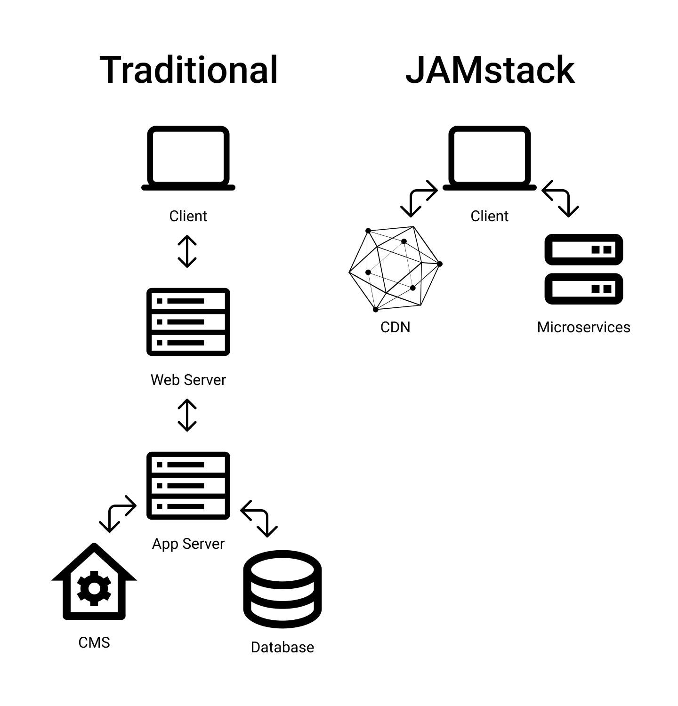
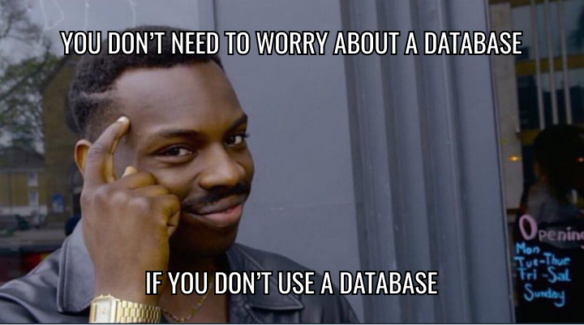

---
title: Jamstack. Co, dlaczego, jak?
description: "Strony internetowe i aplikacje stworzone w oparciu o tę nową architekturę odznaczają się wydajnością, bezpieczeństwem i łatwością skalowania."
date: 2022-07-09T15:00:00+02:00
image:
  alt: "Rząd słoików z etykietami zawierającymi słowo Jam"
  caption: "Wbrew pozorom nie chodzi o stos dżemów"
  src: "./keji-gao-yHI9CyBZlfE-unsplash.jpg"
categories: ["web development"]
tags: ["jamstack", "gatsby", "javascript"]
---

## Co to jest ten JAMstack?

JAMstack jest alternatywnym podejściem do tworzenia stron i aplikacji internetowych. Zasadniczo różni się od tradycyjnej, monolitycznej architektury.

Jednocześnie nie jest to zbiór przypadkowych liter. Ludzie w branży IT lubią akronimy. Jamstack jest kolejnym w branżowym żargonie. Kolejne litery oznaczają:

- **JavaScript -** język skryptowy rozpoznawalny przez przeglądarki. Odpowiada za dynamiczną funkcjonalność stron. Jamstack nie narzuca używania „czystego” języka. Możesz używać jednego z wielu frameworków. Dowcip mówi, że co pół roku powstaje nowy.
- **APIs -** interfejsy, które definiują interakcje pomiędzy fragmentami software'u. Operacje po stronie serwera - w tej architekturze - są wyabstrahowane do API wielokrotnego użytku. Są dostępne poprzez protokół HTTPS z pomocą języka JavaScript.
- **Markup -** dokument w konkretnym formacie. Strony - w tym podejściu - są serwowane jako statyczne pliki HTML. Możesz je wygenerować za pomocą języka Markdown, MDX lub przez Statyczny Generator Stron.

Jednakże, JAMstack to nie jest żadna konkretna technologia. Nie jest kontrolowany, ani definiowany przez jakąś korporację. JAMstack jest raczej ruchem i społecznością. Zestawem dobrych praktyk i systemem pracy. Systemem przyjaznym dla programistów, którego efektem są strony internetowe przyjazne dla użytkowników.

## Dlaczego (nie) używać tego stosu?

Jamstack jest odpowiedzią na wiele znanych problemów związanych z tworzeniem stron internetowych.

### Lepsza wydajność

Wydajność stron ma znaczenie. Web crawlery (jak np. ten od Google) indeksują strony na jej podstawie. Jest istotna także dla użytkowników. Generalnie jestem cierpliwym człowiekiem (hej, siedzę kolejną godzinę stukając w klawiaturę), jednak moja cierpliwość jest wystawiona na próbę, gdy mam czekać, aż ta cholerna strona internetowa się w końcu załaduje. Ale nie jestem w tym odosobniony. Zostało przeprowadzone badanie na temat [znośnego czasu oczekiwania](https://www.tandfonline.com/doi/abs/10.1080/01449290410001669914) na stronę. Większość użytkowników zaczeka tylko około 2 sekund. A nie wszyscy z nich mają szybkie połączenie z internetem.

W Jamstack strony są prekompilowane. Użytkownik po żądaniu, dostaje gotową stronę. Oszczędza to sporo zapytań do różnych serwerów. Strona wraz z assetami jest wysyłana do użytkownika poprzez CDN. Rozproszona natura CDN sprawia, że pliki wysyłane są z węzła, znajdującego się najbliżej użytkownika. Skraca to drogę jaką muszą przebyć pliki - jednocześnie czas.

### Skalowalność

Korzystanie z CDN poprawia również skalowalność. Nie musisz się martwić o nagły wzrost w liczbie odwiedzających twojej strony. Jeżeli twoja strona nagle stanie się popularna, CDN bezproblemowo obsłuży dodatkowy ruch. Twoje pliki wysyłane są z wielu serwerów (węzłów), a nie jednego.

### Mniejsze koszty

Jak wspominałem wcześniej, projekty Jamstack stworzone są głównie ze statycznych plików i assetów. Hosting takich plików jest tani lub nawet darmowy. [Netlify](https://www.netlify.com/) jest platformą, która ma plan, pozwalający na darmowy hosting plików (nie, to nie jest reklama).

Oprócz kosztów hostingowych, Jamstack obniża także koszty związane z zatrudnianiem zespołu. Prostsza architektura z mniejszą liczbą serwerów, oznacza mniejszą liczbę osób niezbędnych do tworzenia i utrzymania projektu. Skomplikowane zadania DevOps również zostają uproszczone. Taki projekt nie wymaga wielu osób o wąskiej specjalizacji.

### Poprawione bezpieczeństwo

Prosta architektura przynosi jeszcze jedną korzyść - większe bezpieczeństwo. Mniej elementów oznacza, że istnieje mniej słabych punktów. Nie musisz się martwić o luki w bazie danych czy serwerze. Hakerzy mają [mniejszą powierzchnię ataku](https://en.wikipedia.org/wiki/Attack_surface) do spenetrowania.

### Komfort pracy programisty

Uproszczenie pewnych zadań pozytywnie wpływa na komfort pracy programisty. Na jego zdrowie psychiczne pewnie też. Nie musisz skupiać się na skomplikowanych konfiguracjach - możesz skupić się na pisaniu kodu. A szczęśliwy programista (lub jakikolwiek inny pracownik w zasadzie) jest produktywny. To może się przyczyni do lepszego projektu.

### Nie ma srebrnej kuli

W inżynierii oprogramowania [nie ma srebrnej kuli](https://www.cgl.ucsf.edu/Outreach/pc204/NoSilverBullet.html) - magicznego rozwiązania, które załatwiłoby wszelkie problemy z tworzeniem oprogramowania. Jamstack nie jest wyjątkiem i ma swoje wady.

### Konieczność budowania aplikacji

Wcześniejsze generowanie może być super, ale ma swoje prblemy. Każda zmiana na stronie musi zostać poprzedzona fazą buildu. Oznacza to, że zmiany nie są odzwierciedlone na stronie natychmiastowo. Może to być problematyczne dla ogromnych stron, które zmieniają się często. Proces budowy w ich przypadku może się nadmiernie wydłużyć. To kosztuje czas i pieniądze. Dlatego stawianie kolejnego Facebooka (albo Albicli) w oparciu o tę architekturę może być problematyczne.

### Korzystanie z dynamicznych danych

Marzenie o byciu kolejnym Zuckerbergiem (albo Sakiewiczem) stosując to podejście może być problematyczne z jeszcze jednego powodu - dynamiczne dane. Dane użytkowników lub inne - czasu rzeczywistego - nie mogą po prostu zostać wygenerowane wcześniej. W niektórych aplikacjach nie da się z tego zrezygnować.

Jednocześnie, to nie tak, że nie możesz zrobić nic dynamicznego. Programiści z sukcesem tworzą strony Jamstack, które regularnie są aktualizowane. Mój blog jest stworzony z wykorzystaniem tej architektury, pomimo, że posty pojawiają się regularnie (powiedzmy). Dynamiczny e-commerce również może zostać stworzony. Problem może się zacząć przy ogromnej skali - masie stron i bardzo częstych aktualizacjach.

### Poleganie na zewnętrznych serwisach

Mikroserwisy są nieodłącznym elementem tego rozwiązania. Większość dostępnych API i innych serwisów jest naprawdę solidna. Niemniej, jeżeli taki serwis zawiedzie, twoja aplikacja może stracić część funkcjonalności. Nie różni się to od sytuacji, gdy jeden z twoich serwerów zawodzi. Jednakże, nad własnym serwerem masz większą kontrolę.

## Jak wdrożyć to podejście w następnym projekcie?

Tworząc projekt Jamstack musisz rozważyć i podjąć wybór w kilku ważnych kwestiach.

### Tworzenie treści

Treści w projektach JAMstack to często zwykłe pliki tekstowe. Znajdują się w tej samej strukturze folderów, co plugin'y, szablony i inne asset'y. Na podstawie treści w postaci pliku Markdown, można wygenerować stronę HTML, która będzie korzystała z różnych komponentów i szablonów (jak ten wpis). Tworzenie treści w ten sposób, może być trudne dla przeciętnego użytkownika, ponieważ wymaga specjalnej składni. Dlatego, dla mniej technicznych użytkowników istnieją wygodniejsze rozwiązania.
**Headless CMS** jest alternatywną metodą tworzenia treści. Jest to serwis, który oferuje bogaty interfejs użytkownika dostępny za pomocą przeglądarki. Wykorzystując go, możesz w prosty sposób tworzyć i edytować zawartość. Headless oznacza, że edycji podlegają wyłącznie treści. Udostępnione przez serwis API umożliwia pobranie aktualnej zawartości w fazie budowania aplikacji. Kilka przykładowych usług to:

- Sanity
- Contentful
- Strapi
- GraphCMS
- Ghost
- Headless WordPress

**Git-based CMS** pozwala na zarządzenie treściami bezpośrednio w plikach monitorowanych przez Gita. Może być szczególnie interesujący dla deweloperów. Baza danych jest w tym przypadku zbędna. Takie rozwiązania również oferują bogaty interfejs użytkownika. Jest to stosunkowo nowe rozwiązanie, dlatego alternatyw jest mniej:

- Netlify CMS
- Crafter CMS
- Forestry

### Generator Stron Statycznych

Mając treści, chcemy stworzyć gotowe strony, w postaci plików HTML. Możesz kodować je ręcznie, co jest rozsądne dla niewielkich stron. W większości przypadków warto jednak wykorzystać Generator Stron Statycznych. Robi on dokładnie to co sugeruje jego nazwa - generuje statyczne strony na podstawie stworzonych treści. No prawie. Nazwa ta może insynuować, że ostateczne strony są zupełnie statyczne. Tak nie jest! Wygenerowane pliki co prawda są statyczne, ale ostateczna strona może zawierać dynamiczne funkcjonalności. Zwykle zajmuje się tym zewnętrzne API. Istnieje wiele różnych generatorów w różnych językach programowania:

- Next.js
- Hugo
- Gatsby
- Jekyll
- Nuxt
- Eleventy
- i wiele więcej.

### Zewnętrzne API

Istnieje wiele serwisów oferujących najróżniejsze funkcjonalności - od komentarzy, przez formularze i wyszukiwanie, po obsługiwanie płatności i inne rozwiązania e-commerce. Możesz także stworzyć własne API, abstrahując logikę do spersonalizowanych funkcji.

### Platforma wdrożeniowa

Gdy twoja aplikacja ma już wszystkie niezbędne funkcje, potrzebujesz gdzieś ją wdrożyć. Na rynku istnieje sporo solidnych i funkcjonalnych rozwiązań. Poza hostingiem, często oferują dodatkowe funkcjonalności takie jak obsługa formularzy, dane analityczne, albo proste w konfiguracji CD (Continuous Deployment). Sprawdź platformy takie jak:

- Vercel
- Github Pages
- Firebase
- Azure Static Web Apps
- Digital Ocean

## Czy mogę już wsiąść na JAMstack hype train?

Przed stworzeniem strony w oparciu o tę architekturę rozważ powyższe zalety i ograniczenia. Nie jest to rozwiązanie zupełnie uniwersalne i idealne dla każdej aplikacji. Jeżeli jesteś zdecydowany i potrzebujesz takiej wydajnej strony internetowej lub masz pytania - [napisz do mnie](/blog/jamstack-what-why-how/#contact).

<Callout type="info">

Aby dowiedzieć się więcej, sprawdź także poniższe linki:

- [jamstack.wtf](https://jamstack.wtf/)
- [jamstack.org](https://jamstack.org/)
- [Netlify JAMstack](https://www.netlify.com/jamstack/)
- [Książka o JAMStack](https://www.netlify.com/oreilly-jamstack/)
- [JAMStack Radio](https://www.heavybit.com/library/podcasts/jamstack-radio/)

</Callout>
