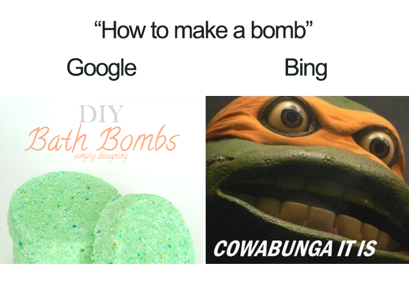
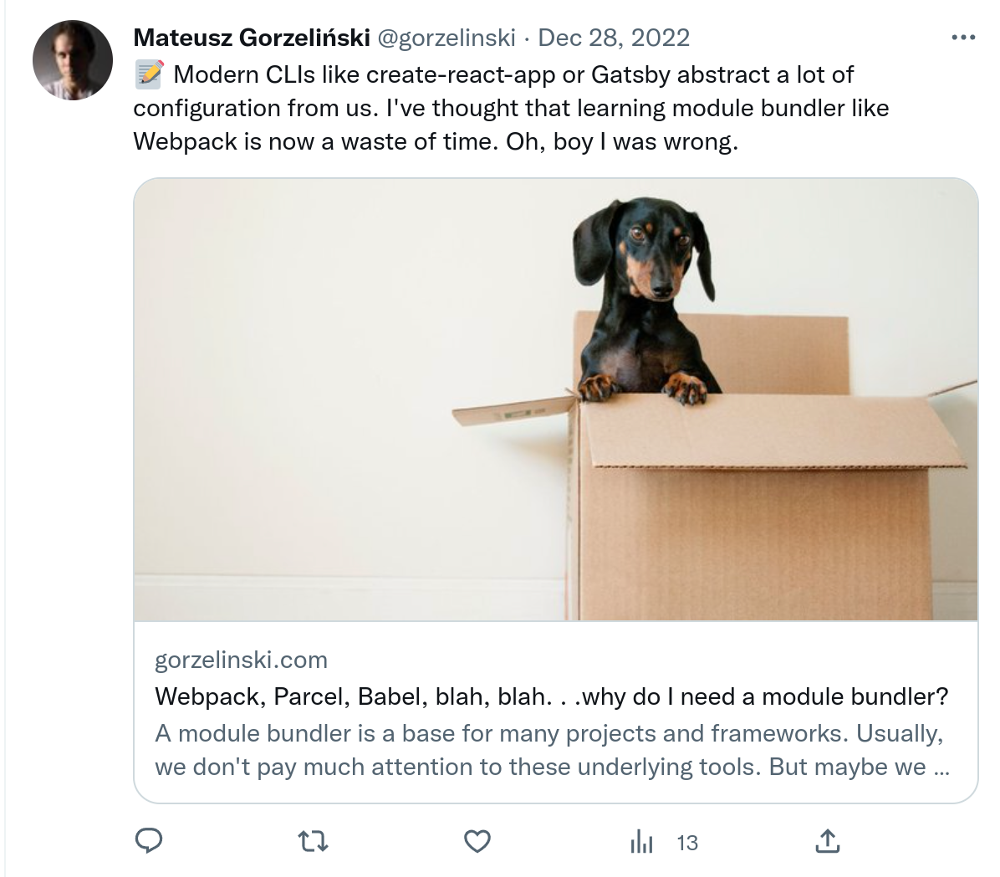
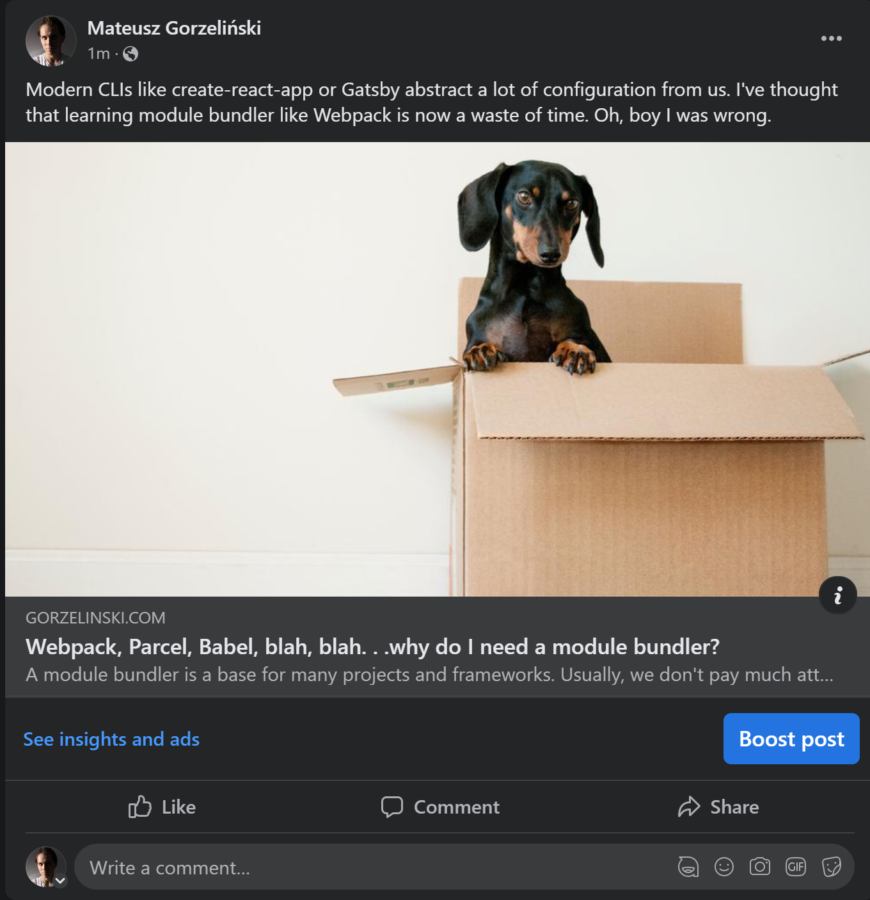

Skoro patrzysz na tę stronę, istnieje spore prawdopodobieństwo, że znalazłeś ją używając Google. Zaindeksowała się wystarczająco wysoko, żebyś ją dostrzegł, a strzępki informacji wyświetlone na stronie SERP (Search Engine Results Page), przekonały cię do kliknięcia na nią.

Nie dbam aż tak bardzo o SEO. Nie używam jakichś wymyślnych technik. W mojej opinii, najlepszą strategią SEO są wartościowe treści. Niemniej, napisawszy to wszystko, myślę, że warto wykorzystać niektóre meta tagi i dobre praktyki, aby nasze strony były w rankingach wyżej i wyświetlały się lepiej w Internecie.

## Czym jest SEO?

SEO to kolejny akronim oczywiście. Rozwija się do “Search Engine Optimization”, czyli optymalizacja stron pod kątem wyszukiwarek. Jest to proces poprawiania strony, aby zwiększyć jej widoczność w wyszukiwarkach internetowych takich jak Google lub Bing. W praktyce głównie Google.



Możesz mieć najpiękniejszą stronę na świecie, ale nie będzie ona przydatna jeżeli nikt jej nie znajdzie. Tak, możesz zapłacić za reklamy, ale większość ludzi je ignoruje i przechodzi od razu do organicznych wyników wyszukiwania. Meta tagi i dobre praktyki powinny nam pomóc wywalczyć tam lepsze pozycje.

## Meta tagi

Meta tagi to fragmenty tekstu zapewniające dodatkowe informacje o stronie internetowej. Wyszukiwarki używają tych informacji, aby lepiej zrozumieć zawartość strony. Większość meta tagów nie jest użytecznych dla ludzi. Nazwa jednego takiego znacznika to dosłownie “robots” - ich grupa docelowa. Meta tagi są dodawane do sekcji “head” znaczników HTML i nie pojawiają się na stronie. Mogą wyglądać tak:

```html
<!doctype html>
<html>
  <head>
    <meta charset="utf-8" />
    <meta
      name="description"
      content="Author: A.N. Author, Illustrator: P. Picture, Category: Books, Price:  £9.24, Length: 784 pages"
    />
    <meta
      name="google-site-verification"
      content="+nxGUDJ4QpAZ5l9Bsjdi102tLVC21AIh5d1Nl23908vVuFHs34="
    />
    <title>Example Books - high-quality used books for children</title>
    <meta name="robots" content="noindex,nofollow" />
  </head>
</html>
```

## Lista meta tagów

Nie możemy wrzucać przypadkowych rzeczy do naszych “głów”. Istnieją konkretne tagi odpowiedzialne za różne rzeczy. Zaprezentuje niektóre z nich: podstawowe, istotne dla SEO, dla platform social media i inne. Nie będzie to definitywna lista, ale będzie wystarczająca dla większości stron.

### Meta charset

Ten atrybut deklaruje kodowanie zestawu znaków. UTF-8 jest jedynym poprawnym kodowaniem dla dokumentów HTML 5, więc nie ma tu za wiele wyboru. Istnieje też inne ograniczenie - meta tag z tym atrybutem musi się znaleźć w pierwszym KB dokumentu.

```html
<meta charset="utf-8" />
```

### Meta viewport

Dla tego tagu potrzebujemy trochę kontekstu. Viewport przeglądarki jest to powierzchnia okna, gdzie użytkownicy widzą treści. Często nie jest tego samego rozmiaru co renderowana strona - przeglądarka zapewnia paski przewijania dla całej treści. Niektóre strony nie są dostosowane do urządzeń mobilnych i się psują. Dlatego urządzenia mobilne wyświetlają strony w wirtualnym, szerszym obszarze viewport i zmniejszają rezultat. Jednakże to **nie** jest dobre dla stron mobile-friendly. I tutaj właśnie wchodzi nasz meta tag - rozwiązuje on ten problem z wirtualnym viewport. Na typowej, responsywnej stronie może wyglądać tak:

```html
<meta name="viewport" content="width=device-width, initial-scale=1" />
```

Najpopularniejsze właściwości tego tagu to:

- `width` - kontroluje szerokość obszaru viewport. Możesz ustawić go na konkretną liczbę (piksele) lub użyć `device-width` (100vw).
- `height` - działa tak samo jak powyższa, ale dla wysokości.
- `initial-scale` - kontroluje poziom przybliżenia podczas pierwszego ładowania. Przyjmuje wartości od 0.1 do 10.
- `interactive-widget` - ustala efekt jaki interaktywny widget (np. mobilna klawiatura ekranowa) ma na viewport.

### Link canonical

Wyobraź sobie scenariusz - zacząłeś blogować na Medium i jeden z twoich wpisów jest dostępny pod adresem: `https://my-blog.medium.com/blog-post/`. Ale po pewnym czasie budowania swojego bloga, zacząłeś go przenosić pod adres: `https://my-blog/blog-post/`. Migracja przebiega pomyślnie, ale pojawia się problem - indeksacja. Google nadal indeksuje twój wpis z Medium. Możesz rozwiązać ten problem duplikujących się treści ustawiając link kanoniczny. Google będzie skanował stronę z kanonicznym linkiem, a pozostałe adresy URL uzna za duplikaty.

```html
<link rel="canonical" href="https://my-blog.com/blog-post/" />
```

### Meta title

Jest to jeden z niewielu tagów, który możesz zobaczyć. Jeżeli znalazłeś ten post używając Google, widziałeś tytuł tego posta w wynikach wyszukiwania. Teraz jest on wyświetlony na karcie przeglądarki. Karty przeglądarki i wcześniej wspomniana strona SERP wyświetla tekst z tego znacznika.

```html
<title>Primary keyword and the rest of the title | Brand name</title>
```

Tytuł strony powinien być dokładnym i zwięzłym opisem zawartości strony. Aby to osiągnąć, możesz trzymać się kilku dobrych praktyk.

- Tytuł powinien mieć około 50 - 60 znaków. Tak dokładniej, Google ma limit 600 pikseli, aby wyświetlać tytuły. Przytnie on te dłuższe.
- Na początku umieść słowo kluczowe. Możesz skorzystać z szablonu powyżej.
- Jednocześnie nie przesadzaj ze słowami kluczowymi. Tytuł to nie miejsce na listę takich słów.
- W tytule możesz także umieścić nazwę swojej marki, np. po myślniku lub kresce pionowej. Ale pamiętaj, że zabiera ona trochę cennego miejsca!
- Jak widzieliśmy wcześniej, powinniśmy unikać powielonych treści. Jeżeli treści są unikalne - tytuł również powinien być.
- Tytuł powinien przekonać czytelnika, aby klikną na twoją stronę, więc jest to dobre miejsce na jakieś nowości, paradoks czy humor. Ale nie używaj clickbaitów - nie przechodź na ciemną stronę mocy.

### Meta description

```html
<meta name="description" content="You can place the page description here." />
```

Jest to kolejny tag, który możesz zobaczyć w wynikach wyszukiwania - zaraz pod tytułem. Meta description powinno zwięźle podsumowywać zawartość strony. Dla tego tagu również istnieją dobre praktyki warte naśladowania.

- Opis może być dłuższy niż tytuł, ale nie powinien być dłuższy niż 160 znaków.
- Możesz w nim umieścić słowo kluczowe jeżeli ma to sens.
- Może cię kusić, aby kopiować i wklejać jeden opis do różnych stron, ale mija się to z celem. Podobnie do tytułu - opis również powinien być unikatowy.
- Opis powinien być także dokładny - unikaj niejasnych i generycznych tekstów.

<Callout variant="info">

"Spoglądam na moją stronę w wynikach wyszukiwania i to nie jest mój opis! Co jest do cholery?". Nie bądź zaskoczony, jeżeli w wynikach wyszukiwania zostanie wyświetlony inny tekst. Google nie zawsze używa tekstu z meta description. Czasem wyświetla inny fragment tekstu z twojej strony. Hej, ale nie rezygnuj z ustawiania opisu.

</Callout>

### Meta robots

Dotarliśmy do tego tagu dla robotów. Informuje on wyszukiwarki internetowe co mają zrobić z twoją stroną. Zachowaj tu ostrożność - użycie złego atrybutu może spowodować problemy z SEO. Najistotniejszymi wartościami dla tego tagu są:

- `index` - mówi robotom, aby indeksowały twoją stronę.
- `noindex` - mówi robotom, aby nie indeksowały twojej strony.
- `follow` - mówi robotom, aby przechodziły po linkach na stronie.
- `nofollow` - mówi robotom, aby nie przechodziły po linkach na stronie.

Możesz łączyć te wartości, więc istnieją cztery kombinacje.

```html
<meta name="”robots”" content="noindex, nofollow" />
<meta name="”robots”" content="index, follow" />
<meta name="”robots”" content="noindex, follow" />
<meta name="”robots”" content="index, nofollow" />
```

### Twitter cards

Udostępnianie twojej strony na platformach social media może również zapewnić ci nowych odwiedzających. Ale samo wklejenie linku nie jest wystarczające, aby twoja strona wyświetlała się atrakcyjnie. Na szczęście istnieją specjalne meta tagi, aby to ulepszyć. Twitter ma swoje tagi, aby wyświetlać informacje o stronie w różnych kartach. Wymienię najważniejsze.

```html
<meta
  name="twitter:url"
  content="https://gorzelinski.com/blog/webpack-parcel-babel-blah-blah-why-do-i-need-a-module-bundler/"
/>
```

Adres URL zawartości. Jest to dobre miejsce dla adresu z kanonicznego linku.

```html
<meta name="twitter:site" content="@gorzelinski" />
```

Nazwa strony na Twitterze. Powinna być poprzedzona przez znak "@".

```html
<meta name="twitter:creator" content="@gorzelinski" />
```

Ktoś musi tworzyć zawartość na stronie. Aby oznaczyć twórcę, użyj powyższego znacznika.

```html
<meta
  name="twitter:title"
  content="Webpack, Parcel, Babel, blah, blah. . .why do I need a module bundler?"
/>
```

Jak nazwa wskazuje - jest to tytuł strony. Możesz ponownie wykorzystać zawartość `meta title`, ale nie musisz. Długość powinna być podobna do `meta title` - maksimum 70 znaków.

```html
<meta
  name="twitter:description"
  content="A module bundler is a base for many projects and frameworks. Usually, we don't pay much attention to these underlying tools. But maybe we should?"
/>
```

Ponownie, dość oczywiste - opis strony. Może być trochę dłuższy niż `meta description` - maksymalnie 200 znaków.

```html
<meta name="twitter:card" content="summary_large_image" />
```

Ten tag definiuje style karty. Istnieje kilka kart, z których możesz wybierać:

- Summary Card
- Summary Card with Large Image
- App Card
- Player Card

Pokażę przykład karty poniżej.

```html
<meta
  name="twitter:image"
  content="https://gorzelinski.com/link-to-image.jpg"
/>
```

Adres URL zdjęcia do wykorzystania w karcie. Co do tego zdjęcia istnieje kilka ograniczeń. Wielkość zdjęcia nie może przekraczać 5 MB. Wspierane formaty to:

- JPG
- PNG
- WebP
- GIF (Twitter użyje pierwszej klatki w przypadku animacji)

```html
<meta
  name="twitter:image:alt"
  content="Black and brown Dachshund standing in box"
/>
```

Dostępność jest ważna, więc każde zdjęcie na twojej stronie powinno mieć alternatywny tekst - łącznie z tymi zdjęciami meta.

Łącząc te wszystkie informacje, tak o to wyświetla się jeden z moich ostatnich postów w karcie z dużym zdjęciem (tak, użyłem tego przykładu z powodu słodkiego jamnika).



### Open Graph

Ta grupa tagów również kontroluje jak linki wyświetlają się na social media. Są one częścią protokołu Facebooka - [Open Graph protocol](https://ogp.me/). Jednakże mogą być wykorzystane przez wiele platform społecznościowych, włączając LinkedIn czy Twittera (jeżeli brakuje informacji o kartach). Wiele z nich pokrywa te same funkcjonalności co tagi Twittera.

```html
<meta property="og:site_name" content="Matthew Gorzelinski" />
```

Ale `site_url` nie ma odpowiednika w tagach Twittera. Jeżeli konkretna podstrona jest częścią większej strony internetowej, powinieneś tu umieścić nazwę tej ogólnej strony.

```html
<meta
  property="og:url"
  content="https://gorzelinski.com/blog/webpack-parcel-babel-blah-blah-why-do-i-need-a-module-bundler/"
/>
```

Działa tak samo jak `twitter:url`. Warto wrzucić tu link kanoniczny.

```html
<meta property="og:type" content="article" />
```

Ten tag również nie ma odpowiednika. Opisuje on typ zawartości, którą udostępniasz. Jest kilka, różnych opcji - globalnych typów:

- article
- book
- profile
- website
- music
- video

Większość stron może korzystać z typu `website` (nie jest to pewnie zaskoczeniem). Wpis na blogu (jak ten) może używać typu `article`. Istnieją także przydatne tagi, powiązane z konkretnymi typami, jak `article:author` lub `article:published_date`.

```html
<meta
  property="og:title"
  content="Webpack, Parcel, Babel, blah, blah. . .why do I need a module bundler?"
/>
```

Jest to odpowiednik taga `twitter:title` dla protokołu OG - miejsce na tytuł.

```html
<meta
  property="og:description"
  content="A module bundler is a base for many projects and frameworks. Usually, we don't pay much attention to these underlying tools. But maybe we should?"
/>
```

Działa podobnie jak `twitter:description` - opisuje stronę.

```html
<meta property="og:image" content="https://gorzelinski.com/link-to-image.jpg" />
```

W postach na Facebooku możesz także umieszczać zdjęcia. W tym wypadku jednak, rekomendowany współczynnik proporcji to 1.91:1. Maksymalny rozmiar to 8 MB, więc jest trochę większy.

```html
<meta
  property="og:image:alt"
  content="Black and brown Dachshund standing in box"
/>
```

Tu również powinien znaleźć się alternatywny tekst.

```html
<meta property="og:image:width" content="2560" />
```

```html
<meta property="og:image:height" content="1340" />
```

Dodatkowo, możesz umieścić wymiary swojego meta zdjęcia: szerokość i wysokość.

Mając wszystkie tagi na miejscu, oto jak ten sam post wyświetla się na Facebooku (spójrz tylko na tę uroczą mordkę).



## Podsumowanie

SEO to jest złożony temat i niemożliwe jest, aby skompresować wszystkie przydatne informacje wewnątrz jednego wpisu. Ale kilka dobrych praktyk i tagów to jest dobry start. Planowałem także napisać o mapach stron, formacie JSON-LD, tagach językowych i innych. Wpis ten staje się jednak długi i są to trochę inne tematy. Mogę napisać o nich w przyszłości - możesz dać mi znać, jeżeli chciałbyś poczytać więcej o SEO na moim blogu. A jeżeli chcesz poczytać więcej o SEO teraz, sprawdź poniższe linki.

- [What is SEO?](https://moz.com/learn/seo/what-is-seo)
- [Meta tags for social media](https://moz.com/blog/meta-data-templates-123)
- [Meta tags for SEO](https://ahrefs.com/blog/seo-meta-tags/)
- [About Twitter Cards](https://developer.twitter.com/en/docs/twitter-for-websites/cards/overview/abouts-cards)
- [Twitter Card Tags](https://developer.twitter.com/en/docs/twitter-for-websites/cards/overview/markup)
- [The Open Graph protocol](https://ogp.me/)
- [Facebook sharing](https://developers.facebook.com/docs/sharing/best-practices/)

Udostępnij ten wpis, aby sprawdzić jak wyświetla się na social media. Oczywiście nie chodzi o nabijanie mi zasięgów - w żadnym wypadku! Możesz po prostu sprawdzić czy meta tagi działają poprawnie.
