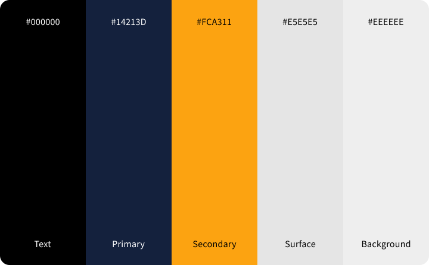
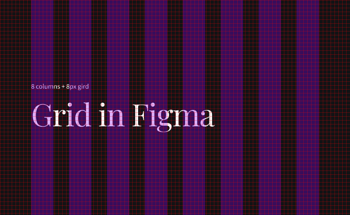
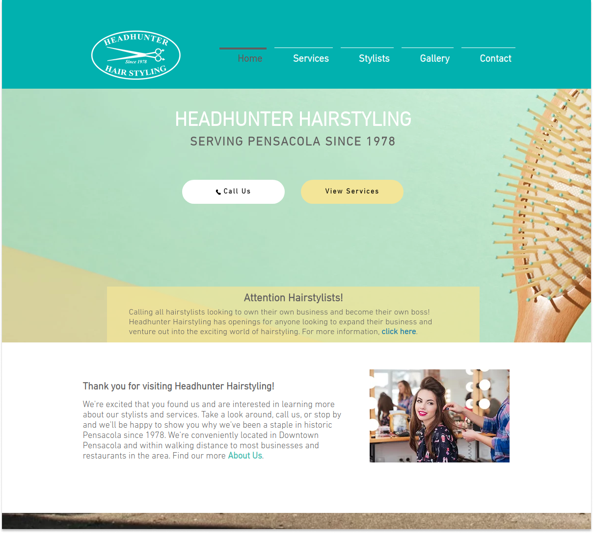

---
title: Stylish design principles with a nasty acronym
description: "In this post, we will look at four universal design principles that can improve any graphical work: website, slide, document, etc."
date: 2022-07-08T17:00:00+02:00
updated: 2022-07-08T17:00:00+02:00
image:
  alt: "Draft of a chair with grid lines"
  caption: "Photo by Karol D."
  src: "./pexels-karol-d-323645.jpg"
categories: ["design", "books"]
tags: ["ui", "ux", "contrast", "a11y", "typography", "grid"]
type: "post"
---

Most people can spot bad design. You look at a website and immediately declare "it looks bad" or "it looks unprofessional." The problem occurs when you have to describe what's wrong with it.

## Good design can be easy as 1-2-3

Designing doesn't need to be complicated. It can be easy as 1-2-3:

1. Learn the principles.
2. Recognize when you're not using them.
3. Apply the principles.

## Contrast

The Principle of Contrast states: **Contrast various elements of the work to draw a user's eye to the page.**

But it's not the only function. Contrast organizes information, clarifies hierarchy, or guides users around the page. Contrast not only serves multiple purposes - it manifests itself in many ways. You can create it by contrasting elements that have different properties:

- big font size - small font size
- serif font - sans-serif font
- simple, geometrical font - classical and more complex font (you can see that contrast in one of my [projects](/portfolio/an-lam/))
- a thin line - a thick line
- warm color - cold color
- smooth texture - rough texture
- etc. You have the idea.

You can create the most interesting contrast with fonts, especially by contrasting multiple font attributes like family, weight, and size.

It is the most dramatic rule - a few changes can turn an average design into an outstanding one.

**What to avoid?** Bad contrast. If elements are not identical, make them different! A weak contrast ratio additionally may cause problems with accessibility. Similar colors may blend for people with low vision. You can use websites like [Colour Contrast](https://colourcontrast.cc/) to check the color contrast ratio.

## Repetition

The Principle of Repetition states: **Repeat some design aspects throughout the entire work.**

You can create repetition, like contrast, in multiple ways. You can repeat anything a user will recognize:

- unified font sizes
- repeating decoration element
- elements spaced with constant distances
- cohesive color palette
- one alignment type
- etc.

Repetition exemplifies consistency. When you scroll through a website with repeating elements in different subpages, you can certainly identify that you're on the same page. Besides, a website (or another work) doesn't need multiple pages. Even a one-page document will look more sophisticated after applying this rule. Repetition adds professionalism and authority to the piece. A user feels that somebody controls the design because repetition indicates conscious decisions. Nothing is accidental.

**What to avoid?** Excessive repetition. The element repeated too often may annoy and weigh down the entire work. You can create a surprise by adding a unique item. Keep the element of surprise for things that need the user's attention. Remember about the contrast.

## Alignment

The Principle of Alignment states: **Don't place anything on the page arbitrarily. Every item should have a visual connection with something else on the page.**

The principle forces you to be more careful during work. There is no place to throw elements anywhere. In your work, use guiding lines and grids. They will show you which items don't have a visual connection. Graphic and text editors offer different types of rulers, margins, and alignments - use them.

Text alignment is also significant. The four most common alignments are:

- _Align left_. It's the default option. The invisible line connects the left edge of the text. The right edge is ragged.
- _Align right._ Here the invisible line connects the right edge of the text. People don't use it as often. Because of that, you can create a surprising and more dramatic effect with it.
- _Center._ There are no lines connecting edges. It can appear "weaker" for that reason. It also looks safe, and that's why many new designers overuse it. You can create a formal look with it. But boring at the same time. It may help to distinguish the centered text.
- _Justify._ Both edges are aligned. It helps with text readability. Books and scientific papers are usually justified. Text on websites - less often. Inspect your work when you use it. Too short lines may cause blank, unaesthetic spaces.

The work without uniform alignment often appears unprofessional. Even the slightest differences between elements will cause the impression that something is off.

**What to avoid?** Many types of alignment in one work. Heading centered above the left-aligned text will look unpleasant and accidental.

## Proximity

The Principle of Proximity states: **Group related elements together. Move them closer to each other so they appear as a group rather than a bunch of unrelated items.**

This principle does **not** say that everything should be closer together. Conceptually linked elements should also be linked visually. The base function of this rule is organization. It's easier to process and assimilate yourself with grouped content. The paragraphs in this post are a good example. They're not overwhelming and are easier to digest because they're small and grouped under headings.

**What to avoid?** A couple of things:

- Too many distinct elements in your work. You can usually group elements into logical groups.
- Using the same amount of space between items. Unless all of these items are in the same group.
- Don't create a visual connection between bits of the work that are not related. If bits differ, move them apart.
- Don't throw elements into places just because they're empty. A lot of designers don't utilize white space enough.

## Principles in practice

Use mentioned principles together to achieve the most aesthetically pleasing results. I'll do it myself - I'll use them to improve the example website.

Looking for examples of poor design, I found this website of a local hairdresser. The design is not so bad! But it is a good candidate for some changes. I'll improve this design using the principles, but I won't change it completely. I'll reuse assets and try to stick to the original layout. I'll leave the content unchanged.

The first problem that stands out is the weak hierarchy. You can see the logo, navigation, main heading, and buttons, but everything blends. I've used the principle of **proximity** to create three main groups: logo, navigation buttons, and headers with CTA buttons. I've added white space (I like white space) to spread out these groups. At the same time, I've brought the elements closer within the groups.

The website also suffers from a lack of contrast. Most of the text doesn't have sufficient color contrast. Different design elements have similar sizes. It ruins the hierarchy, and it ruins the accessibility. I've differentiated design elements by **contrasting** the colors, font sizes, weights, buttons, and resizing other parts.

There is no clear line that would guide the user thorugh the sections. Too much text is centered. The centered heading above the left-aligned paragraph looks random. There are parts not aligned with anything. I've fixed that by **aligning** texts and buttons on both axes. I've transformed the "attention" section into a pop-up. That's the only element not aligned with the primary axis. But I think it's an appropriate exception to the rule.

There are too many different shades, font sizes, and spaces. I set some design tokens then I **repeated** them in the design. It gives a more consistent look.

Do I state my design is perfect? No, I don't. It's just my suggestion after over an hour of redesigning. But I think we can agree that the design is improved. With those tweaks, the website is more accessible, readable, looks professional, and overall is more user-friendly.

## Don't be a wimp!

Don't be a wimp using these principles. If you use contrast, make the elements differ. Juxtapose dark as night black with sunny yellow. Align content to the last pixel. Don't hesitate to use the same element multiple times. But what's most important - don't hesitate to experiment. Break the rules. Nevertheless, you need to know the rules first to break them smartly. I hope that after reading this post, you know some of them.

The above principles are from the book by Robin Williams (no, not the actor), [The Non-Designer's Design Book](https://www.goodreads.com/book/show/23846768-the-non-designer-s-design-book). Check it out for more design tips. It's not an ad. My websites look just better after using these principles.
