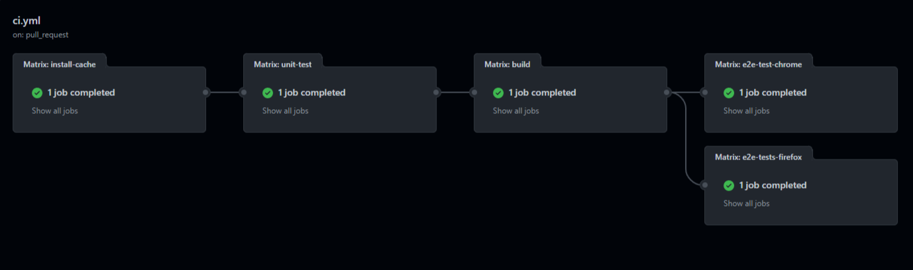

“Nigdy nie poświęcaj 6 minut na zrobienie czegoś ręcznie jeżeli możesz poświęcić 6 godzin na nieudane próby zautomatyzowania tego” - brzmi stary dowcip. Pomimo, że jako programiści mamy tendencję do nadmiernej komplikacji różnych zadań, istnieją oczywiste zalety automatyzacji.


Pomyśl o tym - to nie jest tak, że cały dzień poświęcasz na programowanie. Inne żmudne lub organizacyjne zadania również potrzebują naszej atencji: etykietowanie issue, aktualizowanie paczek czy wdrażanie kodu itd. Aaa i nie zapomnijmy o ulubieńcu wszystkich - spotkaniach.

W ciągu ostatniej dekady, programiści stworzyli wiele narzędzi i platform, takich jak CircleCI, Jenkins lub Travis (nie Scott), aby rozwiązać wymienione problemy. My jednak skupimy się na relatywnie nowym graczu w tej grze - GitHub Actions.

## Nie kolejne narzędzie CI/CD?

Zanim nauczymy się czym są GitHub Actions, musimy dowiedzieć się czym nie są. “Akcje GitHub to narzędzie CI/CD.” Gdy robiłem research, wiele razy natrafiałem na takie nieporozumienia. I nie zrozum mnie źle - jest nim, ale nie musi być. Przypadek użycia jest szerszy. GitHub Actions to jest platforma do automatyzacji zadań używając zdefiniowanego workflow. CI lub CD jest jednym z wielu przykładów takiego przepływu pracy.

## Dlaczego używać Github Actions?

Ok, ale dlaczego użyć ich zamiast innych, zaprawionych w boju rozwiązań? Istnieje kilka powodów.

- Nie wymagają zewnętrznych integracji. Spoglądając na statystyki, najprawdopodobniej i tak już używasz GitHuba.
- Konfiguracja jest prosta. Nie musisz być specjalistą DevOps, żeby ich używać (nie złośćcie się na mnie chłopaki - jesteście niezastąpieni przy bardziej złożonych rzeczach).
- Abstrahują niskopoziomowe komendy i inną logikę. Przypomnij sobie ile małych kroków musisz wykonać, aby uruchomić aplikację node od podstaw. Przypomniałeś sobie? Dobrze, teraz możesz zapomnieć je znowu, bo będą wyabstrahowane.
- Istnieje wiele integracji z rozmaitymi narzędziami i stosami technologicznymi. Java, .NET, Node.js? Wejdź na [GitHub Marketplace](https://github.com/marketplace) i znajdź środowisko, którego potrzebujesz.
- Nie musisz zaczynać od zera. Wspomniany marketplace oferuje mnóstwo gotowych do użycia aplikacji i akcji. Możesz także tworzyć swoje niestandardowe akcje na bazie szablonów.

## Czym jest GitHub workflow?

Na początek zapoznajmy się z podstawową terminologią. Będziemy się uczyć z góry na dół, zaczynając od ogólnych konceptów i przechodząc do detali.

**Workflow** to zautomatyzowany proces, który uruchamia jedną lub więcej prac (job). Możesz go skonfigurować dodając plik konfiguracyjny YAML w folderze `.github/workflows`. Składni przyjrzymy się w następnych sekcjach.

**Job** to zestaw korków definiujący przepływ pracy. Kroki mogą uruchamiać komendy, konfigurować zadania lub wywoływać akcje GitHub. Domyślnie, prace działają równolegle, ale możesz skonfigurować je, aby uruchamiały się sekwencyjnie.

**Action** to pojedynczy krok wewnątrz pracy. Jest to aplikacja dla platformy GitHub Actions, która wykonuje często powtarzające się zadania. Możesz stworzyć swoje niestandardowe akcje lub znaleźć wiele gotowych do użycia na GitHub Marketplace.

**Runner** to serwer uruchamiający workflow w odpowiednim momencie. Każda praca w workflow jest uruchamiana w nowym wirtualnym środowisku. GitHub zarządza tymi serwerami i oferuje trzy główne systemy operacyjne: Ubuntu, Windows i macOS.

## Jak działają GitHub Actions?

GitHub emituje **zdarzenia** (events), gdy coś się dzieje “w” lub “w stosunku do” twojego repozytorium - jak np. otworzenie PR lub issue. W odpowiedzi na te zdarzenia, możesz uruchamiać akcje GitHub. Te akcje to są również repozytoria. Ogólnie, przypomina to bazującą na zdarzeniach naturę JavaScriptu. Ogólna idea jest zatem prosta:

1. Nasłuchuj na event
2. Uruchom odpowiedni workflow

## Składnia pliku konfigurującego workflow

Tak jak wspomniałem, potrzebujesz pliku YAML, żeby skonfigurować workflow. Przyjrzyjmy się strukturze takiego pliku.

- `name` - nazwa workflow. Strona z akcjami w repozytorium ją wyświetli.
- `on` - nazwa zdarzenia, które wywołuje workflow, np. `push` lub `pull_request`. Istnieje cała lista zdarzeń na stronie [GitHub events](https://docs.github.com/en/actions/using-workflows/events-that-trigger-workflows).
- `jobs` - sekcja, gdzie umieszczasz pojedyncze prace.
- `job-name` - nazwa zadania, którą możesz edytować. Pod tym kluczem, umieszczasz listę kroków. Każdy krok może:
  - Mieć nazwę - `name`.
  - Używać zdefiniowanej akcji - `uses`.
  - Uruchomić komendę w terminalu - `run`.
  - Być uruchomiony z dodatkowymi parametrami - `with`.

## CI pipeline w GitHub Actions

Ludzie najlepiej uczą się z przykładami (a przynajmniej ja tak mam), więc sprawdźmy przykładową konfigurację ciągłej integracji.

```yaml title="Konfiguracja GitHub Actions CI"
name: CI
on:
  pull_request:
    branches:
      - main
    paths:
      - '**.js'
      - '**.jsx'
      - '**.json'
      - '**.yml'

concurrency:
  group: ${{ github.ref }}
  cancel-in-progress: true

jobs:
  install-cache:
    runs-on: ubuntu-latest
    strategy:
      matrix:
        node: [16]
    steps:
      - name: Checkout commit
        uses: actions/checkout@v3
      - name: Use Node ${{ matrix.node }}
        uses: actions/setup-node@v3
        with:
          node-version: ${{ matrix.node }}
          cache: npm
      - name: Install dependencies
        run: npm ci --legacy-peer-deps
      - name: Cache Cypress binary
        uses: actions/cache@v3
        id: cache-cypress
        with:
          path: ~/.cache/Cypress
          key: cypress-binary-${{ hashFiles('**/package-lock.json') }}
          restore-keys: |
            cypress-binary-
  unit-test:
    runs-on: ubuntu-latest
    strategy:
      matrix:
        node: [16]
    needs: install-cache
    steps:
      - name: Checkout commit
        uses: actions/checkout@v3
      - name: Use Node ${{ matrix.node }}
        uses: actions/setup-node@v3
        with:
          node-version: ${{ matrix.node }}
          cache: npm
      - name: Install dependencies
        run: npm ci --legacy-peer-deps
      - name: Run unit tests
        run: npm test
  build:
    runs-on: ubuntu-latest
    strategy:
      matrix:
        node: [16]
    needs: unit-test
    steps:
      - name: Checkout commit
        uses: actions/checkout@v3
      - name: Use Node ${{ matrix.node }}
        uses: actions/setup-node@v3
        with:
          node-version: ${{ matrix.node }}
          cache: npm
      - name: Install dependencies
        run: npm ci --legacy-peer-deps
      - name: Run build
        run: npm run build
      - name: Upload build artifacts
        uses: actions/upload-artifact@v3
        with:
          name: build-output
          path: |
            .cache
            public
          retention-days: 1
  e2e-test-chrome:
    runs-on: ubuntu-latest
    strategy:
      matrix:
        node: [16]
    needs: build
    steps:
      - name: Checkout commit
        uses: actions/checkout@v3
      - name: Use Node ${{ matrix.node }}
        uses: actions/setup-node@v3
        with:
          node-version: ${{ matrix.node }}
          cache: npm
      - name: Install dependencies
        run: npm ci --legacy-peer-deps
      - name: Restore Cypress binary
        uses: actions/cache@v3
        id: cache-cypress
        with:
          path: ~/.cache/Cypress
          key: cypress-binary-${{ hashFiles('**/package-lock.json') }}
          restore-keys: |
            cypress-binary-
      - name: Download build artifacts
        uses: actions/download-artifact@v3
        with:
          name: build-output
      - name: Run Cypress
        uses: cypress-io/github-action@v4
        with:
          start: npm run serve
          wait-on: 'http://localhost:8000'
          browser: chrome
          install: false
  e2e-tests-firefox:
    runs-on: ubuntu-latest
    strategy:
      matrix:
        node: [16]
    needs: build
    steps:
      - name: Checkout commit
        uses: actions/checkout@v3
      - name: Use Node ${{ matrix.node }}
        uses: actions/setup-node@v3
        with:
          node-version: ${{ matrix.node }}
          cache: npm
      - name: Install dependencies
        run: npm ci --legacy-peer-deps
      - name: Restore Cypress binary
        uses: actions/cache@v3
        id: cache-cypress
        with:
          path: ~/.cache/Cypress
          key: cypress-binary-${{ hashFiles('**/package-lock.json') }}
          restore-keys: |
            cypress-binary-
      - name: Download build artifacts
        uses: actions/download-artifact@v3
        with:
          name: build-output
      - name: Run Cypress
        uses: cypress-io/github-action@v4
        with:
          start: npm run serve
          wait-on: 'http://localhost:8000'
          browser: firefox
          headed: true
          install: false
```

O panie, jaki długi plik! Ale nie bądź przytłoczony - spróbujemy go rozszyfrować. Nasz workflow nazywa się “CI”. Wystartuje, gdy ktoś zrobi PR do gałęzi `main`. Dodatkowo, zmiany muszą obejmować pliki z wymienionymi rozszerzeniami. Dlaczego? Bo zmiany w plikach takich jak Markdown lub MDX najprawdopodobniej niczego nie zepsują, wiec nie musimy uruchamiać naszego worfklow.

Sekcja `concurrency` pozwala na anulowanie zadań w trakcie pracy, jeżeli należą do tej samej grupy. Np. kontynuowanie procesu budowania projektu nie ma sensu, jeżeli testy nie przeszły.

Praca `install-cache` rozpoczyna się typowo - od uzyskania dostępu do repozytorium. Do tego celu istnieje zdefiniowana funkcja, nazwana `checkout`. Później musimy skonfigurować środowisko node. W naszym przykładzie użyjemy node 16, pobierając liczbę z sekcji matrix. Mając node możemy zainstalować paczki. Komenda `npm ci` działa podobnie do `npm install`, ale jest przeznaczona do zautomatyzowanych środowisk. W końcu sprawdzamy czy istnieją jakieś pliki binarne narzędzia Cypress. Pózniej się dowiemy po co.

Praca `unit-test`, bez niespodzianek, uruchamia testy jednostkowe. Zaczyna się podobnie do poprzedniej pracy - od sprawdzenia plików w cache. Nie musimy instalować zależności z każdym uruchomieniem workflow. Ostatni krok rzeczywiście uruchamia testy.

Kolejna praca buduje projekt. Jest to przykład pracy sekwencyjnej. Ma ona zależność w postaci poprzedniego kroku. Po zbudowaniu projektu, akcja `upload-artifact` zapisuje w pamięci wyjście tego procesu na jeden dzień.

Dwie ostatnie prace są bardzo podobne - obie uruchamiają testy end-to-end. Jedna z nich w Chrome, druga w Firefox. Te prace muszą zostać uruchomione po fazie budowania. Obie próbują znaleźć zapisane pliki narzędzia Cypress, dla zwiększenia wydajności. Po pomyślnym wykonaniu wszystkich prac, cały workflow jest zakończony.



Mam nadzieję, że ten post był niezłym wprowadzeniem do GitHub Actions. Po jego przeczytaniu powinieneś wiedzieć dlaczego i jak ich używać. Być może będziesz nawet w stanie zautomatyzować jakieś żmudne zadania w mniej niż 6 godzin. Być może będziemy kontynuowali naszą zautomatyzowaną przygodę i napiszemy jakąś niestandardową akcję GitHub. Ale, na razie, the best I can do to zaoferować przydatne linki.

- [GitHub Marketplace](https://github.com/marketplace)
- [Events that trigger workflows](https://docs.github.com/en/actions/using-workflows/events-that-trigger-workflows)
- [GitHub Actions Documentation](https://docs.github.com/en/actions)
- [Quickstart for GitHub Actions](https://docs.github.com/en/actions/quickstart)
