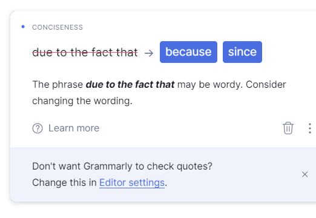
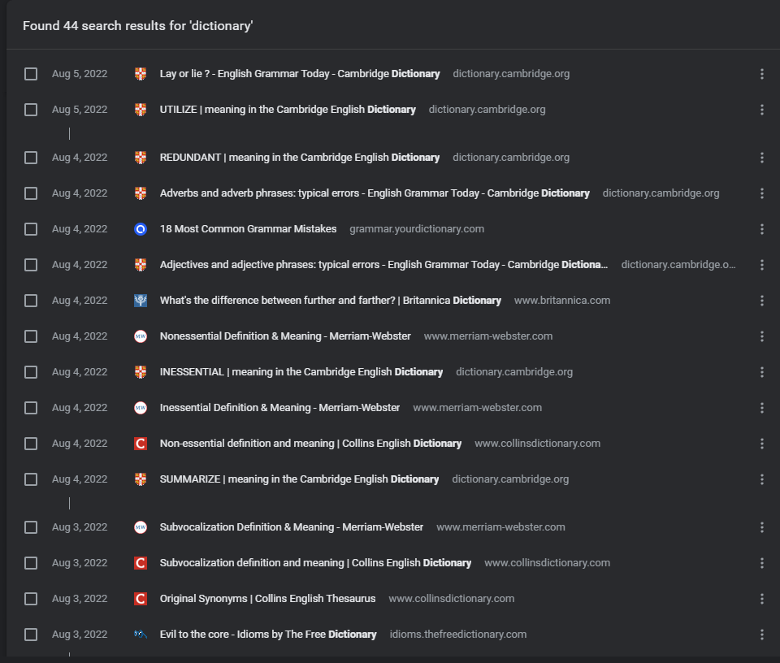

Before I published my website, I sent a temporary link to my friend. Despite checking everything many times, I wanted someone else to look at it. There is not too much testing. She read it carefully, and to my surprise, she didn't have too many remarks. "Reading you is like reading a good book," she concluded. I'm flattered, but my first reaction was that she exaggerates, and that's courtesy. She is an honest person, and she's probably reading that, so I officially announce - that was a joke. Nevertheless, this positive reaction got me thinking - what constitutes good writing?

If I could go back in time and tell myself that I'll be writing these words, the young me would be flabbergasted. I'm still not convinced to call myself a writer. But, I believe everyone can learn writing.

> Writing is a craft, not an art.

You can improve that skill, at least. Me too - I'm writing this post also for my future self. It just requires patience and practice. **Sticking to a regular schedule sounds like a good idea.**

## You're the product, not the subject

Lately, I catch myself reading books that usually wouldn't interest me. Like this book by Robert M. Sapolsky, "[Behave](https://www.goodreads.com/book/show/31170723-behave)." I bought it because I saw promising reviews. It sounds interesting, but I'm not so much into biology. Yet, I read the whole thing (about 900 pages) because of quality writing. I read it mainly for the author, not the subject per se. I'm sure you and many people have their favorite authors. And that's the point. **Ultimately the product that any author has to offer is who they are, not the subject.** I love to read people writing about their interests with **passion, humanity, warmth, and subtle humor.** I'm not suggesting to ditch your interest and read just for the author. That's extreme. But, good writing can catch the reader and overcome initial hesitation. If the author is writing well about the subject that interests you - that's the best combination.

However, pure passion is not enough. Writing is hard. There is no excuse for losing readers through sloppy craftsmanship. But I think some principles can help with that craft.

## Simplicity

Clutter is a disease of any writing. People fill sentences with unnecessary words, ornaments, or meaningless jargon. "Like," "quite," or "maybe" are examples of my clutter. I sometimes use IT terminology with people that are not IT specialists. That's not the best way to communicate. Other fields are also guilty of this. Ask people if they understand the legal document they are reading. It may take effort to decipher it. Don't make people do this with your texts. There is nothing wrong with simple sentences. **The secret of good writing is to strip every sentence to its bare bones.** Leave only essential elements. Remove every word with no function. Why "highly recommend" using these principles when I can "urge" using them? Unnecessary adverbs weaken your writing. Just like passive constructions - don't "urge" your readers to guess who is doing what.

### Clear thinking = clear writing

That may sound paradoxical, but it is hard to write simply. It is easy to be lost in the train of thought. That's our default state. We jump from one unrelated thought to the other. Try to unravel and structurize this tangled web of memories, ideas, and emotions. It's easier to move that on paper. A muddy thinker can't write good English. If you're lost, you can be sure the reader will be too - especially on the web. The user is not a patient creature (I know something about this). And when he is lost, he won't easily be lured back. Even if you offer him a cookie. So, before sitting to write, try to clear your head of clutter. **Clear thinking becomes clear writing. One can't exist without the other.**

### What am I trying to say?

I'm trying to make a post about good writing. No, but really - surprisingly often, I don't know what I want to communicate. I made a structure for this post. I'm looking at it, and still, I'm wondering. But constantly asking this question from the heading helps. Then I need to look at my text and ask - have I said it? Have I written it clearly? A clear sentence is no accident. Very few sentences emerge right the first time or even the third time. Rewriting now is easier than ever. With a few clicks, you can delete whole sentences or paragraphs. Don't be afraid to do that.

> The essence of writing is rewriting.

## Clutter

The main goal of rewriting is to remove clutter. Fighting clutter is like fighting weeds - the writer is always slightly behind. Don't hesitate to remove words that aren't doing anything useful. Replace phrases with fewer words. Are you convinced "at this point in time" to remove clutter? Why not do it "now"?

I have a ~~professional~~ background in IT. In my ~~personal~~ opinion, effectiveness in this field ~~of knowledge~~ is ~~overwhelmingly~~ significant. I ~~constantly stumble upon and~~ find rules like DRY or YAGNI. The main goal is to free ~~up~~ as much space as possible. So maybe ~~there is an unlikely possibility that~~ I have ~~experienced some kind of~~ bias toward this rule. Or have I?

**Writing improves in direct ratio to the number of things we can keep out of it that shouldn't be there.**

### If you might add it, add it

I'm the victim of this. I like to explain things to people, as you see. But, I'm often tempted to add an introduction before explaining something. "I might add," "it's worth pointing out," or "it's interesting to note" are a few examples. Phrases like that are usually redundant. If something is worth pointing out, point it out. Fun facts will be interesting - have some faith. Don't make too much buildup. I like the phrase "due to the fact that," but I could just say "because" (even Grammarly prompts me that).

**Most first drafts can be cut by 50 percent without losing any information or the author's voice.**

## Style

"But, is it possible to delete so much without losing your voice?" you may ask. That's a good question. If you push simplicity to the extreme, you will be left with sentences like "I make this" or "You do that." That's writing like Neanderthal - not good either. Let's go with a renovation metaphor. If you do a general renovation, you get rid of old stuff. You throw away the sofa, carpet, and old wardrobe. Maybe you leave a vanity table that you have sentiment for, but most furniture is thrown out or recycled. You clean walls from stains, remove old paint and tear floorboards. After all this work comes the fun part - designing and decorating your space. **You have to clear your writing before you can rebuild it.**

### There is no style store

Even before decoration, you can be proud. Take satisfaction from a neatly prepared space. But you need to be patient before the next step. You can't buy random paints, floors, and expensive furniture, throw everything inside and expect it to look good. At first glance, it may look better - you've done renovation. But at second glance - something won't look quite right. You can buy furniture and hang a picture on the wall, but you can't buy style. Don't embellish your sentences blindly with words you "bought" from someone else in the hope of making them better. **There is no style store. Style is organic to the person doing the writing.** I hope I'll develop mine with time and practice. I hope you find your style that will be cohesive with who you are.

### Be yourself

Why do I put emphasis on being yourself? Am I secretly a self-help coach? No, not at all. I hate them. Before you write me an angry message - I'm joking. Not every coach is a scammer, and you can find good self-help books. However, the principle is not a joke. **Readers want the person who is talking to them to sound genuine.** It's easier said than done. This rule is hard to follow. It requires writers to do two things: relax and have confidence. I'm naturally patient and peaceful. But even for me, living in this fast world can be stressful. Walking and meditation usually calm me. You need to find your own way. Chamomile? Maybe smash something? But better not hit anybody. For me, it's harder to follow the second piece of advice. I often see myself using words like "guess," "quite," or "probably," even though I'm sure. Skepticism and humility are good qualities, but excessive distrust toward yourself is not. Readers want the writer to be confident. But don't be overconfident. Have a solid basis for your claims, and don't be afraid to admit that you don't know something.

### Write in the first person

Writers are at their most natural when they write in the first person. That's not a surprise. But you may be hesitant like I am. "Who am I to elaborate on what I think?" Does anybody care about my opinion?" Those types of questions are circling in my head. But at the same time, there is only one me. There is only one you. It may be cliché, but everybody is unique in some way. I consume different media. I watch YouTube videos and read blogs, comments, and books. I also listen to podcasts. And I care. I care enough to come back to some authors. Maybe it can be the same with you or me. Somebody will care.

> They'll care if you tell them something interesting and tell them in words that come naturally.

### It's scary to reveal yourself

Writers think that they need to earn the right to reveal their emotions or thoughts. I feel the same way. In many writing forms, you even can't use "I." Businesses and institutions often use impersonal forms. Newspapers don't want "I" in their news stories. Academic writing guides (European in particular) still encourage the usage of a detached, impersonal style. And I get it - the facts should be presented objectively. Yet, all this contributes to society's fear of revealing who we are. Hiding behind institution formality can be comforting. But, it's hard to notice people behind impersonal passive sentences. I can't change policies. If you aren't allowed to use "I," at least think "I" while you write. Or write the first draft with "I" and then replace it. Warm up this impersonal style. **Good writers are visible just behind their words.**

### Writing is an act of ego

Oh, I know this well. Maybe you too. People are presenting an opinion on social media on a particular subject. It's a stupid opinion, and you feel the urge to correct them. You get public approval. You get a dose of dopamine, and you feel better. Ego led you here. I'm not advocating arguing online. Mostly it's a waste of time. If you want to discuss something publicly, use logical reasoning, and omit fallacious arguments. But ego is not inherently evil if you control it. It can motivate you to keep going. **Writing is an act of ego, and you might as well admit it.**

## The Audience

"Ok, I know some principles, but who am I writing for?" That may be counterintuitive - **You are writing for yourself.**
Don't try to visualize average Joe. Averages are useful in statistics, but there is no such Joe. Everyone is unique in some way, including readers. I like to use sarcasm, exaggeration, and subtle humor. I sometimes worry if readers will "get it." Unnecessarily - many of them will get it. Don't treat your readers like idiots. If something put a smirk on your face, it probably put it on the reader's face too.

### Craft vs. Attitude

I wrote about a reader or user as an impatient creature who needs care, and know I say to write for yourself? Isn't that a contradiction? There are two issues here: craft and attitude. Losing readers due to poor writing is a sign to work on your craftsmanship. Be honest with yourself about your skill level. But also be honest with your audience. Don't imitate attitude. There is no point in pretending you're someone else. You can't control if someone likes you or your way of thinking. You and your reader will get along, or you won't. It's impossible to please everyone.

### Write as you talk

**Never say anything in writing that you wouldn't comfortably say in conversation.** Even though I mentioned I overuse words like "probably," or "likely," I will still use them in moderation. Why? Because I use them when I talk. I try my best to sound genuine and just like myself. Try to find your voice. Obviously, don't write every word you pronounce. Speaking is more casual. There is less time to react, so we make mistakes, repeat ourselves, or say something ungrammatically. Unless you're writing dialogue, there is no point in pouring that on paper. You have time to filter your stream of consciousness.

## Words

**You'll never make your mark as a writer unless you develop a respect for words and curiosity about their shades of meaning that is almost obsessive.** Here's a fragment of my browser history.

I took the rule to heart. I want to express myself precisely. But, often, the first word that comes to my mind is not perfect. So I search. I search a lot. This takes time and energy but pays off when the sentence comes out just right. Do the same. There is no limit to queries you can make (I hope). Google, google, and google. Or use DuckDuckGo - that's not important here. What's important are the words and their meaning. Care deeply about words.

> I have hated words, and I have loved them, and I hope I have made them right.
>
> &mdash;<cite> Markus Zusak</cite>

### Respect words. Obsess over synonyms

We have many online dictionaries at our fingertips. Don't you know what "secularization" means? That's no problem. Let's peek at the online dictionary - "the action or process of converting something from religious to secular possession or use," and we know. Even familiar words are worth checking. After another check, I see that I could use the word "glance" instead of "peek." **Master small gradations between words.** Look for synonyms. Thesaurus with lists of related terms and concepts comes in handy here. It's like a reminder of all the choices you have. Find the word that encloses your thought. Don't settle on the first word that comes to mind.

### Avoid banalities

Looking for precise synonyms has another advantage - it helps avoid banalities. Clichés, platitudes, and other buzzwords are often the first things that come to mind. They are not evil to the core. One bad apple doesn't spoil the bushel. But as you see, you know what to expect. There is no surprise. Surprise in the form of an unusual word or clever sentence makes text exciting. Don't settle on the first banal that comes to mind.

### Read

But what if nothing else comes to mind? You're forcing your neurons to work, but there is a void. Perhaps the best way to create new neural connections and extend your mental dictionary is through reading. I sometimes surprise my friends with peculiar words I throw into casual conversations. Do I sit in my room, laugh ominously and browse dictionaries when texting somebody to make them feel inferior? No, I don't. I just read regularly, and some of these words are stuck in my head. Overall, reading is probably one of the best habits I'm cultivating. Make a habit of reading what is being written today and what was written by earlier masters. Read frequently and wide - in terms of topics and time range. But don't read every text in your sight. Be critical. Don't assume the book is good just because it was published. **Writing is learned in part by imitation.** Make sure that your models are the finest.

### Readers hear what you write

What? We read with our eyes, no? Yes and no. If you're not visually impaired, you read with your eyes. But to read with comprehension, we need to subvocalize words - by whispering or repeating them mentally. You can't get rid of it. So you need to think about how your paragraphs sound. **Such considerations of sound and rhythm should go into everything you write.** It's hard to give more concrete advice here. However, if something is hard to verbalize, it will be hard to read. Next time before you publish or send some text, **read it aloud.** It may help you spot tricky sentences. Readers hear what they are reading more than we realize. So remember - somebody out there is listening.

## Usage

My post is ending, so you can give me feedback. No, actually, I'm listening to what you think. In many cases, there is no need for technical terms. Usage is as important as familiarity with the words. Some words are better suited for a particular context. We need to know when and how to use them. It can be difficult sometimes. I'm a native Polish speaker, so I'm prone to silly mistakes. Even native English speakers need to be careful. I can advise you to use words correctly. You can take make advice. The first word is a verb, and the second is a noun. Adverbs can also be tricky. Your text has the potential to be good. But, you can write well. Besides mixing words, mistakes can take the form of excessive words. This sentence is unique, but not in a good way. If you suspect incorrect usage - check the word up. Look for examples. **Good usage consists of using good words to express yourself clearly and simply to someone else.**

## Summary

Most of the writing tips here are from the book "[On Writing Well](https://www.goodreads.com/book/show/53343.On_Writing_Well)" by William Zinsser. This post is getting long, so I'll end here. Its main goal will be to summarize applicable principles - especially for nonfiction. I hope they will help you with your next article, professional email, or even an informal message to a friend. Maybe I'll add another part centered around attitudes and values that accompany good writing. If you don't want to wait or need more details - check out the book. In my opinion, it's worth reading.
