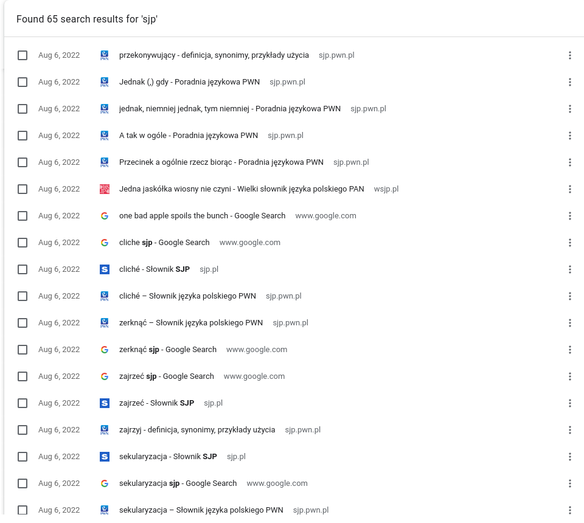

Zanim opublikowałem moją stronę, wysłałem tymczasowy link mojej znajomej. Pomimo że sprawdzałem wszystko wielokrotnie, chciałem żeby ktoś jeszcze ją przejrzał. Nie ma zbyt wielu testów. Przeczytała wszystko starannie i ku mojemu zaskoczeniu, nie miała zbyt wielu uwag. "Czyta się ciebie jak dobrą książkę" - podsumowała. Schlebia mi to, ale w pierwszym odruchu pomyślałem, że przesadza i to jest kurtuazja. Ona jest szczerą osobą i prawdopodobnie to czyta, dlatego oficjalnie ogłaszam - to był żart. Jednakże ta pozytywna reakcja, dała mi do myślenia - co składa się na dobre pisanie?

Gdybym mógł cofnąć się w czasie i powiedzieć sobie, że będę pisał te słowa, młodszy ja byłby zdumiony. Nadal nie jestem przekonany żeby nazwać się pisarzem. Ale wierzę, że każdy może nauczyć się pisać.

> Pisanie to rzemiosło, nie sztuka.

Możesz przynajmniej poprawić tę umiejętność. Ja też - piszę ten post dla siebie z przyszłości. Wymaga to po prostu cierpliwości i praktyki. **Trzymanie się regularnego harmonogramu brzmi jak dobry pomysł.**

## Ty jesteś produktem, nie temat

Ostatnio, przyłapuję się na tym, że czytam książki, które normalnie by mnie nie zainteresowały. Jak książka autorstwa Roberta M. Sapolsky, "[Zachowuj się](https://lubimyczytac.pl/ksiazka/4949256/zachowuj-sie-jak-biologia-wydobywa-z-nas-to-co-najgorsze-i-to-co-najlepsze)". Kupiłem ją, ponieważ widziałem obiecujące recenzje. Brzmiała intrygująco, ale ja nie jestem aż tak bardzo zainteresowany biologią. Mimo to, przeczytałem ją całą (około 900 stron), dla dobrej jakości tekstu. Przeczytałem ją głównie dla autora, nie dla tematu per se. Ty na pewno też masz swoich ulubionych autorów, jak wiele innych ludzi. I w tym właśnie rzecz. **Ostatecznie, produktem który ma do zaoferowania autor jest on sam, nie temat.** Uwielbiam czytać ludzi, którzy piszą o swoich zainteresowaniach z **pasją, człowieczeństwem, ciepłem i subtelnym humorem.** Nie sugeruję, abyś porzucił swoje zainteresowania i czytał tylko dla autora. To jest skrajność. Ale jakościowe pisanie może zatrzymać czytelnika i przezwyciężyć początkowe wahanie. Jeżeli autor pisze dobrze na temat który cię interesuje - to jest najlepsza kombinacja.

Jednakże, czysta pasja nie wystarczy. Pisanie jest trudne. Nie ma usprawiedliwienia dla stracenia czytelnika przez słaby warsztat. Ale myślę, że jest kilka zasad które pomogą w tym rzemiośle.

## Prostota

Zaśmiecenie jest chorobą dowolnego pisania. Ludzie wypełniają swoje zdania niepotrzebnymi słowami, ozdobnikami i nic nieznaczącym żargonem. "Jakby", "w zasadzie" czy "generalnie" to przykłady moich śmieci. Czasem używam terminologii IT z ludźmi, którzy nie są specjalistami. To nie jest doby sposób komunikacji. Inne branże też są temu winne. Zapytaj ludzi czy rozumieją pismo prawne, które otrzymali. Rozszyfrowanie go może zająć sporo wysiłku. Nie każ ludziom robić tego samego z twoimi tekstami. Nie ma niczego złego w prostych zdaniach. **Sekretem dobrego pisania jest rozebranie każdego zdania do podstaw.** Zostaw tylko niezbędne elementy. Usuń każde słowo, które nie ma funkcji. Dlaczego mam "gorąco polecać" używanie tych zasad, jeżeli mogę "nalegać" na używanie ich? Nadmiarowe przysłówki osłabiają twój tekst. Podobnie jak pasywne konstrukcje - nie "nalegaj" żeby twoi czytelnicy musieli zgadywać kto robi co.

### Jasne myślenie = jasne pisanie

Zabrzmi to paradoksalnie, ale trudno jest pisać prosto. Łatwo się zgubić w potoku myśli. To nasz domyślny stan. Skaczemy z jednej niepowiązanej myśli do drugiej. Spróbuj rozplątać i ustrukturyzować tę poplątaną sieć wspomnień, idei i emocji. Łatwiej wrzucić ją na papier. Mętny myśliciel nie może pisać dobrą polszczyzną. Jeżeli jesteś zagubiony, możesz być pewny, że twój czytelnik również będzie - szczególnie w sieci. Użytkownik to nie jest cierpliwe stworzenie (coś o tym wiem). Jeżeli się zgubi, nie będzie łatwo zwabić go ponownie. Nawet jeżeli zaoferujesz mu ciasteczka. Dlatego zanim usiądziesz do pisania, spróbuj oczyścić swoją głowę. **Jasne myślenie staje się jasnym pisaniem. Jedno nie może istnieć bez drugiego.**

### Co staram się powiedzieć?

Staram się stworzyć post o dobrym pisaniu. Nie, ale serio - zaskakująco często nie wiem co chcę zakomunikować. Zrobiłem strukturę dla tego wpisu, wpatruję się w nią i nadal się zastanawiam. Ale powtarzanie pytania z nagłówka pomaga. Następnie muszę przyjrzeć się tekstowi i zapytać - czy to powiedziałem? Czy wyraziłem się klarownie? Klarowne zdanie nie jest przypadkiem. Bardzo niewiele zdań jest poprawnych za pierwszym, czy nawet trzecim razem. Przepisywanie jest prostsze niż kiedykolwiek. Możesz usuwać całe zdania czy paragrafy kilkoma kliknięciami. Nie obawiaj się, aby to robić.

> Esencją pisania jest przepisywanie.

## Zatłoczenie

Głównym zadaniem przepisywania jest pozbywanie się śmieci. Walka z nimi jest jak walka z chwastami - pisarz jest zawsze trochę z tyłu. Nie wahaj się usuwać słów, które nie robią niczego pożytecznego. Zastąp frazy mniejszą ilością słów. Czy "w tym momencie" jesteś przekonany, aby usunąć ten natłok? Dlaczego nie zrobić tego "teraz"?

Mam ~~profesjonalną~~ przeszłość związaną z IT. W mojej ~~osobistej~~ opinii, efektywność w tej dziedzinie ~~wiedzy~~ jest ~~przytłaczająco~~ ważna. Cały czas ~~natykam się i~~ znajduję zasady takie jak DRY czy YAGNI. Głównym celem jest zwolnienie jak największej ilości pamięci. Dlatego możliwe, że mam ~~i doświadczyłem jakiegoś~~ uprzedzenia w stosunku do tej zasady. A może nie?

**Pisanie poprawia się wprost proporcjonalnie do liczby rzeczy trzymanych poza tekstem, których nie powinno tam być.**

### Jeżeli warto coś dodać, dodaj

Jestem tego ofiarą. Lubię tłumaczyć rzeczy innym ludziom jak widzisz. Ale często kusi mnie, aby dodać jakiś wstęp przed wytłumaczeniem czegoś. "Warto zauważyć że", "mogę dodać", "ciekawą obserwacją jest" to kilka przykładów. Frazy jak te są często zbędne. Jeżeli coś warto dodać, dodaj. Zabawne fakty będą interesujące - miej trochę wiary. Nie buduj nadmiernego napięcia. Lubię frazę "w związku z faktem, że", ale mogę po prostu powiedzieć "ponieważ". **Większość pierwszych szkiców może być obcięta o 50 procent bez straty żadnej informacji lub stylu autora.**

## Styl

"Ale czy jest możliwe zachować swój głoś usuwając tak dużo?", możesz zapytać. To jest dobre pytanie. Jeżeli pociągniesz prostotę do skrajności, zostaniesz ze zdaniami typu "Ja robię to", "Ty zrób tamto". To jest pisanie jak neandertalczyk - też niezbyt dobre. Posłużmy się budowlaną metaforą. Gdy robisz remont generalny, pozbywasz się wszystkich starych rzeczy. Wyrzucasz łóżko, dywan i starą szafę. Może zostawiasz toaletkę, do której masz sentyment, ale większość mebli jest wyrzucona lub poddana recyklingowi. Myjesz ściany z plam, usuwasz stare farby i zrywasz podłogę. Po tym wysiłku przychodzi przyjemniejsza część pracy - projektowanie i dekorowanie przestrzeni. **Musisz najpierw wyczyścić swoje pismo zanim będziesz mógł je odbudować.**

### Nie ma sklepu ze stylem

Nawet przed dekoracją możesz być dumny. Czerp satysfakcję z elegancko przygotowanej przestrzeni. Ale musisz być cierpliwy przed następnym krokiem. Nie możesz kupić przypadkowych farb, desek podłogowych i drogich mebli, wrzucić wszystkiego do środka i oczekiwać, że będzie to wyglądać dobrze. Na pierwszy rzut oka, może to wyglądać lepiej - w końcu zrobiłeś remont. Ale na drugi - coś zawsze będzie nie tak. Możesz kupić meble i powiesić obrazek na ścianie, ale nie możesz kupić stylu. Nie ozdabiaj swoich zdań na ślepo, wyrazami które "kupiłeś" od kogoś innego w nadziei, że będą lepsze. **Nie istnieje sklep ze stylem. Style jest organiczny dla osoby piszącej.** Mam nadzieję, że z czasem rozwinę swój styl. Mam nadzieję, że ty również znajdziesz swój styl, który będzie spójny z twoją osobowością.

### Bądź sobą

Dlaczego kładę nacisk na bycie sobą? Czy sekretnie jestem trenerem sukcesu? Nie, nie jestem. Nienawidzę ich. Zanim wyślesz mi złowrogą wiadomość - żartuję. Nie każdy taki trener to oszust i da się znaleźć dobre książki o samorozwoju. Jednakże sama zasada to nie żart. **Czytelnicy chcą, aby osoba mówiąca do nich brzmiała szczerze.** Łatwiej powiedzieć niż zrobić. Trudno podążać za tą zasadą. Wymaga ona od pisarza dwóch rzeczy: aby się zrelaksował i był pewny siebie. Z natury jestem spokojny i opanowany. Ale nawet dla mnie życie w szybkim świecie potrafi byś stresujące. Spacery i medytacja zwykle mnie uspokaja. Musisz znaleźć swój sposób. Rumianek? Może rozwal coś? Ale lepiej nie bij nikogo. Dla mnie trudniejsza jest druga zasada. Często używam słów jak "może", "trochę" czy "prawdopodobnie", nawet gdy jestem czegoś pewien. Sceptycyzm i pokora to są dobre wartości, ale nadmierna nieufność wobec siebie już nie jest dobra. Czytelnicy chcą, aby pisarz był pewny siebie. Ale nie nadmiernie pewny. Miej solidne podstawy dla swoich twierdzeń i nie bój się przyznać, gdy czegoś nie wiesz.

### Pisz w pierwszej osobie

Pisarze są najbardziej naturalni, gdy piszą w pierwszej osobie. Nie jest to niespodzianka. Ale możesz mieć opory podobne do moich. "Kim ja jestem, żeby rozwodzić się o tym co myślę?". "Czy kogokolwiek obchodzi moja opinia?". Tego typu pytania krążą w mojej głowie. Ale jednocześnie jest tylko jeden ja. Nie ma dwóch takich jak ty. Będzie to cliché, ale każdy jest wyjątkowy w jakiś sposób. Konsumuję różne media. Oglądam filmy na YouTube. Czytam blogi, komentarze i książki. I mnie to obchodzi. Obchodzi mnie na tyle, że wracam to konkretnych autorów. Być może podobnie będzie z tobą lub ze mną. Ktoś się zainteresuje.

> Zainteresują się, gdy powiesz coś ciekawego i powiesz to słowami, które przychodzą ci naturalnie.

### Strasznie jest się ujawnić

Ludzie myślą, że potrzebują zezwolenia, aby ujawnić swoje emocje czy myśli. Ja czuję podobnie. W wielu formach nawet nie można używać słowa "ja". Firmy i instytucje często używają bezosobowych form. Gazety nie chcą "ja" w swoich aktualnościach. Akademickie poradniki (europejskie w szczególności) nadal zalecają używanie zdystansowanego, bezosobowego stylu. I ja to rozumiem - fakty powinny zostać zaprezentowane obiektywnie. Jednak wszystko to przyczynia się do społecznego strachu przed ujawnieniem kim jesteśmy. Ukrywanie się za instytucjonalnym formalizmem może być kojące. Ale trudno dostrzec ludzi za bezosobowymi, pasywnymi zdaniami. Nie mogę zmienić zasad. Jeżeli nie możesz używać "ja", przynajmniej myśl "ja", gdy piszesz. Albo napisz pierwszy szkic z "ja", a następnie je wymień. Ogrzej ten bezosobowy styl. **Dobrzy pisarze są widoczni tuż za swoimi słowami.**

### Pisanie to akt ego

Tak, znam to dobrze. Może ty też. Ludzie na social media prezentują opinie na dany temat. Ta opinia jest głupia i czujesz potrzebę, aby ich poprawić. Dostajesz publiczne uznanie. Dostajesz dawkę dopaminy i czujesz się lepiej. Ego cię tu zaprowadziło. Nie polecam kłótni w sieci. To jest strata czasu. Jeżeli chcesz o czymś dyskutować publicznie, bądź merytoryczny i unikaj błędów argumentacyjnych. Ale ego nie jest zupełnie złe, jeżeli potrafisz je kontrolować. Może motywować cię do działania. **Pisanie jest aktem ego i równie dobrze możesz to przyznać.**

## Publiczność

"Dobra, znam kilka zasad, ale dla kogo piszę?" To może być nieintuicyjne - **piszesz dla siebie.** Nie próbuj wyobrazić sobie przeciętnego Kowalskiego. Średnie są przydatne w statystyce, ale taka osoba nie istnieje. Każdy jest unikalny na swój sposób, w tym czytelnicy. Lubię sarkazm, wyolbrzymianie i subtelny humor. Czasami się zastanawiam czy czytelnicy go załapią. Nie potrzebnie - wielu z nich załapie. Nie traktuj czytelników jak idiotów. Jeżeli coś wywołuje uśmieszek na twojej twarzy, prawdopodobnie wywoła go także u czytelnika.

### Rzemiosło kontra nastawienie

Pisałem o użytkowniku czy czytelniku jako o niecierpliwym stworzeniu wymagającym opieki, a teraz mówię, żeby pisać dla siebie? Czy to nie jest sprzeczność? Trzeba tu rozróżnić dwie rzeczy: rzemiosło i nastawienie. Utrata czytelnika przez słabe rzemiosło to znak, żeby popracować nad umiejętnościami. Bądź szczery co do ich poziomu. Bądź szczery także ze swoją publicznością. Nie udawaj nastawienia. Nie ma sensu udawanie kogoś innego. Nie możesz kontrolować czy ktoś lubi cię, albo twój sposób myślenia. Ty i czytelnik się zrozumiecie, albo nie. Nie można dogodzić wszystkim.

### Pisz jak mówisz

**Nigdy nie pisz niczego, czego nie powiedziałbyś komfortowo w konwersacji.** Wspominałem, że nadużywam słowa takie jak "prawdopodobnie" czy "chyba", ale nadal będę ich używał z umiarem. Dlaczego? Bo używam ich, gdy mówię. Staram się brzmieć szczerze i po prostu jak ja. Spróbuj znaleźć swój głos. Oczywiście nie pisz wszystkiego co wypowiadasz. Mówienie jest mniej formalne. Jest mniej czasu, aby zareagować, więc robimy błędy, powtarzamy się lub mówimy coś niepoprawnie. O ile nie piszesz dialogów, nie ma sensu przelewać tego na papier. Masz czas, aby przefiltrować swój strumień świadomości.

## Słowa

**Nigdy nie pozostawisz po sobie śladu jako pisarz, jeżeli nie rozwiniesz w sobie szacunku dla słów i ciekawości wobec ich znaczenia, graniczącą z obsesją.** Tu jest fragment historii mojej przeglądarki.

Wziąłem sobie tę regułę do serca. Chcę wyrażać siebie precyzyjnie. Ale często pierwsze słowo, które przychodzi mi do głowy nie jest idealne. Dlatego szukam. Wymaga to czasu i energii, ale opłaca się, gdy zdanie wychodzi po prostu dobrze. Rób podobnie. Nie ma limitu zapytań, które możesz wysłać (mam nadzieję). Googluj, googluj i googluj. Albo używaj DuckDuckGo - tu to nie jest istotne. Istotne są słowa i ich znaczenie. Bardzo dbaj o słowa.

> Nienawidziłem słów i kochałem je. Mam nadzieję, że nauczyłem się ich używać.
>
> &mdash;<cite> Markus Zusak</cite>

### Szanuj słowa. Miej obsesję na punkcie synonimów

Na wyciągnięcie ręki mamy mnóstwo słowników online. Nie wiesz co znaczy "sekularyzacja"? Nie ma problemu. Zerknijmy do słownika - "przejście określonego podmiotu spod władzy kościelnej do świeckiej" i już wiemy. Nawet znane słowa warte są sprawdzenia. Po ponownym sprawdzeniu, widzę że mogłem użyć słowa "zajrzeć" zamiast "zerknąć". **Opanuj drobne różnice pomiędzy słowami.** Szukaj synonimów. Słownik wyrazów bliskoznacznych z grupami powiązanych terminów i konceptów może się przydać. Jest jak przypomnienie z wszystkimi dostępnymi możliwościami. Znajdź słowo, które ujmuje twoją myśl. Nie spoczywaj na pierwszym słowie, które przychodzi do głowy.

### Unikaj banałów

Szukanie precyzyjnych synonimów ma dodatkową zaletę - pomaga unikać banałów. Frazesy, ogólniki i truizmy są często pierwszymi rzeczami, które przychodzą do głowy. Nie są one złe do szpiku kości. Jedna jaskółka wiosny nie czyni. Ale jak widzisz, wiadomo czego się spodziewać. Brak jakiegokolwiek zaskoczenia. Niespodzianka w postaci nietypowego słowa albo zgrabnej sentencji sprawia, że tekst jest ekscytujący. Nie spoczywaj na pierwszym banale, który przychodzi do głowy.

### Czytaj

Ale co jeżeli nic nie przychodzi do głowy? Zmuszasz swoje neurony do pracy, ale widzisz pustkę. Prawdopodobnie najlepszym sposobem na stworzenie nowych połączeń nerwowych i rozszerzenie swojego mentalnego słownika jest czytanie. Czasami zaskakuję swoich znajomych nietypowymi słowami, które wrzucam do zwykłych konwersacji. Czy siedzę w swoim pokoju, śmieję się złowieszczo i przeglądam słownik, gdy z kimś piszę by poczuł się gorszy? Nie, zdecydowanie nie. Po prostu czytam regularnie i wiele z tych nietypowych słów zostaje mi w głowie. W ogóle czytanie jest jednym z najlepszych nawyków, które kultywuję. Wyrób w sobie nawyk czytania tego co zostało napisane dziś i przez mistrzów z przeszłości. Czytaj regularnie i szeroko - pod względem tematów i zakresu czasu. Ale nie czytaj wszystkiego w zasięgu wzroku. Nie zakładaj, że książka jest dobra tylko dlatego, że została wydana. **Pisania uczymy się po części przez imitację.** Upewnij się, że twoje modele są najlepsze.

### Czytelnicy słyszą co piszesz

Co? Czytamy oczami, nie? Tak i nie. Jeżeli nie masz problemów ze wzrokiem, czytasz oczami. Ale żeby czytać ze zrozumieniem, musimy subwokalizować słowa - szepcząc albo powtarzając mentalnie. Nie możesz się tego pozbyć. Dlatego musisz myśleć o tym jak twoje paragrafy brzmią. **Takie rozważania na temat dźwięku i rytmu powinny towarzyszyć wszystkiemu co piszesz.** Trudno jest o bardziej konkretną poradę. Jednak gdy coś trudno jest zwerbalizować, trudno to będzie przeczytać. Następnym razem, zanim coś opublikujesz albo wyślesz, **przeczytaj to na głos.** Może to pomóc odnaleźć zdradliwe zdania. Czytelnicy słyszą co czytają częściej niż nam się wydaje. Dlatego pamiętaj - ktoś zawsze słucha.

## Zastosowanie

Mój wpis dobiega końca, więc możesz dać mi feedback. Nie, w zasadzie, po prostu słucham co o nim sądzisz. W wielu wypadkach nie ma konieczności używania technicznych terminów. Zastosowanie jest równe istotne co znajomość słów. Niektóre słowa lepiej się sprawdzą w konkretnym kontekście. Musimy wiedzieć kiedy i jak ich używać. To może być nieraz trudne. Polski jest trudny. Moje zasady mogą być "przekonujące", ale nie mogą być "przekonywujące". Możesz się "wyłączać" czytając mój post, ale nie "wyłanczać". Czasami błędy mogą przyjmować formę zbędnych słów. Pisałem ten post przez dłuższy okres ~~czasu~~, starając się wyłapać wszystkie błędy. Nie machaj na nie ręką z przekonaniem, że [to nic nie znaczy](https://www.youtube.com/watch?v=_6HCOgTc5r4). Jeżeli przypuszczasz, że używasz czegoś niepoprawnie - sprawdzaj podejrzane słowo. Szukaj przykładów. **Dobre zastosowanie to używanie dobrych słów, aby wyrazić się jasno i zrozumiale dla kogoś innego.**

## Podsumowanie

Wiele z powyższych rad pochodzi z książki "[On Writing Well](https://www.goodreads.com/book/show/53343.On_Writing_Well)" autorstwa Williama Zinssera. Ten post staje się długi, więc tu zakończę. Jego głównym zadaniem będzie podsumowanie dających się zastosować porad - szczególnie dla literatury faktu. Mam nadzieję, że pomoże ci przy następnym artykule, profesjonalnym mailu czy nawet nieformalnej wiadomości do bliskiego. Być może dodam kolejną część skoncentrowaną wokół nastawienia i wartości, które towarzyszą dobremu pisaniu. Jeżeli nie chcesz czekać lub potrzebujesz więcej szczegółów - sprawdź książkę. Moim zdaniem, jest warta przeczytania.
