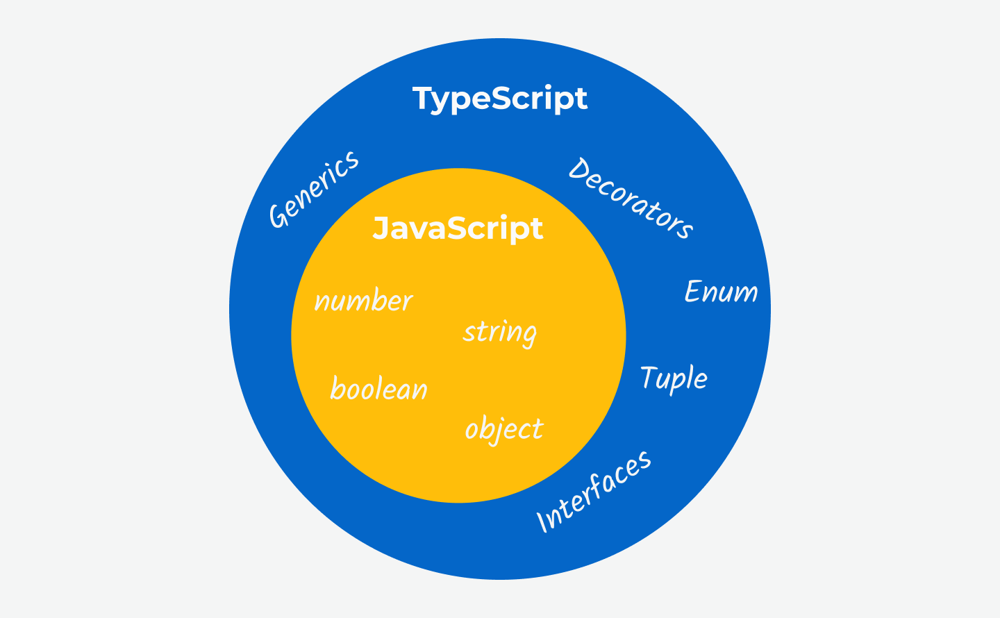

Niedawno zacząłem uczyć się TypeScripta (w zasadzie kodowałem wcześniej w Angularze, więc TypeScript nie jest dla mnie zupełnie nowy, ale od tamtej pory nie używałem go często). Na początku miałem wątpliwości, nie będę kłamał. Kod w tym języku wydawał mi się opasły i nieelegancki. Ale bądźmy szczerzy - jedynym minusem TypeScripta jest to, że musisz poświęcić czas na naukę. Jestem tylko człowiekiem, więc zmiana może być przerażająca. Ale jedyną stałą życiu jest zmiana. Zmiany mogą być dobre. A wraz z rosnącym wykorzystaniem TypeScripta, to jest dobry moment żeby zacząć się go uczyć. Ucz się ze mną!

## Czym jest TypeScript?

U podstaw, TypeScript jest **nadzbiorem** JavaScriptu. Co to znaczy? Już wyjaśniam zagadnienie. Pewnie pamiętasz zbiory ze szkoły - wiesz, te przecinające się kółka. Jest to diagram Venna - graficzna reprezentacja, która pokazuje logiczne relacje pomiędzy tymi zbiorami. Podobna relacja zachodzi pomiędzy językiem JavaScript i TypeScript - TypeScript to nadzbiór JavaScriptu lub JavaScript to podzbiór TypeScripta. Każda linia kodu JS jest poprawnym kodem TS, ale nie odwrotnie.



To znaczy, że TypeScript rozbudowuje JavaScript. Dodaje nowe funkcjonalności i zalety względem “waniliowego” języka. W zasadzie, TypeScript to zarówno **język** jak i **narzędzie.** Jest to potężny kompilator, który uruchamiasz, żeby skompilować kod TS do JS. Dlaczego? Bo przeglądarki rozpoznają tylko kod JS.

## Dlaczego używać TypeScripta?

> W programowaniu chodzi o myślenie, a nie o pisanie.

“No dobra, po co pisać kod, którego przeglądarki nie rozpoznają?”. Istnieje kilka zalet.

- Przede wszystkim, TypeScript zmusza cię, abyś myślał więcej o swoim kodzie i celach. Wszystkie twoje intencje są spisane - nie ma miejsca na domysły.
- TypeScript dodaje nowe funkcjonalności - niedostępne w bazowym języku - jak np. interfejsy czy generyki.
- TypeScript oferuje meta-programistyczne funkcjonalności jak dekoratory.
- Dzięki krokowi kompilacji, możesz używać współczesnej składni języka JavaScript i nie przejmować się wsparciem dla przeglądarek. Jest to podobna zaleta jak w przypadku używania kompilatora Babel.
- Wiele opcji konfiguracji - możesz skonfigurować kompilator według swoich potrzeb.
- Jak nazwa wskazuje, oferuje on typy. Na nich skupimy się w następnych sekcjach.
- Lepsze autouzupełnianie w edytorach tekstu i IDE.

## Typy JavaScript, a typy TypeScript

JavaScript jest dynamicznie typowanym językiem. Typy są ustalane w trakcie pracy skryptu. Ma to swoje zalety, ale może powodować wiele błędów.

TypeScript jest typowany statycznie. Definiujemy typy podczas rozwoju oprogramowania. Nie zmieniają się po uruchomieniu skryptu.

## Typy TypeScript

Zacznijmy od tego, że TypeScript dostarcza dodatkowe typy do języka JavaScript. Istnieją typy które są dostępne zarówno w JavaScripcie jak i w TypeScripcie. Ale istnieją też typy dostarczone przez nasz nadzbiór.

Podstawowe typy dostępne w JS i TS to:

- `number`
- `string`
- `boolean`
- `object`
- `array`

Dodatkowe typy oferowane przez TypeScript to m.in.:

- `Tuple`
- `Enum`
- `Any`
- `Union`
- `Literal`
- `Custom`

### Przypisywanie typów

JavaScript nie rozumie składni przypisywania TypeScripta. Typy są używane przez kompilator TS. TypeScript ma wbudowaną funkcjonalność nazwaną **wnioskowaniem typu.** TS robi co może, aby zrozumieć typ konkretnej zmiennej lub stałej. Dlatego nie musisz ich ręcznie deklarować za każdym razem. Aby przypisać typ do zmiennej możesz wykorzystać dwukropek.

```typescript
let name: string // Zmienna name ma typ string.
```

<Callout variant="warning">

Wszystkie podstawowe typy w TypeScripcie są zapisane z **małej litery.**

</Callout>

### Number

Podobnie do bazowego języka, TypeScript nie definiuje różnych typów liczb. Liczby w JavaScript są zapisywane zawsze jako liczby zmiennoprzecinkowe podwójnej precyzji, zgodne ze standardem IEEE 754 lub jako big integers.

```typescript
const PI = 3.14 // TypeScript wnioskuje, że ta liczba zawsze powinna równać się 3.14.
let age = 25 // TypeScript wnioskuje, że to ma być liczba.
// W przypadku maksymalnego wieku dziewczyny DiCaprio to równiez jest stała - wiem.
let age: number = 25 // Ten kod działa ale jest redundantny - zła praktyka.
let age: number // Tu ma to sens, ponieważ nie ma inicjalizacji zmiennej.
```

### String

Aby zdefiniować string, użyj cudzysłowów podwójnych lub pojedynczych. Template strings, wykorzystując odwrotny apostrof, też są opcją.

```typescript
const maxim = "Medals don't help me sleep at night." // TypeScript wnioskuje, że ten string jest stały.
let name = 'Sam' // TypeScript wnioskuje, że powinien być to typ string.
let name: string // Tej zmiennej będzie przypisany string.
```

### Boolean

Najbardziej podstawowy typ danych - reprezentuje wartość true lub false. W przeciwieństwie to JavaScriptu, TypeScript nie posiada wartości “truthy” i “falsy”.

```typescript
let isDone: boolean
```

### Object

Typ obiektu definiujesz podobnie do standardowych obiektów JS. Jednakże zamiast par klucz-wartość, zapisujesz pary klucz-typ. Przyjrzyj się składni - odrobinę się różni.

```typescript
const person = {
  name: 'Sam',
  age: 66
}

// TypeScript wnioskuje.
const person: {
  name: string
  age: number
}

// Tak możesz definiować generyczne obiekty.
const person: object = {
  name: 'Sam',
  age: 66
}

// Możesz także zdefiniować bardziej konkretną strukturę obiektu.
const person: { name: string } = {
  name: 'Sam',
  age: 66 // Tej właściwości nie ma w typie, więc powoduje błędy.
}
```

### Array

W języku JavaScript, możesz mieszać różne typy danych - jedna tablica może składać się z liczb i łańcuchów znaków. Każda tablica JS jest poprawną tablicą TS. Tablice TS mogą być elastyczne, ale również restrykcyjne.

```typescript
const person = {
  hobbies: ['Krav maga', 'sneaking']
}

// TypeScript wnioskuje.
const person: {
  hobbies: string[]
}

// Możesz zdefiniować restrykcyjna tablicę zawierającą tylko łańcuchy znaków.
let hobbies: string[]

// Możesz także zdefiniować bardziej elastyczną tablicę.
let hobbies: any[]
```

### Tuple

Typ tuple nie jest dostępny w języku JavaScript - jest dodany przez TypeScript. Tuple to tablica o stałej długości i typie. Może być przydatna, gdy wcześniej znasz dokładną strukturę tablicy.

```typescript
const person = {
  role: [3, 'agent']
}

// TypeScript wnioskuje.
const person: {
  role: (string | number)[]
}

// Możesz wyraźnie zdefiniować strukturę typu tuple.
const person: {
  role: [number, string]
} = {
  role: [3, 'agent']
}
```

### Enum

Enum to niestandardowy typ w języku TypeScript. Daje ci wyliczoną listę. Typ enum mapuje czytelne dla człowieka etykiety do liczb, zaczynając od 0. Nie jest dostępny w JavaScripcie i zostaje skompilowany do IIFE.

```typescript
// Etykiety są często zapisane wielkimi literami.
enum Role {
  AGENT,
  INTEL
}

const person = {
  role: Role.AGENT
}

// Możesz zmienić domyślne zachowanie typu enum.
enum Role {
  AGENT = 'AGENT',
  INTEL
}
```

### Union

Czasami chcesz akceptować więcej niż jeden rodzaj wartości. W takiej sytuacji przydaje się typ union. Możesz zdefiniować unie wykorzystując znak poziomej kreski pomiędzy różnymi typami.

```typescript
// Oba parametry tej funkcji mogą być zrówno liczbą jak i ciągiem znaków.
function combine(i1: number | string, i2: number | string) {
  const result = i1 + i2
  return result
}
```

### Literal

Wspomniałem o tym typie w poprzednich fragmentach kodu, ale czas zdefiniować go oddzielnie. Typ literal nie określa tylko typu zmiennej, ale także mówi: “ta zmienna powinna otrzymać tę konkretną wartość”.

```typescript
const PI = 3.14 // TypeScript oczekuje tej konkretnej liczby, nie dowolnej liczby.

function combine(
	i1: number | string,
	i2: number | string
	// Union połączone z typem literal - tylko dwa możliwe łańcuchy znaków.
	conversion: "as-text" | "as-number"
) {
	const result = i1 + i2
	return result
}
```

### Custom

Poza wbudowanymi typami, TypeScript pozwala ci także definiować niestandardowe typy (znane także jako aliasy typów). Istnieje specjalne słowo kluczowe - `type` - do tego celu. Możesz wrzucić cokolwiek do niestandardowego typu: sting, obiekt czy unie. Po zdefiniowaniu niestandardowego typu, możesz użyć tego aliasu w wielu miejscach w kodzie. W ten sposób unikasz duplikacji kodu.

```typescript
// Konwencja mówi, żeby definować niestadardowe typy z wielkiej litery.
type State = 'idle' | 'loading' | 'success'

type Person = {
  name: string
  age: number
}
```

<Callout variant="warning">

Możesz wykorzystać dowolną nazwę dla niestandardowego typu, ale nie możesz wykorzystać zarezerwowanych słów kluczowych języka JavaScript (lub TypeScript) jak `Date` czy `Math`.

</Callout>

### Typy parametrów funkcji

W poprzednich fragmentach kodu, ustawiałem typy parametrom funkcji. Możesz je dodawać po każdym parametrze wykorzystując standardową składnię.

```typescript
// Funkcja ma dwa parametry, gdzie każdy z nich to liczba.
function add(n1: number, n2: number) {
  return n1 + n2
}
```

### Typy zwracane przez funkcję

Podobnie możesz ustawiać typy wartościom zwracanym przez funkcje. `void` jest często używany z funkcjami, które nie zwracają żadnej wartości. Jest jak przeciwieństwo typu `any` - brak jakiejkolwiek wartości.

```typescript
function add(n1: number, n2: number) {
  return n1 + n2
}

// TypeScript wnioskuje.
function add(n1: number, n2: number): number {
  return n1 + n2
}

// Możesz wyraźnie zaznaczyć typ zwracanej wartości
// ale w większości wypadków TypeScript może go wywnioskować.
function add(n1: number, n2: number): string {
  return n1.toString() + n2.toString()
}

// Możesz użyć typu void
// jeżeli funkcja nie zwaraca wartości.
function printResult(num): void {
  console.log('Result: ' + num)
}

// Undefined to poprawny typ w TypeScript,
// ale nie gdy funkcja niczego nie zwraca.
function printResult(num: number): undefined {
  console.log('Result: ' + num)
}
```

### Wyrażenie typu funkcji

Istnieje także typ `Function` w języku TypeScript. Opisuje on właściwości takie jak `bind` lub `apply` - dostępne we wszystkich funkcjach w JavaScripcie. Jednakże, deklarowanie niespecyficznej funkcji nie jest zbyt przydatne. Lepszym sposobem na ich opisywanie jest wyrażenie typu funkcji. Jeżeli przypomina ci funkcje strzałkowe - masz rację - składnia jest podobna.

```typescript
// Deklarowanie niespecyficznej funkcji.
let combineValues: Function

// Ta funkcja przyjmuje dwa parametry, gdzie każdy z nich to liczba.
// Funcja ogólnie zwaraca liczbę.
let combineValues: (a: number, b: number) => number
```

### Unknown

Istnieje inny nieznany dla nas typ (hehe). Jest podobny do typu `any`, ale jest bezpieczniejszy. Nie możesz zrobić czegokolwiek z typem `unknown`.

```typescript
let input: unknown
let name: string

input = 5
name = 'Sam'
// To nie zadziała, ponieważ nie ma gwarancji,
// że typ unknown będzie stringiem.
name = input
```

```typescript
let input: any
let name: string

input = 5
input = 'Sam'
// Z drugiej strony, to zadziała, ponieważ
// typ any jest najbardziej elastyczny.
name = input
```

### Never

Niektóre funkcje w JavaScripcie nigdy nie zwracają wartości. “Chwila, moment, czym się to różni od typu `void`?”. Musimy zagłębić się w język JavaScript, aby odpowiedzieć na to pytanie.

Funkcja, w której nie ma wyrażenia return, nadal zwraca `undefined` w języku JavaScript. Mogłeś zaobserwować to zachowanie przy funkcjach, które logują coś w konsoli. Pomimo że ignorujemy tę wartość, ona tam nadal jest. Jest to dobre miejsce na wykorzystanie typu `void`.

Funkcja która ma przypisany typ `never`, nigdy nie zwraca wartości. Nie zwraca nawet domyślnego `undefined`. Taka sytuacja zachodzi, gdy funkcja wyrzuca error.

```typescript
// Ta funkcja nigdy nie zwraca wartości. Ona psuje skrypt.
function generateError(message: string, code: number): never {
  throw { message: message, errorCode: code }
}
```

No dobra, nigdy (hehe) nie powiedziałem, że pokryje wszystkie typy w jednym wpisie. TypeScript oferuje nawet więcej podstawowych i zaawansowanych typów, które mogą ci pomóc w produkowaniu przewidywalnego kodu, który jest łatwy w utrzymaniu. W przyszłości przybliżę także bardziej zaawansowane koncepty, takie jak [generyki](/pl/blog/typescript-generics/), [interfejsy](/pl/blog/object-oriented-programming-in-typescript/) czy [dekoratory](/pl/blog/typescript-decorators/). W międzyczasie możesz sprawdzić poniższe linki:

- [Oficjalna strona TypeScript](https://www.typescriptlang.org/)
- [Typy na co dzień](https://www.typescriptlang.org/docs/handbook/2/everyday-types.html)
- [Understanding TypeScript (kurs)](https://www.udemy.com/course/understanding-typescript/)
- [The State of JS 2022](https://2022.stateofjs.com/en-US/other-tools/#javascript_flavors)
