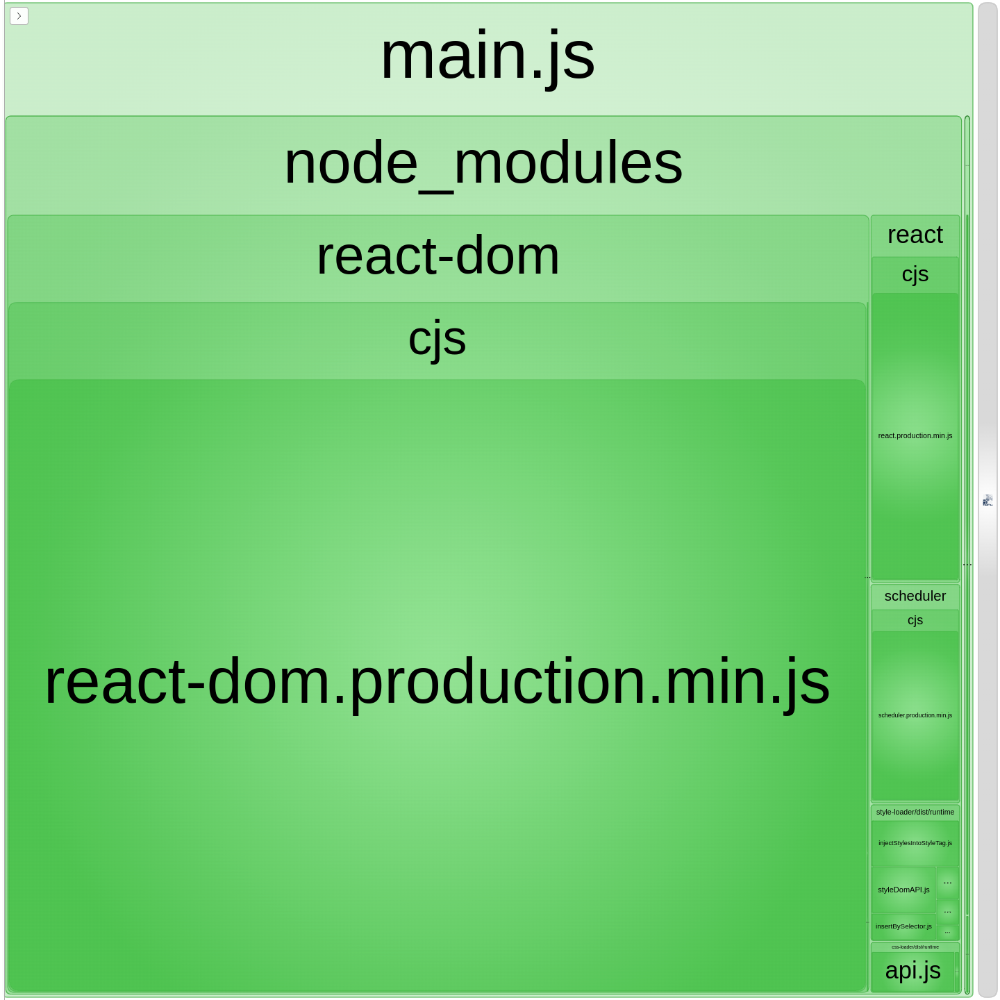

Wszyscy znamy trzy składniki potrzebne do zbudowania strony internetowej: HTML, CSS, JavaScript. HTML jest jak rzeczowniki w zdaniach, CSS jak przymiotniki, a JavaScript jest jak czasowniki. HTML definiuje strukturę, CSS style, JavaScript funkcjonalność. Ale czy obecnie to wystarcza?

Pierwsze strony internetowe z lat 90. były proste. Były to statyczne dokumenty ze znikomą ilością styli czy funkcjonalności. Wystarczyło napisać trochę HTML-a, dołączyć arkusz stylów i skrypt (jeżeli w ogóle) i strona była gotowa. W latach 90. robiłem swoje pierwsze kroki (dosłownie), dlatego do moich pierwszych kroków w tworzeniu stron musiało minąć trochę czasu. Ale nawet dla mnie ten prosty sposób tworzenia jest znajomy. Przypomina mi o moich pierwszych stronach.

Jednakże, współczesne aplikacje internetowe są o wiele bardziej złożone. Są one wysoko interaktywne. Składają się z wielu assetów, zdjęć w wielu formatach, filmów, fontów i innych zewnętrznych modułów. Dodatkowo ludzie wykorzystują technologie takie jak Typescript, React czy SCSS zamiast tych podstawowych języków. Wiele plików o różnorodnych rozszerzeniach importuje się wzajemnie wraz z innymi assetami. Ale nie jest to dostępne natywnie w przeglądarce. Współczesne przeglądarki dopiero zaczęły wspierać funkcjonalności modułów. No i nie możesz importować assetów wewnątrz plików js. Potrzebujemy narzędzia, aby rozwiązać te problemy.

## Czym jest bundler modułów?

Module bundler rozwiązuje wymienione problemy. U podstaw, taki bundler bierze wiele plików js (moduły) i łączy je w jeden plik (bundle), który buduje twoją aplikację w przeglądarce. Poza lokalnymi modułami, wszystkie zewnętrzne zależności także zostaną scalone. Te zależności mogą posiadać swoje zależności itd. Bundler modułów, taki jak webpack, tworzy graf zależności, aby je śledzić. Oczywiście to jest uproszczenie. Skonfigurujemy projekt wraz narzędziem webpack, aby się zagłębić i poznać więcej funkcjonalności.

<Callout variant="info">

W narzędziach CLI jak `create-react-app` lub frameworkach jak Gatsby, webpack jest już skonfigurowany. Nadal jednak uważam, że dobrze wiedzieć co się dzieje "pod maską".

</Callout>

## Webpack

Na początek zainicjujmy nowy projekt npm.

```bash
npm init -y
```

Następnie zainstalujmy paczki webpack.

```bash
npm install -D webpack webpack-cli
```

Potrzebujemy czegoś do “spakowania”, więc dodajmy prosty plik JavaScript.

```js title="./src/index.js"
const exampleFunction = () => {
  console.log('Message')
}
```

Webpack zadziała bez wcześniejszej konfiguracji. Po wpisaniu w terminalu `webpack`, połączy on twoje pliki wykorzystując domyślną konfigurację. Jednakże, najczęściej chcesz dodać własną konfigurację. Musimy dodać plik konfiguracyjny, aby dostosować jego zachowanie. Plik ten musi eksportować obiekt wraz z twoimi ustawieniami.

### Entry

Entry jest jak punkt startowy twojej aplikacji. Ta opcja przyjmuje ścieżkę do modułu. Webpack wykorzysta ten moduł, aby zacząć budować graf zależności. Ustawimy tę wartość na `./src/index.js`, która jest też domyślną wartością. Może ona także przyjąć obiekt dla wielu ścieżek i podziału kodu (code splitting).

```js title="webpack.config.js"
module.exports = {
  entry: './src/index.js'
}
```

### Output

Output ustawia, gdzie webpack powinien umieścić nasz bundle. Ta opcja przyjmuje dwa parametry: `path` i `filename`. Skonfigurujemy webpacka, aby zapisywał bundle w `./public/main.js`.

```js title="webpack.config.js" highlight={[5, 8]}
const path = require('path')

module.exports = {
  entry: './src/index.js',
  output: {
    filename: 'main.js',
    path: path.resolve(__dirname, 'public')
  }
}
```

### Loaders

Powiedzmy, że chcemy także ostylować naszą aplikację. Stwórzmy plik CSS ze zmienną.

```css title="./src/style.css"
:root {
  --eiffel-65: blue;
}
```

Następnie zaimportujmy go do naszej aplikacji.

```js title="./src/index.js"
import './style.css'
```

Być może cię to zaskoczy, jeżeli przywykłeś do frameworków, ale ta składnia nie zadziała. Potrzebujemy sposobu, żeby przekształcić nasz plik CSS w poprawny moduł. A webpack sam w sobie nie robi aż tak wiele. W domyśle wspiera tylko pliki JSON i JavaScript. Dlatego potrzebujemy loadera. Loader konwertuje różne typy plików na poprawne moduły. Potrzebujemy zainstalować dwa z nich, aby użyć naszych stylów.

```bash
npm install -D style-loader css-loader
```

Następnie musimy je skonfigurować. Loader przyjmuje dwie właściwości:

1. Właściwość `test`, która identyfikuje pliki do przekształcenia.
2. Właściwość `use` ustala, którego loadera użyć.

W naszym przypadku, użyjemy wyrażenia regularnego do zidentyfikowania plików CSS i użyjemy powyższych loaderów.

```js title="webpack.config.js" highlight={[12, 15]}
const path = require('path')

module.exports = {
  entry: './src/index.js',
  target: ['web', 'es5'],
  output: {
    filename: 'main.js',
    path: path.resolve(__dirname, 'public')
  },
  module: {
    rules: [
      {
        test: /\.css$/,
        use: ['style-loader', 'css-loader']
      }
    ]
  }
}
```

### Babel

Pora na małą dygresję. Z naszym plikiem może być inny problem - konkretnie, funkcja strzałkowa. Podobnie jak Jahwe pomieszał ludziom języki, bogowie przeglądarek mieszają implementacje JavaScript. Pomimo że przeglądarki obsługują większość funkcjonalności specyfikacji ES6, wsparcie nie jest stuprocentowe. Powiedzmy, że chcemy wspierać Internet Explorera z jakiegoś powodu. Potrzebujemy sposobu na przekształcenie naszej składni. Moglibyśmy wykorzystać polyfill, ale wraz z nowym kodem i funkcjonalnościami, szybko stałoby się to kłopotliwe. JavaScript szybko się rozwija i nowa składnia pojawia się regularnie: async/await, operator spread, klasy itp. Kilka postów temu, sam napisałem o nowej, przydatnej funkcjonalności - [optional chaining](/pl/blog/is-it-native-javascript-isnt-it/). W tym momencie, jak dar glosolalii od Boga, przychodzi Babel. Babel bierze współczesną składnię języka JavaScript i kompiluje ją do formy zrozumiałej przez różne przeglądarki. Babel wykorzystuje pluginy, aby przekształcać różne funkcjonalności języka takie jak `plugin-proposal-optional-chaining`. Pluginy są małe i nie chcemy ich instalować oddzielnie. Zamiast tego, zdefiniujemy preset z wieloma funkcjonalnościami. Wykorzystamy `babel-preset-env`. Pozwala on na definiowanie poziomu kompatybilności z przeglądarkami, które chcemy wspierać. Dodamy także preset dla biblioteki React.

```bash
npm install -D @babel/core @babel/preset-env @babel/preset-react babel-loader
```

```bash
npm install react react-dom
```

Babel może być używany niezależnie, ale my skonfigurujemy go z webpackiem. W tym celu musimy dodać loader wewnątrz tablicy `rules`. Tym razem musimy wykluczyć folder `node_modules` i dodać presety, dlatego właściwość `use` przyjmuje obiekt.

```js title="webpack.config.js" highlight={[16,25]}
const path = require('path')

module.exports = {
  entry: './src/index.js',
  target: ['web', 'es5'],
  output: {
    filename: 'main.js',
    path: path.resolve(__dirname, 'public')
  },
  module: {
    rules: [
      {
        test: /\.css$/,
        use: ['style-loader', 'css-loader']
      },
      {
        test: /\.js$/,
        exclude: /(node_modules|bower_components)/,
        use: {
          loader: 'babel-loader',
          options: {
            presets: ['@babel/preset-env', '@babel/preset-react']
          }
        }
      }
    ]
  }
}
```

Teraz możemy stworzyć prosty komponent React.

```jsx title="./src/component.js"
import React from 'react'

const Heading = () => {
  return (
    <h1 style={{ color: 'var(--eiffel-65)' }}>
      This is heading with style variables
    </h1>
  )
}

export default Heading
```

I zaimportować go wraz ze stylami w naszym głównym pliku.

```jsx title="./src/index.js"
import React from 'react'
import { createRoot } from 'react-dom/client'
import './style.css'
import Heading from './component'

const root = createRoot(document.getElementById('root'))
root.render(<Heading />)
```

Jeżeli skonfigurowaliśmy wszystko poprawnie, webpack powinien nadal działać. Nasz bundle powinien tym razem zawierać znacznie więcej kodu, ponieważ pakujemy także bibliotekę React. Możemy nawet sprawdzić z czego składa się nasz bundle.

### Plugins

Pluginy są potężniejszymi wersjami loaderów. Możesz je wykorzystać do szerszego wachlarza zadań, takich jak optymalizacja całego procesu czy zarządzanie assetami. Chcieliśmy przeanalizować nasz bundle i szczęśliwie istnieje plugin, który możemy wykorzystać. Najpierw zainstalujmy go.

```bash
npm install -D webpack-bundle-analyzer
```

Następnie musimy dodać właściwość `plguins` do naszej konfiguracji. Przyjmuje ona tablicę ze wszystkimi pluginami. W tablicy stworzymy instancję naszego nowego obiektu.

```js title="webpack.config.js" highlight={[28]}
const path = require('path')
const { BundleAnalyzerPlugin } = require('webpack-bundle-analyzer')

module.exports = {
  entry: './src/index.js',
  output: {
    filename: 'main.js',
    path: path.resolve(__dirname, 'public')
  },
  module: {
    rules: [
      {
        test: /\.css$/,
        use: ['style-loader', 'css-loader']
      },
      {
        test: /\.js$/,
        exclude: /(node_modules|bower_components)/,
        use: {
          loader: 'babel-loader',
          options: {
            presets: ['@babel/preset-env', '@babel/preset-react']
          }
        }
      }
    ]
  },
  plugins: [new BundleAnalyzerPlugin()]
}
```

Po uruchomieniu webpacka, karta przeglądarki powinna się otworzyć. Powinieneś ujrzeć interaktywną mapę z proporcjonalnie przeskalowanymi prostokątami. Symbolizują one zależności i zawierają dodatkowe informacje. W mojej opinii - całkiem fajny plugin.



## Podsumowanie

Teraz już wiemy dlaczego zaprzątamy sobie głowę tymi pobocznymi technologiami. Bundler modułów, taki jak webpack, potrafi przekształcić nasz kod, assety i sprawić, aby były kompatybilne z różnymi przeglądarkami. W tym wpisie skonfigurowaliśmy webpacka, ale istnieją alternatywy jak parcel czy rollup. Mogą się różnić detalami, ale podstawowa idea jest taka sama. Poprawnie skonfigurowany module bundler i Babel mogą zająć się różnymi dziwactwami języka/przeglądarek i uczynić nasze programistyczne życie mniej irytującym.
