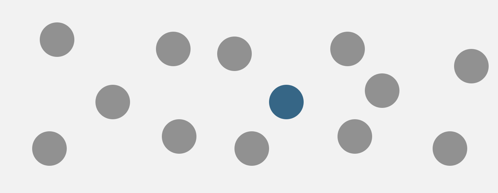
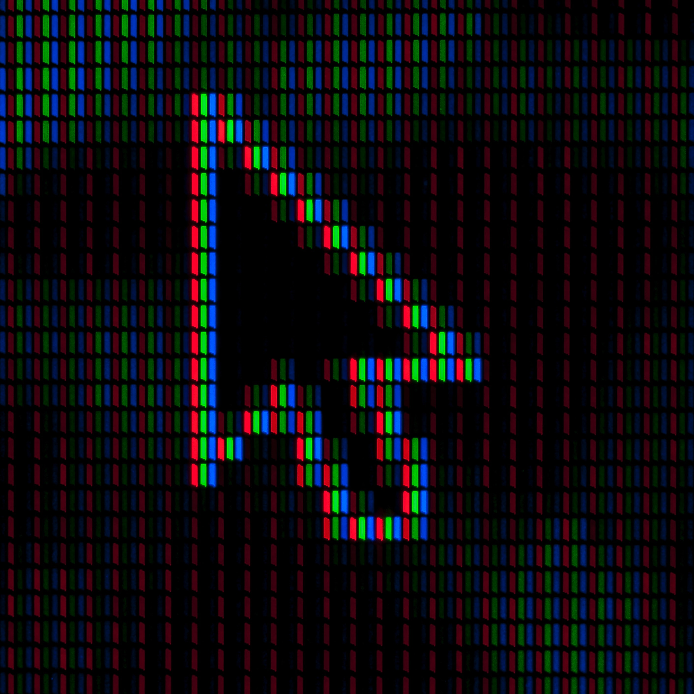
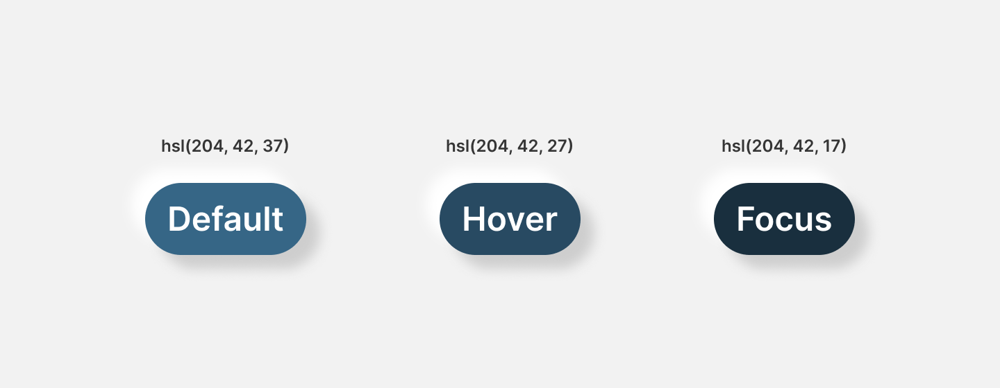
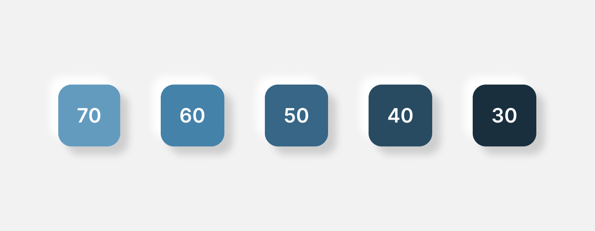
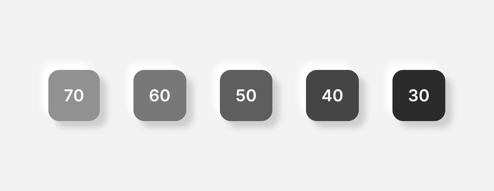

---
title: Why use HSL in your next design system?
description: "In this post, we will look at different color formats. We'll compare the most popular ones available in CSS: hex values, RGB and HSL. Why use the last one?"
date: 2022-12-21T18:00:00+02:00
updated: 2022-12-21T18:00:00+02:00
image:
  alt: "Multi-colored bokeh lights"
  caption: "Photo by Thomas M. Evans"
  src: "./thomas-m-evans-ofEZVY3nzus-unsplash.jpg"
categories: ["design"]
tags: ["css", "colors", "hex", "rgb", "hsl"]
type: "post"
---

I don't know if you're aware, but most of your brain is responsible for processing visual information. Mine too. Most primates are visual learners. Half of the brain of the Indochinese rhesus macaque dedicates itself to vision. Our eyes and brain create a sophisticated tool for detecting depth, movement, and color. Colors are surprisingly significant for our understanding of reality. Look at this example.



Which element stood out? The one with a different color. Colors can differentiate and connect, highlight and hide. Contrasting values tend to bring forms into sharp focus while combining close shades softens the distinction between elements.

> All colors are the friends of their neighbors and the lovers of their opposites.
>
> &mdash;<cite> Marc Chagall</cite>

## The fundamental building blocks of a design system

Just like visual processing is a big part of our brains, colors are a big part of our design systems. I've spent more hours choosing colors for my website than I would like to admit. But after long divagations, experimenting, and accessibility testing, I come up with some colors. My palette 1.0 was simple. It contained some hex values for the background, texts, and a primary color with two shades. Hold on - hex, what is that?

## Colors on the web

To better understand it, let's step back for a moment. You probably know the screen you're looking at now consists of pixels. Standard Full HD screen (1920x1080) has 2 073 600 of them. Each pixel has three mini LEDs: red, green, and blue. Yeah, it's a simplification, but it's good enough.



On the web, we can control them with CSS. CSS supports many different color formats: hex values, `rgb()`, `hsl()`, `rgba()`, `hsla()`, named colors, and the list goes on. I'll focus on the first three.

## Hex values

As I mentioned, at first, I used hex values. "Hexadecimal color" is probably the most common way of declaring colors on the Internet. The hexadecimal system is similar to the standard decimal system, but instead of ten unique digits (0 - 9), it uses sixteen (0 - F). Letters represent numbers 10 - 15. In this method, consecutive hexadecimal numbers represent each primary color - red, green, and blue (referred to as **channels**). So the colors can look like this.

```css
:root {
  /* #RRGGBB */
  --blue: #0000ff;
  --black: #000000;
  --yellow: #ffff00;
}
```

You can control those colors by changing their numbers. You can create a whole color palette by mixing and matching those colors - just like in art class in elementary school. "Yeah, sure, but I didn't need this Hexa-something in elementary school.”

## RGB

If you don't like the hexadecimal system, there is another method of declaring colors in CSS - RGB. Fundamentally it works the same - you control each primary color with numbers. But instead of a hexadecimal system, you can use the standard decimal system. Each channel can take a value from 0 to 255. So to be precise, you can create 16 777 216 colors. There is a specific CSS method for declaring colors this way.

```css
:root {
  /* rgb(red, green, blue) */
  --blue: rgb(0, 0, 255);
  --black: rgb(0, 0, 0);
  --yellow: rgb(255, 255, 0);
}
```

It is a little more convenient than the hex values because we are used to the decimal system. Still, it is not intuitive. That's not how our brains perceive colors. When you look at a specific color, you don't split it into red, green, and blue. And here comes the HSL.

## HSL

The system is fundamentally different from the other two. The name is also an acronym, but it stands for hue, saturation, and lightness. HSL works similarly to how we perceive colors - manipulating them with saturation and lightness.

**The hue** property sets the color. The colors are around the circle, and each degree corresponds to a different hue. So the value can vary from 0 to 360. The chosen color will be a base we can change with saturation and lightness.

**The saturation** property describes in percentage how saturated the chosen color is. 0% means it will be gray. 100% displays the most vibrant version of the hue. Completely saturated blue will be like Rose's Heart of the Ocean necklace.

**The lightness** property describes the intensity of the lightning. The value is also a percentage. 0% will look black, and 100% will display white. Similarly to reality - when there is no light, everything seems black.

In CSS, there is also a function for the HSL format. We can recreate the colors from our examples using HSL.

```css
:root {
  /* hsl(hue, saturation, lightness) */
  --blue: hsl(240, 100, 50);
  --black: hsl(0, 0, 0);
  --yellow: hsl(60, 100, 50);
}
```

The colors in our examples are pure for simplicity, so the saturation is 100%. However, usually, we want to soften them up a little because they can seem unpleasant to the eye.

<Callout type="info">

The combination of green and red (or red and blue) is particularly unpleasant. When designing, try to avoid it. Those colors placed side by side can cause chromostereopsis. It is an illusion that occurs when specific colors are placed alongside each other making it difficult to focus on both.

</Callout>

## Why use HSL?

Softening color up is easy using HSL - you need to tone the saturation down. Changing color brightness is comparably easy. Imagine a typical scenario - you have a button with a few states: default, hover, and focus. You want the background color to be darker for hover and focus. Achieving that with hex values would require manual mixing and testing or generating color shades. Still, with hex values, you wouldn't be sure how much the colors differ. Using HSL, you can set hue and saturation and then manipulate lightness with percentage. The difference between colors is understandable at first glance.



That is another advantage of using the HSL format. You can effortlessly grade the colors. You can imagine a situation where your design system grows, and you need more color variants - adding them is simple. In my example, CSS variables represent subsequent color variants.

```css
:root {
  --color-primary-hue: 204;
  --color-primary-saturation: 42%;
  --color-primary: var(--color-primary-hue), var(--color-primary-saturation);
  --color-primary-70: hsl(var(--color-primary), 57%);
  --color-primary-60: hsl(var(--color-primary), 47%);
  --color-primary-50: hsl(var(--color-primary), 37%);
  --color-primary-40: hsl(var(--color-primary), 27%);
  --color-primary-30: hsl(var(--color-primary), 17%);
}
```

The image below shows how the colors display.



The snippet presents the power of declaring variables with HSL - composition. You can set hue and saturation as variables and reuse them in multiple places. And that is a DRY code! I'm surprised I'll write that, but let's say we don't like blue anymore. We listened to Amy Winehouse, and we're [backing to black](https://www.youtube.com/watch?v=TJAfLE39ZZ8). Changing all colors in our snippet is as simple as changing one number - the saturation (to 0%)!



## Summary

If you're planning to create a design system, consider using the HSL format instead of the default RGB. It is more intuitive and simplifies scalability. HSL also enables composition and calculations on colors. It is probably my last post this year, so - Merry Christmas! I wish you many presents in red boxes, under a green Christmas tree with blue lights 🎄
