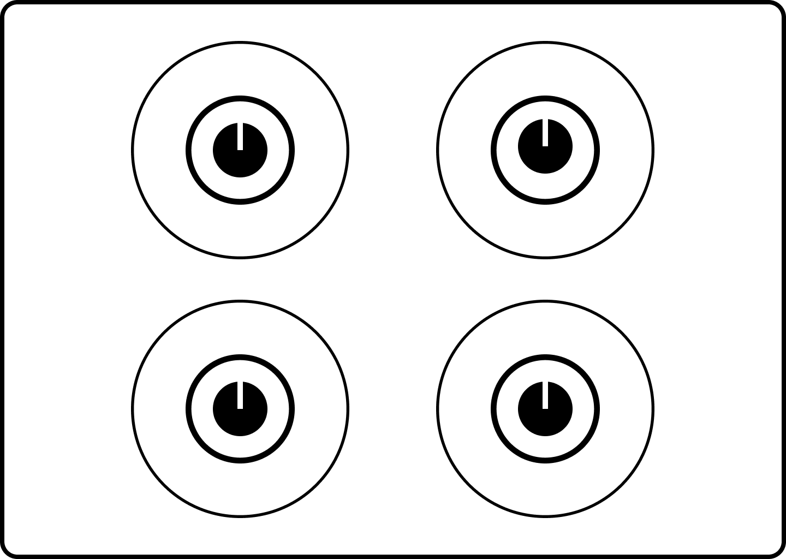
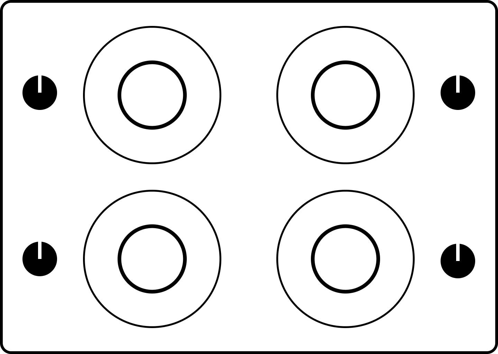
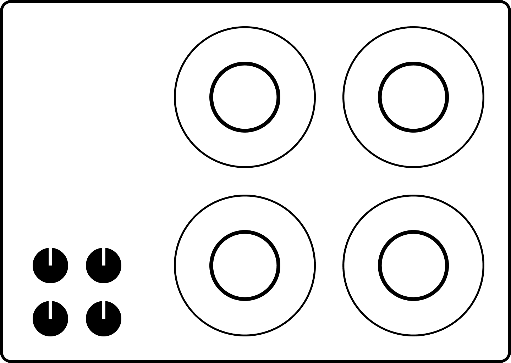

Wyobraź sobie scenariusz - słońce wschodzi, poranek się zaczyna. Budzisz się i wstajesz z łóżka. Włóczysz nogami do kuchni, żeby zrobić sobie filiżankę kawy. Kładziesz czajnik na kuchence obok innych garnków i podpalasz palnik. W międzyczasie robisz inne rzeczy - czeszesz włosy, myjesz twarz, włączasz radio i lekko podrygujesz. Po czasie wracasz, aby zaparzyć sobie kawę. Ale woda się nie gotuje. Przysiągłbyś na Latającego Potwora Spaghetti, że podpaliłeś palnik. I podpaliłeś palnik. . . ale nie ten. W tym scenariuszu łatwo obwiniać siebie. Byłeś śpiący, a twój mózg dopiero zaczynał funkcjonować. Ale błędy jak ten zdarzają się w różnych porach dnia. Szczególnie, gdy używasz cudzej kuchenki. Czy jesteśmy tak głupi, że nie potrafimy zapamiętać co robią cztery (zwykle) pokrętła?

## Pamięć = wiedza w umyśle

Nie, większość ludzi dobrze zapamiętuje cztery elementy[[1]](https://psycnet.apa.org/record/1994-28291-001). Problem zaczyna się, gdy liczba elementów wzrasta. 198.51.100.0 to przykład adresu IPv4. Musiałbyś wpisywać taki ciąg cyfr, gdyby nie było serwerów DNS. Serwery te są jak książka telefoniczna - tłumaczą przyjazne dla ludzi nazwy hosta (przykład.com) na adresy IP. Współczesne książki telefoniczne - kontakty w naszych smartfonach - też pomagają naszym mózgom. Słabo wychodzi nam zapamiętywanie przypadkowych ciągów znaków. Zaloguj się do strony internetowej, której dawno nie używałeś i przekonaj się sam. Dlaczego zatem wiele systemów obciąża naszą pamięć? Ponieważ jest to wygodne dla maszyn i ich twórców. Kombinacje, jak numery telefonów, nie ułatwiają życia użytkowników. Na szczęście technologia jest teraz przyjazna dla użytkowników. Zapisujemy hasła i numery na naszych urządzeniach. Najlepszym sposobem, aby pomóc ludzkiej pamięci to sprawić, aby była mniej potrzebna. Łatwiej ukończyć zadanie, kiedy niezbędne informacje łatwo znaleźć w środowisku.

## "Wiedza w świecie"

"Wiedza musi być w umyśle, wiesz?". Ok, masz mnie. To nie jest precyzyjna definicja, ale ułatwia wywód, dlatego będę się trzymał tego podziału: wiedza w umyśle i świecie. "Wiedza w świecie" to dowolna informacja, potrzebna do osiągnięcia jakiegoś celu. Nie musimy zapamiętywać układu klawiatury, aby jej używać. Każdy przycisk ma etykietę. Wiedza na temat tego co robią klawisze jest w świecie. Ja zapamiętałem cały układ klawiatury qwerty. Przyspiesza to moje pisanie, ale wymaga czasu i nie jest niezbędne. Nie potrzebujesz wielu godzin praktyki pisania na klawiaturze, aby po prostu jej używać. Używanie pada wymaga trochę praktyki. Ma on mniej przycisków niż klawiatura, ale musisz zapamiętać je wszystkie. W większości gier nie ma czasu, aby spoglądać na pada. Istnieją konwencje, ale zwykle musisz się także nauczyć za jakie akcje odpowiedzialne są poszczególne przyciski. Aktualnie gram w Ghost of Tsushima na PlayStation 4. Jin Sakai - legendarny samurai - jest głównym protagonistą. Ma wiele technik i broni pod ręką. Po kilkunastu godzinach w grze, czasem nadal nie pamiętam co wcisnąć, aby coś wyekwipować. I w sumie nie muszę. Przyciśnięcie klawiszy R2 lub L2 wyświetla menu z postawami i broniami.

## Balans

Ghost of Tsushima jest dobrym przykładem balansu pomiędzy wiedzą w świecie i umyśle. Wymaga zapamiętania przycisków dla podstawowych akcji takich jak skakanie, celowanie czy atakowanie. Menu na ekranie pomagają w wyborze przedmiotów. Zaśmiecają one ekran, ale tylko na moment zmiany broni. Przez większość czasu interfejs jest minimalny. Oba typy wiedzy mają plusy i minusy. W codziennym funkcjonowaniu potrzebujemy obu typów.

| Wiedza w świecie                                                                                                                         | Wiedza w umyśle                                                                                                         |
| ---------------------------------------------------------------------------------------------------------------------------------------- | ----------------------------------------------------------------------------------------------------------------------- |
| Informacje są łatwo dostępne, o ile są widoczne.                                                                                         | Informacje są w pamięci, w przeciwnym wypadku przypomnienie ich może wymagać wysiłku.                                   |
| Interpretacja zastępuje naukę. Projektant jest odpowiedzialny za łatwość przyswajania.                                                   | Nauka wymaga czasu i wysiłku. Proces może być mniej bolesny, jeżeli informacje są ustrukturyzowane.                     |
| Jest wolniej dostępna przez szukanie i interpretację.                                                                                    | Może być wydajna, szczególnie gdy dobrze przyswojona. Zautomatyzowana z czasem - nie wymaga świadomego myślenia.        |
| Może być nieestetyczna i nieprzyjemna, szczególnie jeżeli trzeba zamieścić wiele informacji. Nieumiejętne użycie może spowodować natłok. | Nic nie musi być widoczne. Może to tworzyć przyjemniejszy i bardziej estetyczny wygląd, ale kosztem nauki i pamiętania. |

## Mapowanie

Mapowanie ukazuje siłę łączenia obu typów wiedzy. Wróćmy do naszej kuchenki. Większość kuchenek ma cztery palniki. Zapamiętanie, którego pokrętła użyć nie powinno sprawiać nam kłopotu. A jednak czasem mamy problem. Dlaczego? Przez słabe mapowanie pomiędzy pokrętłami i palnikami. Mapowanie to techniczny termin zapożyczony z matematyki. Są różne definicje zależne od kontekstu. Ale prosto rzecz ujmując - jest to relacja pomiędzy elementami w dwóch różnych zbiorach. Pomiędzy pokrętłami i palnikami też występuje relacja (jeden do jednego). Problem w tym, że jest nienaturalna. Większość kuchenek które widziałem, mapuje dwuwymiarową siatkę palników na jednowymiarowy szereg pokręteł.

Oczywiście, że informacja o palniku jest nad pokrętłem. Ale jej interpretacja wymaga trochę wysiłku. Moglibyśmy zapamiętać mapowanie, nawet gdyby nie było naturalne. Ale nie ma standardu pomiędzy różnymi producentami. Dlatego, gdy używamy cudzej kuchenki, albo kupujemy nową, musimy zwykle nauczyć się nowego mapowania. Niektóre kuchenki mają pogrupowane palniki i pokrętła. Ale mapowanie nadal nie jest jednoznaczne.

Co zrobić, aby było jednoznaczne? Stworzyć bardziej naturalne mapowanie. Moglibyśmy umieścić pokrętła bezpośrednio na elementach, którymi sterują.

W przypadku palników nie jest to praktyczne - spaliłyby się. Moglibyśmy też umieścić pokrętła jak najbliżej elementów, które kontrolują.

Jest to jednoznaczne i praktyczne. Ale sięgnięcie do pokręteł z tyłu mogłoby być problematyczne. Trzecie najlepsze mapowanie to odtworzenie pozycji palników przez pokrętła. Jest to trochę mniej jasne, ale sięganie do pokręteł jest prostsze.

Dlaczego producenci nie mapują kuchenek w ten sposób? Może jest to kwestia wygody lub nawyku. Układ klawiatury qwerty też nie jest najlepszym układem jeżeli chodzi o wydajność. Ale jest to układ maszyn do pisania, szeroko rozpowszechniony, dlatego się go trzymamy. Może podobnie jest z kuchenkami.

O mapowaniu i rodzajach wiedzy przeczytałem w książce autorstwa Dona Normana, "[Dizajn na co dzień](https://lubimyczytac.pl/ksiazka/4859309/dizajn-na-co-dzien#:~:text=Donald%20Norman%2C%20ameryka%C5%84ski%20psycholog%20kognitywny,adept%C3%B3w%20wzornictwa%20przemys%C5%82owego%20i%20dizajnu.)". Jest to świetna lektura. Myślę, że nie bez powodu wiele ludzi ją poleca. Nawet jeżeli nie interesujesz się projektowaniem, powinieneś ją przeczytać. Nie spojrzysz na codzienne przedmioty w ten sam sposób.
