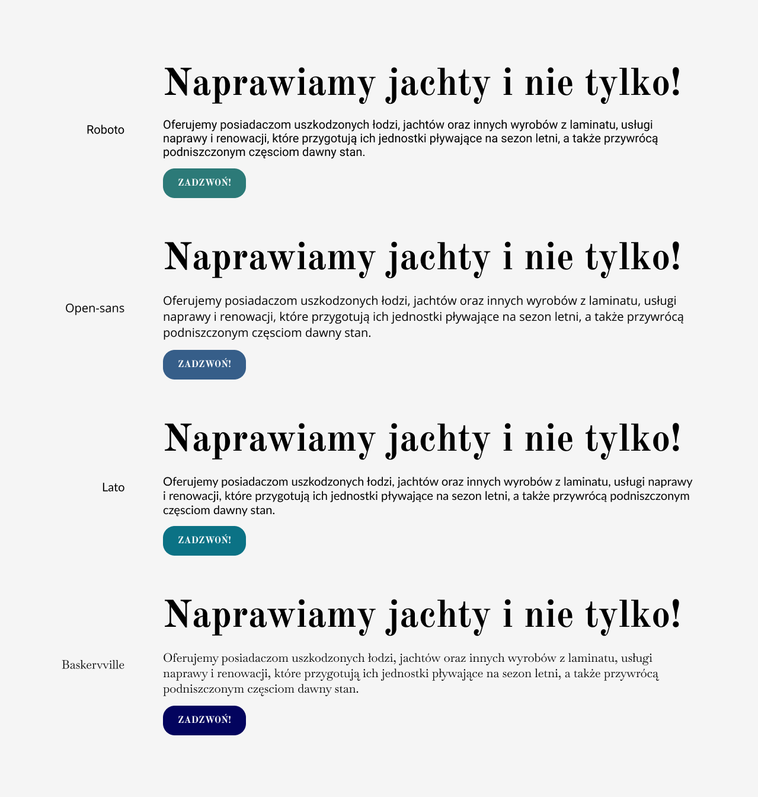
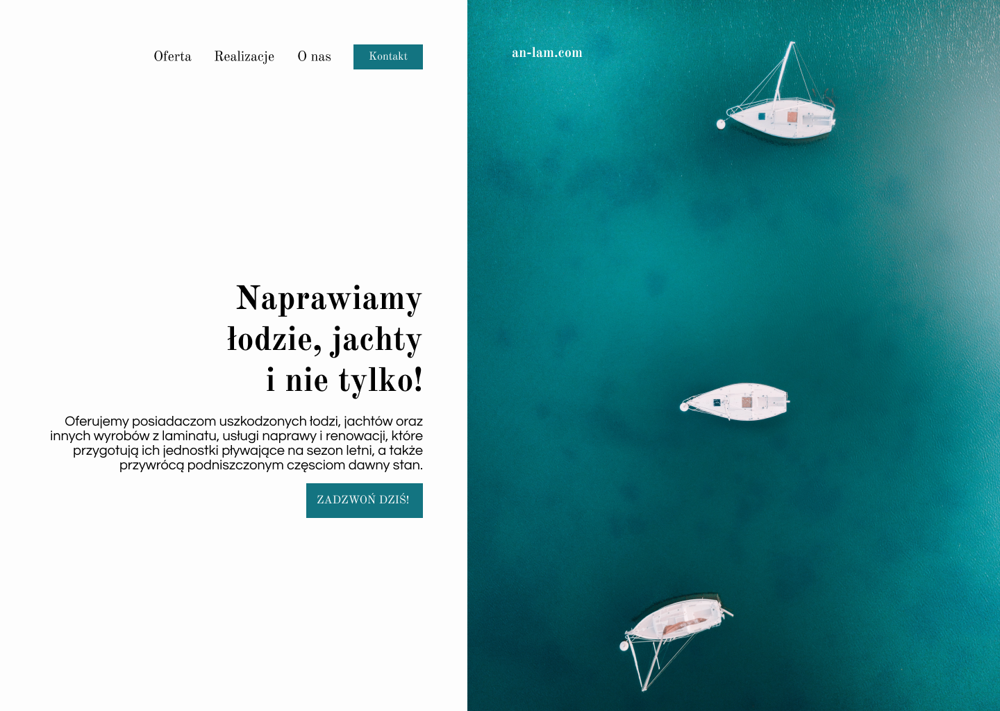
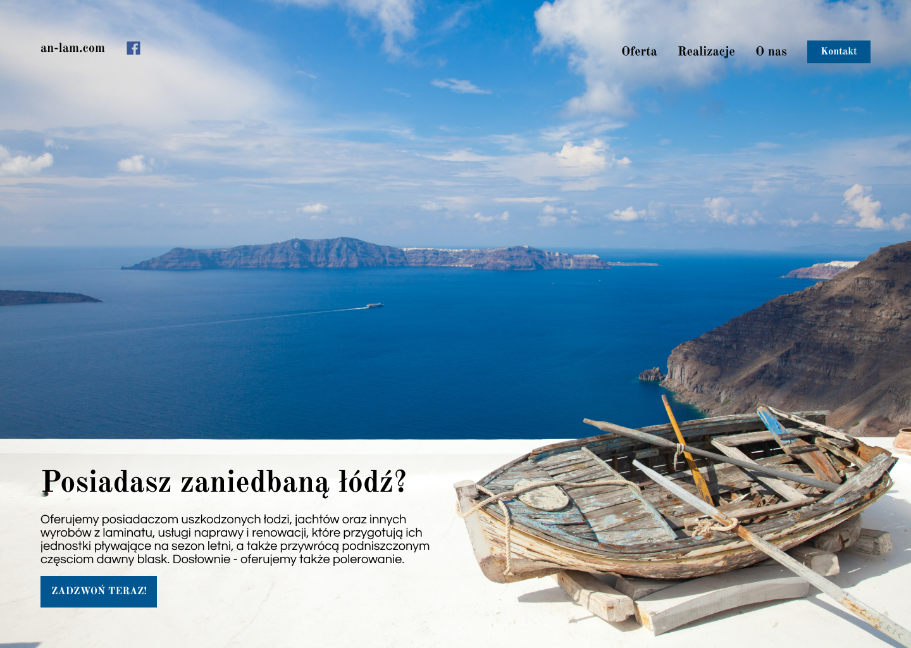
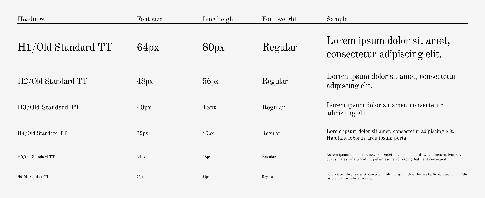

## Problem

Before I started work, I had met with a business owner to understand his needs. After some questions and discussion, we've agreed. He needed a business-card-style website with an offer that convinces a boat owner to use this offer. The website needs to look professional, work efficiently, display past repairs, and underline the long-term experience of the owner to achieve this goal.

## Inspiration

Before I started designing, I had done some research. I visited many competitors' websites - from local boatbuilders to yacht charters. I shared some links with the owner to recognize his aesthetic taste. Marine projects on _Behance_ and _Dribbble_ were also helpful. Using them, I've created an extensive mood board that I've been using during designing.


## Wireframes

I started the design process by creating several drafts of sections and renovations subpage. Then I fastly moved on to experimenting with fonts and colors.



Based on drafts and experiments, I created some wireframes. I shared them with the entrepreneur. His decisions influenced the following work.





## Content

Knowing the structure of the pages, I started creating content. For every section, I made short text. Similarly, I've done the same for every chosen repair. It required constant contact with the business owner. I also helped him with choosing and editing photos. "People don't read websites - they scan them" - I was guided by this principle during content creation. I wanted the user to recognize the business profile by skimming the headings. I was also creating content with keywords and SEO in mind.

## Design System

For this project, I created a simple but formal design system. I divided it into five levels of [Atomic Design](https://bradfrost.com/blog/post/atomic-web-design/). The base of every design system is typography and colors. I and the owner both liked classical font - [Old Standard TT](https://fonts.google.com/specimen/Old+Standard+TT). I paired it with the simple, geometrical font - [Questrial](https://fonts.google.com/specimen/Questrial) - for contrast. I think this combination emphasizes the owner's love for classical items, his long-term experience, and the local character of the business. The color palette consisted of grays, whites, and navy blue. It refers to sea, yachts, and minimalism. The accessibility of a website is significant, so I tested the color contrast ratios.




## Architecture

Having design and content, I could start coding (actually, different project stages were intertwined, but I present everything sequentially). The website will be mostly static, won't be often updated, and need to have good performance - because of that, I've chosen [Jamstack](/blog/jamstack-what-why-how/) architecture.

## Gatsby

Gatsby is one of the most feature-rich static site generators out there. It offers code and image optimization. There are many starters, themes, and plugins, which improve the speed of software development. I've started the project using [default starter](https://www.gatsbyjs.com/starters/gatsbyjs/gatsby-starter-default), and then I added some plugins:

- `gatsby-source-filesystem` for handling local files.
- `gatsby-transformer-JSON` to parse data from JSON files. It allows me to add new repairs easily in the future.
- `gatsby-plugin-sharp` to transform images. It has a noticeable effect on website performance (especially on the subpage with repairs).
- `gatsby-plugin-helmet` to add website meta tags. Important for SEO.
- `gatsby-plugin-styled-components` for styling react components.
- and few more

I was choosing mainly official and supported plugins. I also tried to add only the necessary ones.

## Testing

Gatsby doesn't support unit tests out of the box. I've added config to be able to write them.

In the project, I used the framework `Jest` with `React Testing Library`. In my opinion, it enforces good practices like finding elements by ARIA roles. There was not too much logic in this website - usually covered by unit tests. But, they were still helpful - I used them to test if components rendered everything correctly.

```jsx
import React from "react"
import { render } from "@testing-library/react"
import { ThemeProvider } from "styled-components"

import Light from "../../themes/light"
import { Services } from "../Services"

describe("Services", () => {
  it("has caption", () => {
    const { getByText } = render(
      <ThemeProvider theme={Light}>
        <Services></Services>
      </ThemeProvider>
    )
    expect(getByText(/oferta/i)).toBeDefined()
  })
  it("has title", () => {
    const { getByRole } = render(
      <ThemeProvider theme={Light}>
        <Services></Services>
      </ThemeProvider>
    )
    expect(getByRole("heading", { level: 2 })).toBeDefined()
  })
  it("has categories and corresponding lists of services", () => {
    const { getAllByRole } = render(
      <ThemeProvider theme={Light}>
        <Services></Services>
      </ThemeProvider>
    )
    const categories = getAllByRole("heading", { level: 3 })
    const services = getAllByRole("list")
    services.forEach(service => {
      expect(service.children.length).toBeGreaterThan(1)
    })
    expect(categories.length).toBeGreaterThan(1)
    expect(services.length).toBeGreaterThan(1)
    expect(categories.length).toBe(services.length)
  })
})
```

Besides unit tests, I also created some e2e tests. To achieve that, I added to the project `Cypress` with `Cypress Testing Library`. In this way, I unified searching for DOM elements. I simulated users' behavior with e2e tests: scrolling through sections, clicking links, etc. `Cypress-axe` library turned out to be very handy. It detected some problems with accessibility and helped me fix them.

</img>

## Github

I used Git as a version control system. I was formating commits using Angular convention. Before every commit, the `husky` package was starting git scripts. I put the whole codebase in the Github repository. I linked the repository with Netlify.

## Netlify

Netlify is a platform that combines CDN, serverless functions, and build automation. It works well with Git and improves implementation time. I saved some time not worrying too much about DevOps configuration. The free plan is enough for a new website that won't have too many visitors. The lack of additional hosting costs is beneficial for a small, local business. After linking Netlify to the repository, I launched continuous integration. Then I configured DNS servers and set personalized domain.

## Summary

The effect of my work is a minimalistic, aesthetic, and performant website, that scores high in lighthouse audits.
