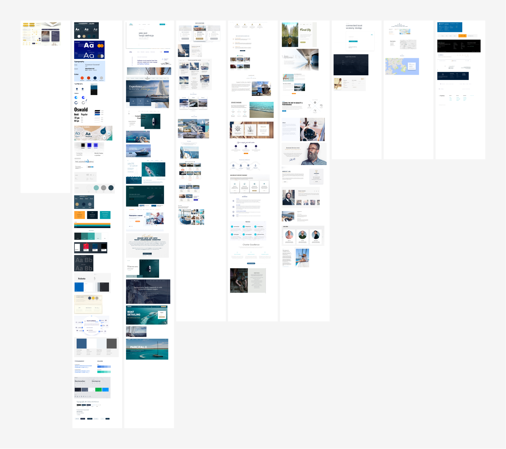
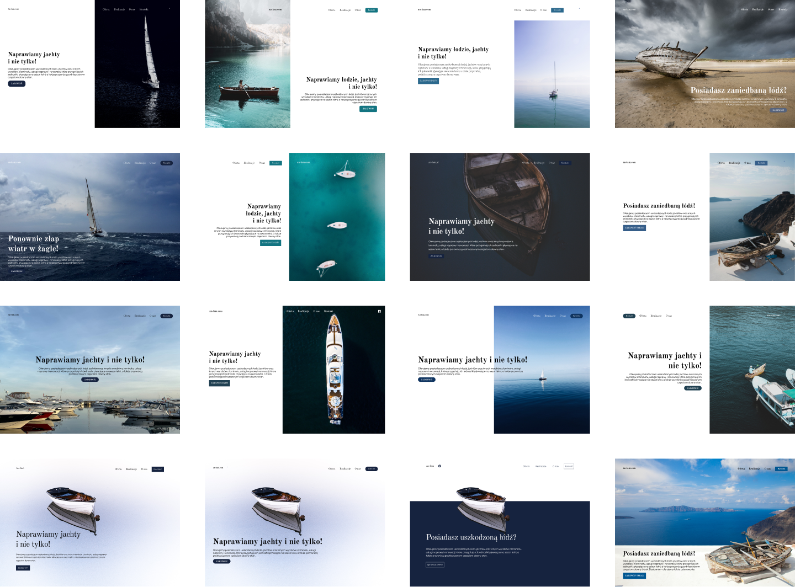
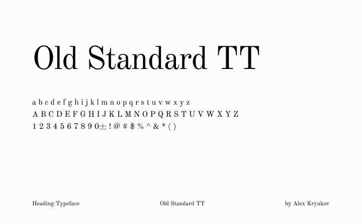
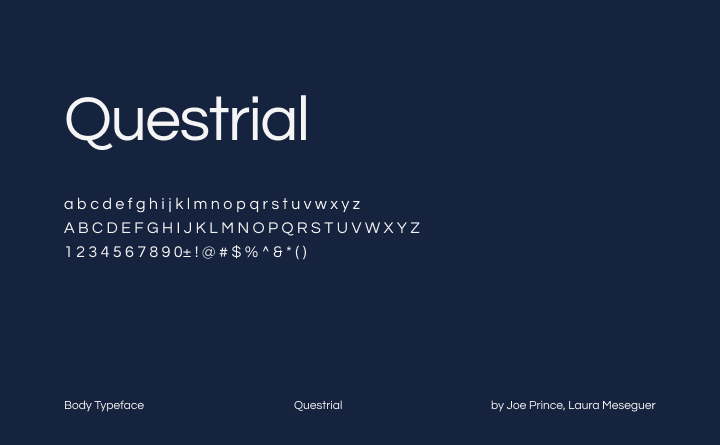
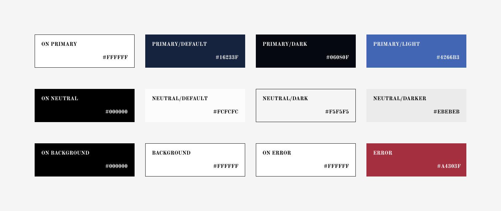
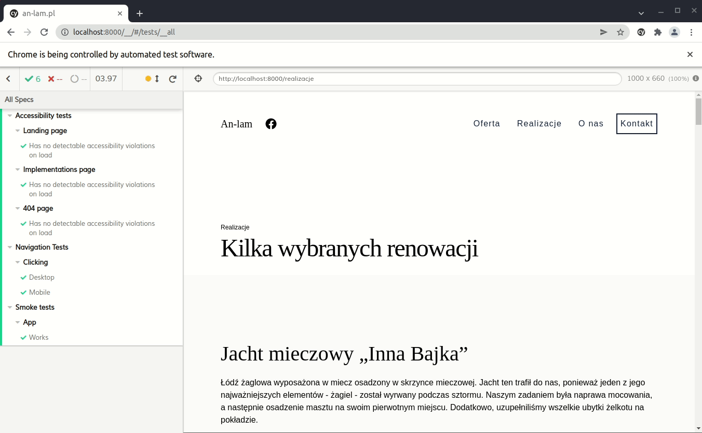
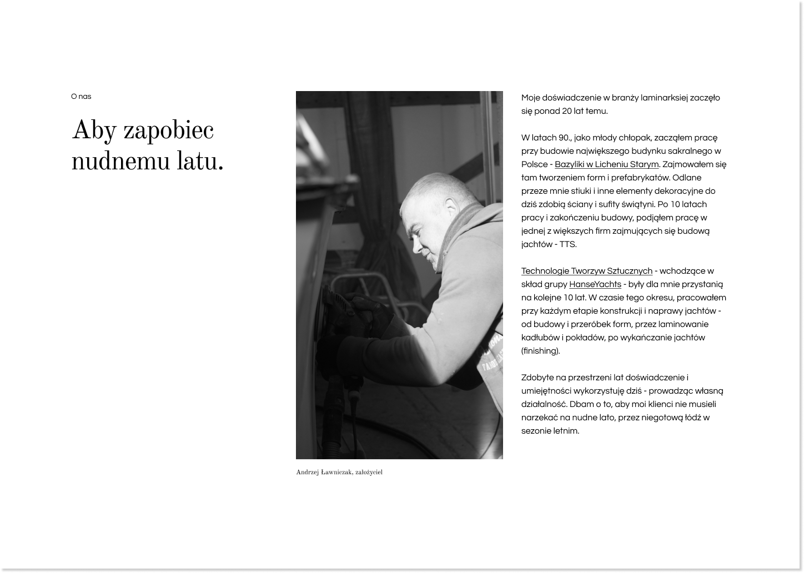
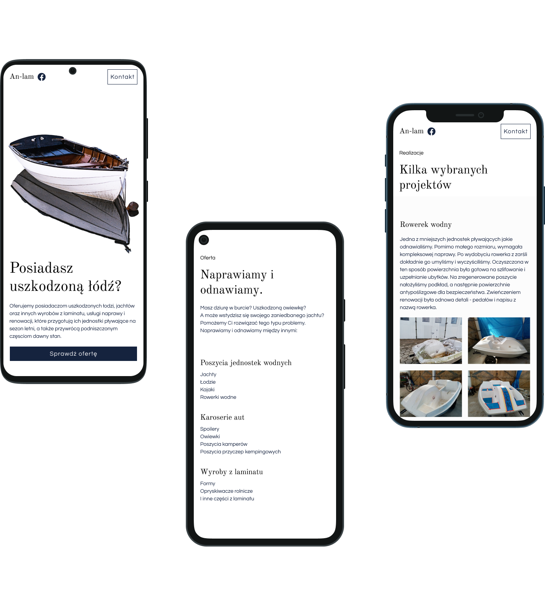

## Problem

Zanim zacząłem pracę, spotkałem się z właścicielem firmy, aby zrozumieć czego dokładnie potrzebuje. Po serii pytań i dyskusji doszliśmy do porozumienia. Potrzebna była strona-wizytówka prezentująca ofertę firmy, która zamieni posiadacza łodzi w klienta. Aby to osiągnąć strona musi wyglądać profesjonalnie, działać wydajnie, prezentować dotychczasowe renowacje i podkreślać wieloletnie doświadczenie właściciela w branży.

## Inspiracja

Przed przystąpieniem do projektowania zrobiłem gruntowny research. Przejrzałem mnóstwo stron konkurencji - od lokalnych szkutników po czartery jachtów. Podesłałem kilka linków właścicielowi, aby zorientować się w jego guście estetycznym.
Przydatne także okazały się projekty marynistyczne na _dribble_ i _behance_. Z ich pomocą stworzyłem moodboard, do którego wracałem podczas projektowania.



## Sitemap

Witryna z założenia miała być prosta, dlatego mapa strony nie jest złożona. Cała witryna składa się ze strony głównej podzielonej na 5 sekcji i podstrony realizacje, gdzie zostały przedstawione wybrane renowacje i naprawy.

## Wireframes

Projektowanie zacząłem od przygotowania kilku, zgrubnych szkiców sekcji i podstrony realizacje. Następnie szybko przeszedłem do eksperymentowania z róznymi fontami i kolorami. Na podstawie szkiców i eksperymentów przygotowałem kilka próbnych układów, które podesłałem właścicielowi. Jego decyzje wpłynęły na dalsze prace.



## Treści

Mając już niezłe pojęcie o strukturze strony przystąpiłem do tworzenia treści. Dla każdej z sekcji przygotowałem krótki tekst. Podobnie uczyniłem dla każdej z wybranych renowacji. Wymagało to stałego kontaktu z klientem. Pomogłem mu także w wyborze i edycji zdjęć. Tworząc treści, kierowałem się zasadą: „ludzie przeglądają strony - nie czytają ich”. Chciałem, aby odwiedzający zrozumiał profil firmy, nawet po przejrzeniu samych nagłówków. Teksty tworzyłem także pod kątem słów kluczowych i SEO.

> Ludzie przglądają strony - nie czytają ich.

## Design System

Na potrzeby projektu stworzyłem prosty, ale formalny design system. Podzieliłem go na pięć poziomów [Atomic Design](https://bradfrost.com/blog/post/atomic-web-design/).
Podstawą każdego, takiego systemu są fonty i kolory.
Zarówno mi jak i właścicielowi spodobał się klasyczny font - [Old Standard TT](https://fonts.google.com/specimen/Old+Standard+TT). Sparowałem go z prostym, geometrycznym fontem [Questrial](https://fonts.google.com/specimen/Questrial), dla uzyskania kontrastu. Myślę, że to połączenie dobrze podkreśla zamiłowanie właściciela do klasycznych rzeczy, jego wieloletnie doświadczenie i lokalny charakter firmy.





Paleta kolorów składa się z odcieni granatu, bieli i szarości. Nawiązuje do morza, jachtów i minimalizmu. Dostępność strony była dla mnie również istotna, dlatego przetestowałem kontrast kolorów.



## Architektura

Mając projekt graficzny i treści mogłem przystąpić do kodowania (w zasadzie, poszczególne etapy przeplatały się ze sobą, ale dla uproszczenia przedstawiam wszystko sekwencyjnie). Biorąc pod uwagę fakt, że treści na stronie nie będą często aktualizowane, strona nie będzie szczególnie interaktywna, a wydajność jest istotna, zdecydowałem się na architekturę [Jamstack](/pl/blog/jamstack-what-why-how/).

## Gatsby

Gatsby jest jednym z lepiej wyposażonych generatorów stron statycznych na rynku. Posiada sporo funkcji optymalizacji kodu i zdjęć. Wydajność stron jest zapewniona w zasadzie domyślnie. Oferuje sporo starterów, tematów i pluginów, co sprzyja prędkości rozwoju oprogramowania. W razie potrzeby ułatwia dodawanie kolejnych funkcji. Projekt rozpocząłem od [domyślnego startera](https://www.gatsbyjs.com/starters/gatsbyjs/gatsby-starter-default/), do którego dodałem dodatkowe pluginy:

- `gatsby-source-filesystem` do pobierania danych z lokalnego systemu plików.
- `gatsby-transformer-json` do parsowania danych z plików JSON. Dzięki temu w łatwy sposób mogę dodawać kolejne realizacje.
- `gatsby-plugin-sharp` do przetwarzania zdjęć. Ma duży wpływ na wydajność strony (szczególnie obfitej w zdjęcia podstrony realizacje).
- `gatsby-plugin-react-helmet` do uzupełniania metadanych strony. Istotny dla SEO.
- `gatsby-plugin-styled-components` do stylowania komponentów React.
- i kilku innych...

Wybierałem głównie te oficjalne i na bieżąco wspierane pluginy. Starałem się również nie dodawać ich zbyt wiele.

### Testowanie

Gatsby nie wspiera testów jednostkowych w domyśle. Dodanie ich wymaga odpowiedniej konfiguracji.

W projekcie wykorzystałem framework `Jest` wraz z biblioteką `React Testing Library`. Wymusza ona dobre praktyki, takie jak wyszukiwanie elementów po rolach ARIA.
Tworzona strona nie posiadała zbyt wiele logiki, którą zazwyczaj obejmują takie testy. Mimo to, były one całkiem przydatne - wykorzystałem je do sprawdzenia niezbędnej treści na stronie.

```jsx
import React from 'react'
import { render } from '@testing-library/react'
import { ThemeProvider } from 'styled-components'

import Light from '../../themes/light'
import { Services } from '../Services'

describe('Services', () => {
  it('has caption', () => {
    const { getByText } = render(
      <ThemeProvider theme={Light}>
        <Services></Services>
      </ThemeProvider>
    )
    expect(getByText(/oferta/i)).toBeDefined()
  })
  it('has title', () => {
    const { getByRole } = render(
      <ThemeProvider theme={Light}>
        <Services></Services>
      </ThemeProvider>
    )
    expect(getByRole('heading', { level: 2 })).toBeDefined()
  })
  it('has categories and corresponding lists of services', () => {
    const { getAllByRole } = render(
      <ThemeProvider theme={Light}>
        <Services></Services>
      </ThemeProvider>
    )
    const categories = getAllByRole('heading', { level: 3 })
    const services = getAllByRole('list')
    services.forEach((service) => {
      expect(service.children.length).toBeGreaterThan(1)
    })
    expect(categories.length).toBeGreaterThan(1)
    expect(services.length).toBeGreaterThan(1)
    expect(categories.length).toBe(services.length)
  })
})
```

Poza testami jednostkowymi stworzyłem także kilka testów E2E. W tym celu, dodałem do projektu framework `Cypress` wraz z biblioteką `Cypress Testing Library`. Ujednoliciłem w ten sposób składnię wyszukiwania elementów DOM. Testy E2E wykorzystałem do symulacji zachowań użytkownika: przeglądania sekcji i podstron, klikania w poszczególne linki itp.
Bardzo przydatna okazała się także biblioteka `cypress-axe`. Wykryła kilka problemów związanych z dostępnością strony i pomogła mi w ich usunięciu.



## Github

Jako system kontroli wersji wykorzystałem Git. Commity formatowałem według konwencji Angulara. Paczka `husky` posłużyła mi do uruchamiania skryptów gita. Cały kod umieściłem w repozytorium na Github. Repozytorium połączyłem z Netlify.

## Netlify

Netlify jest platformą łączącą w sobie CDN, serverless functions i automatyzację buildów. Ściśle współpracuje z Gitem i znacznie przyspiesza proces wdrożenia strony. Oszczędziła mi sporo czasu związanego z konfiguracją serwerów. Darmowy plan jest wystarczający dla strony, która początkowo nie będzie miała mnóstwa wejść. Brak dodatkowych kosztów hostingowych jest istotny dla małej, lokalnej firmy.
Po połączeniu z repozytorium, w projekcie uruchomiłem ciągłą integrację. Następnie skonfigurowałem serwery DNS i ustawiłem spersonalizowaną domenę.

## Podsumowanie

Efektem mojej pracy jest minimalistyczna, responsywna, estetyczna i wydajna strona internetowa, która uzyskuje najwyższe wyniki w audycie lighthouse.




