## Problem

"Szewc bez butów chodzi" czy może "web developer jest offline". Pomimo że naukę frontendu zacząłem jakiś czas temu, nigdy nie stworzyłem strony dla siebie. Czułem syndrom oszusta i myślałem, że nie jestem wystarczająco dobry. Ale w ten sposób, mógłbym to odwlekać w nieskończoność. Postanowiłem to zmienić. Chciałem mieć swój kącik w internecine - gdzie mógłbym wyrazić siebie i dzielić się moimi znaleziskami.

## Szkice

> Łatwiej jest zacząć z długopisem i kartką.

Mając to w pamięci, zacząłem generować pomysły. Zrobiłem zgrubne szkice każdej ze stron.

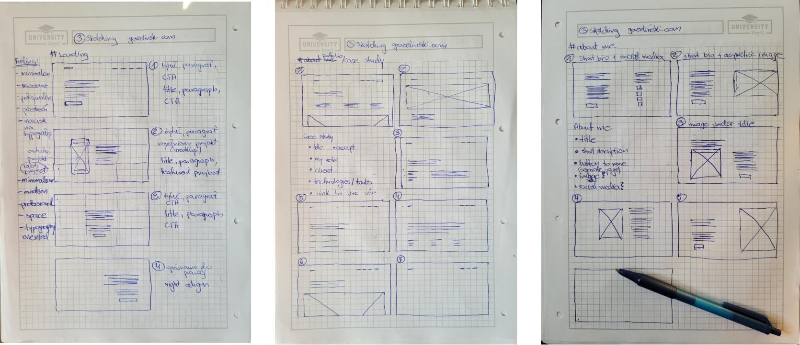

Nie jest to poziom szkiców Da Vinciego, ale były przydatne zanim zabrałem się za robienie makiet.

## Wireframes

Wireframes powinny być jakby pomiędzy szkicami, a prototypami i projektami o wysokiej szczegółowości. Nie przejmując się za bardzo fontami i kolorami, zrobiłem wiele takich makiet.

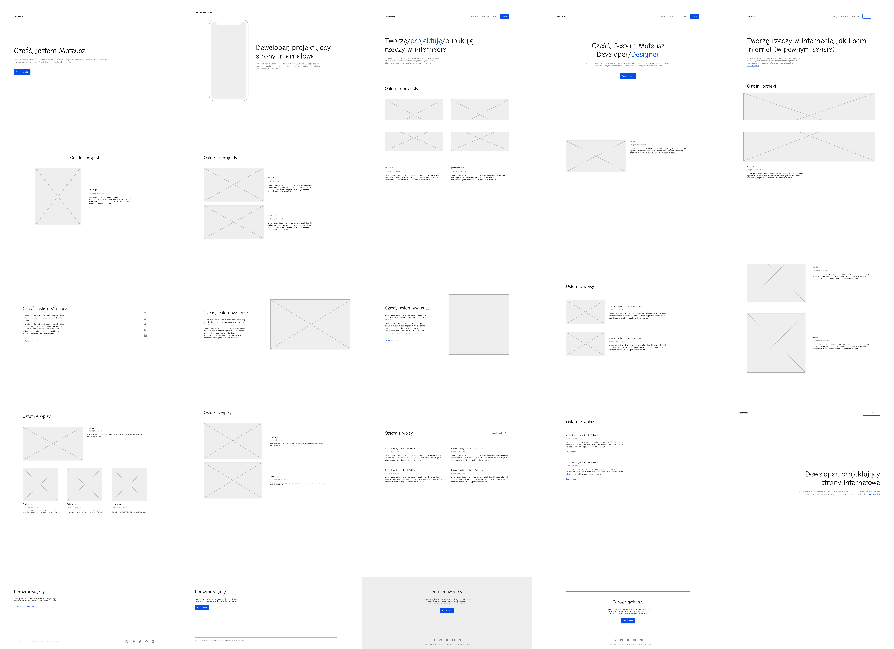

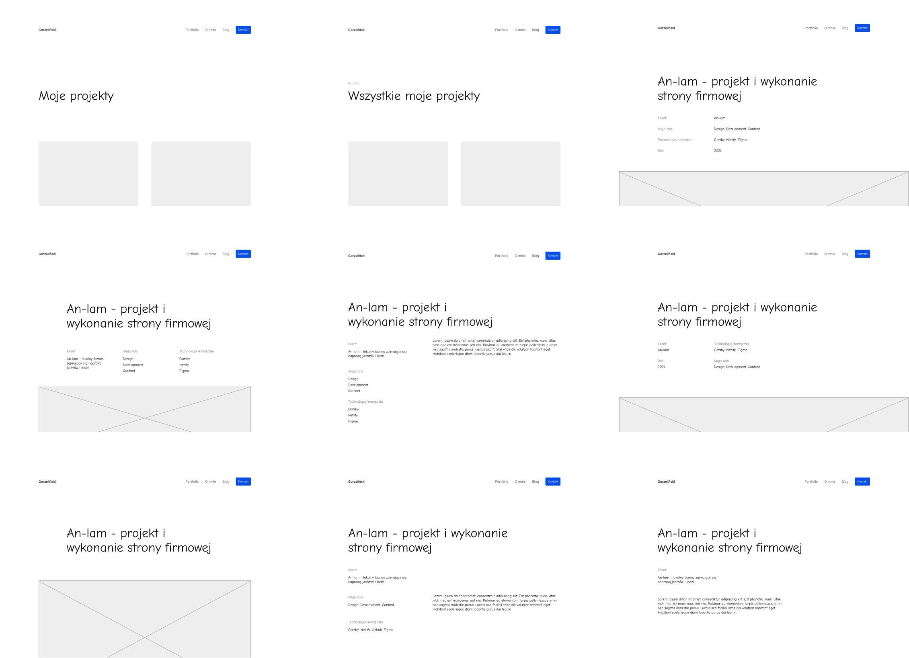

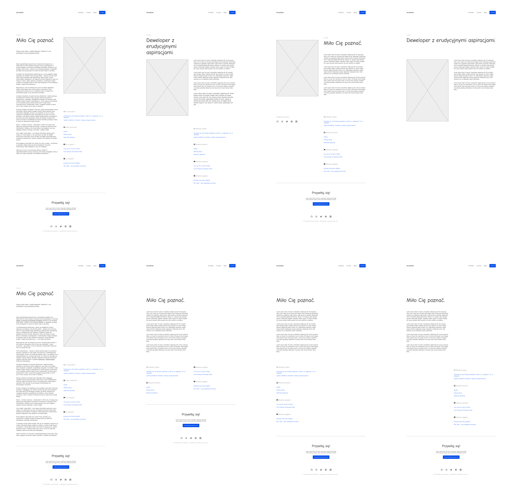

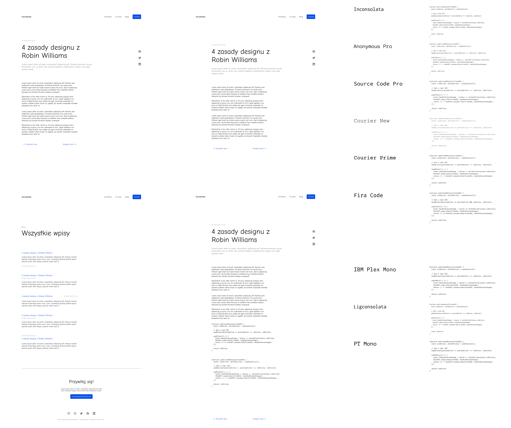

## Kolory

Na wyborze kolorów spędziłem więcej czasu niż chciałbym przyznać. Ale po wielu godzinach poszukiwań (i testowania dostępności) doszedłem do porozumienia sam ze sobą. Paleta kolorów powinna być minimalistyczna, prosta, składać się z odcieni bieli i szarości. I oczywiście powinna zawierać niebieski akcent. Nie stoi za tym jakaś filozofia - po prostu lubię niebieski.

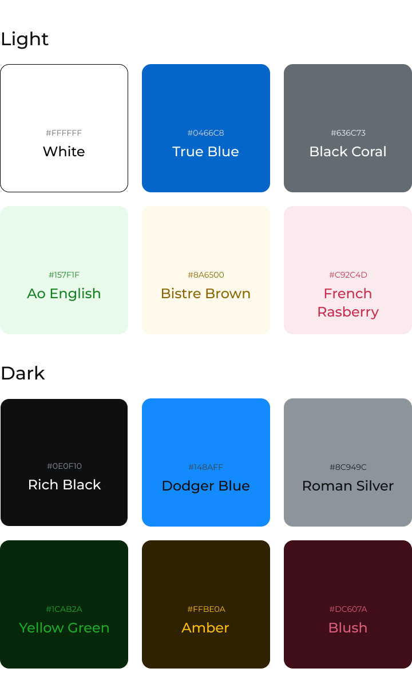

## Typografia

Chciałem, aby strona była zorientowana na typografię, więc kolejny kawał czasu spędziłem poszukując krojów pisma. Moim celem było zestawienie nowoczesnego fontu bezszeryfowego z bardziej klasycznym szeryfowym. Potrzebowałem także fontu do fragmentów kodu.

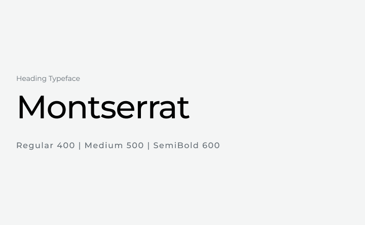

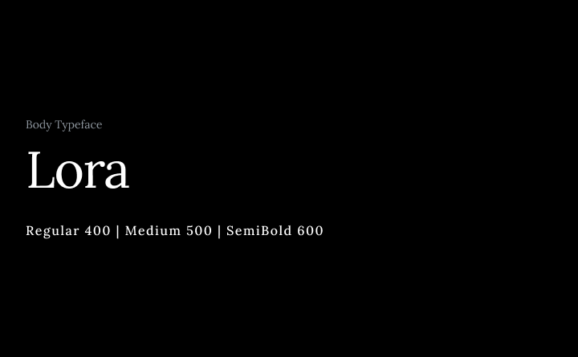


## Design system

Mając podstawy i trochę treści, zacząłem tworzyć system projektowania. Chciałem aby był elastyczny, spójny i łatwo skalowalny. Stworzyłem małe, abstrakcyjne elementy jak przyciski i nagłówki.

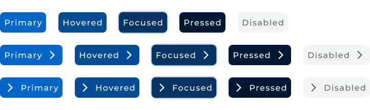

Używałem tych elementów w wielu różnych kontekstach, aby stworzyć bardziej konkretne komponenty, jak ten - pierwsza sekcja na stronie głównej.

```jsx
import React from "react"
import { useTranslation } from "react-i18next"

import { Hero, H1, P, Button, Tile } from "../elements"
import Typewriter from "./typewriter"

const Landing = () => {
  const { t } = useTranslation("components/landing")

  return (
    <Hero>
      <Tile as="header">
        <H1 $decorative aria-label={t("aria")}>
          <Typewriter
            strings={[
              t("typewriter.design"),
              t("typewriter.code"),
              t("typewriter.write"),
              t("typewriter.create"),
            ]}
          ></Typewriter>
        </H1>
        <P $type="lead">{t("description")}</P>
        <Button as="a" $type="primary" $grow href="#say-hello">
          {t("cta")}
        </Button>
      </Tile>
    </Hero>
  )
}

export default Landing
```

Mając elementy, komponenty i sekcje, stworzyłem responsywne szablony dla każdej strony.

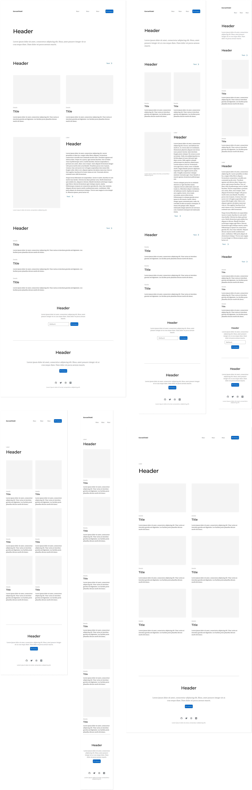

Mój design nie jest skończony i bardziej przypomina proces. Cały czas go rozwijam. W związku z tym możesz zagrać w "znajdź różnicę" pomiędzy tym pokazem, a aktualną wersją mojej strony.

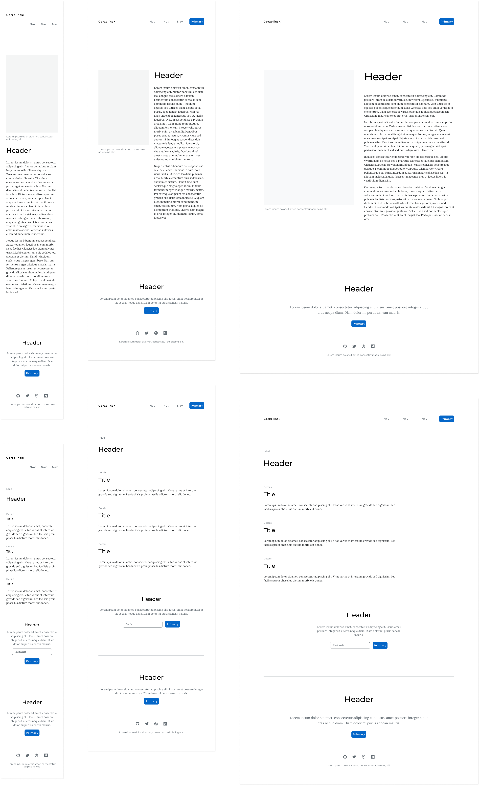

Zauważyłem, że elastyczność jest pożądana podczas całego procesu. Podobnie jak przerwy - dają nową perspektywę. Nowe pomysły przychodziły do mnie w różnych etapach procesu i w nieoczekiwanych momentach. Jak pomysł na pasek postępu - znalazłem go przeglądając internet. Tak, ukradłem go i się tego nie wstydzę!

> The only art I'll ever study is stuff that I can steal from.
>
> &mdash;<cite> David Bowie</cite>

## Gatsby

Do zaimplementowania mojej strony użyłem generatora stron statycznych - Gatsby. Strony są budowane i optymalizowane w procesie generowania, nawet zanim użytkownik ich zażąda. Strony internetowe stworzone przy pomocy tego podejścia są zwykle wydajniejsze niż tradycyjne rozwiązania jak WordPress.

Jeżeli strony są generowane wcześniej, skąd wiedzieć jaki motyw wybrał użytkownik? Zaimplementowanie funkcjonalności zmieniania motywów było dla mnie niespodziewanym wyzwaniem. Ale po przeczytaniu o procesie budowania i testach udało mi się zrobić, aby działało to gładko.

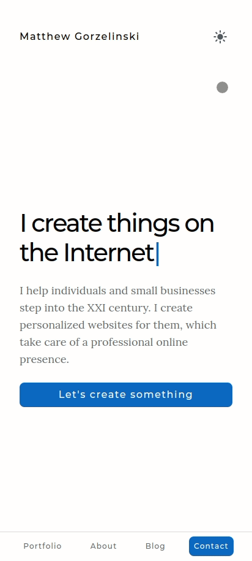</img>

## Testowanie

Poza manualnymi testami, napisałem zautomatyzowane testy. Użyłem frameworka `Jest` do testowania komponentów. Do testowania integracji pomiędzy komponentami i bardziej złożonych zachowań użytkownika, wykorzystałem framework `Cypress` wraz z `cypress-axe`. Te testy pokrywały różne aspekty strony - dostępność, internacjonalizację, SEO i więcej.

## GitHub

Będę się starał dodawać treści i funkcjonalności regularnie, dlatego długotrwała konserwacja była celem od początku. Uruchomiłem ciągłą integrację wykorzystując akcje GitHub, aby zminimalizować liczbę błędów i zyskać więcej pewności co do mojego projektu. Każda zmiana w kodzie uruchamia serię weryfikacji i testów.


Używam konwencji Conventional Commits do formatowania wiadomości i GitHub Flow jako strategię rozgałęziania.

<Callout type="info">

W momencie pisania, używam języka JavaScript w tym projekcie. Ale być może przejdę na Typescript dla dodatkowych testów typów. Będę się starał, aby opis tego projektu był aktualny.

</Callout>
